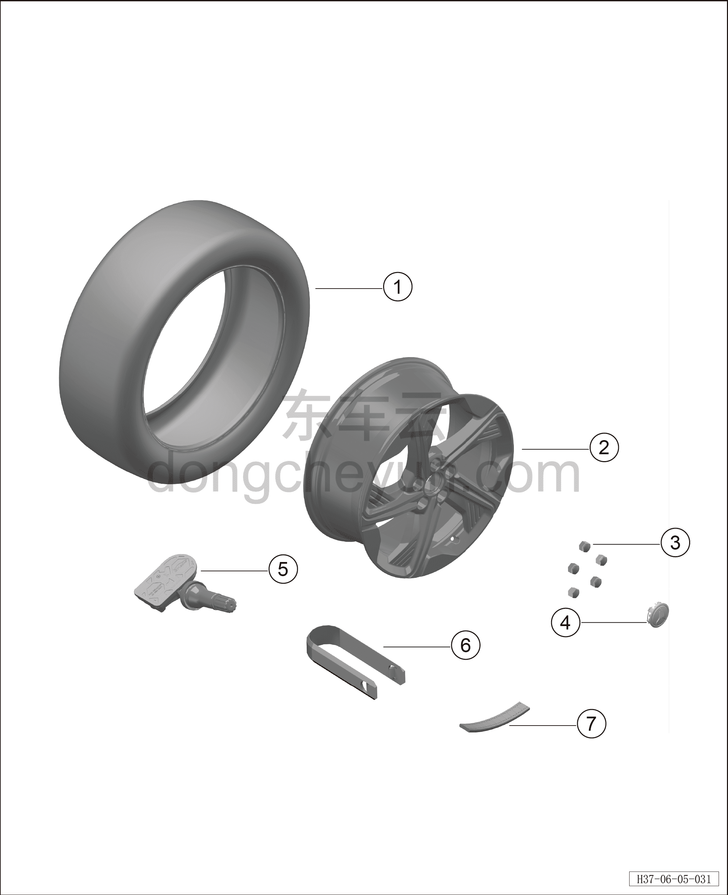

# Покомпонентный вид (деталировка)

> Система шасси › Ходовая часть  
> Оригинал: `结构分解图` · [dongcheyun 56746](https://dongcheyun.com/p/56746), страница `cbf161aa8fbd4534b97745656caeb135` · [оглавление](../README.md)

| № | Наименование детали | Кол-во на автомобиль | Примечание |
|---|---|---|---|
| 1 | Шины | 4 |   |
| 2 | Колесо | 4 |   |
| 3 | Декоративный колпачок колёсного болта | 20 |   |
| 4 | Декоративный колпак колеса | 4 |   |
| 5 | Датчик давления в шине | 4 |   |
| 6 | Съёмник декоративных колпачков | 1 |   |
| 7 | Балансировочный грузик колеса | 4 |   |
