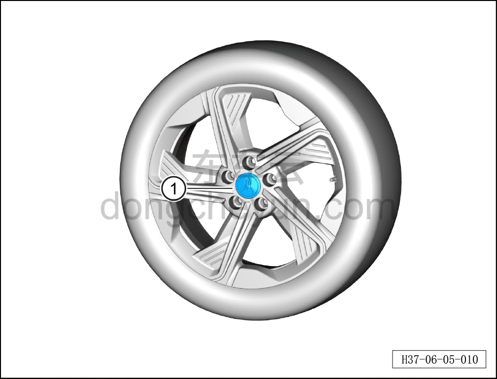

# Снятие и установка декоративного колпака колеса

> Система шасси › Ходовая часть › Декоративные колпаки колёс  
> Оригинал: `拆卸与安装车轮装饰盖` · [dongcheyun 56746](https://dongcheyun.com/p/56746), страница `36fc352e1f61440ca32a7ed605cd7c4d` · [оглавление](../README.md)

**Порядок снятия**

1. Снимите колесо. См. [6.5.8.1 Снятие и установка колеса](064-снятие-и-установка-колеса.md)

2. Снимите декоративный колпак колеса.

a. Слегка постучите по декоративному колпаку колеса с тыльной стороны и извлеките декоративный колпак колеса ①.

**Внимание:**

**- Проверьте декоративный колпак колеса на старение или повреждение; при их наличии замените его на новый.**

**Порядок установки**

Установка выполняется в обратном порядке.

**Внимание:**

**- После завершения ремонта обязательно выполните дорожное испытание, убедитесь в отсутствии посторонних шумов со стороны шасси и явления увода.**
