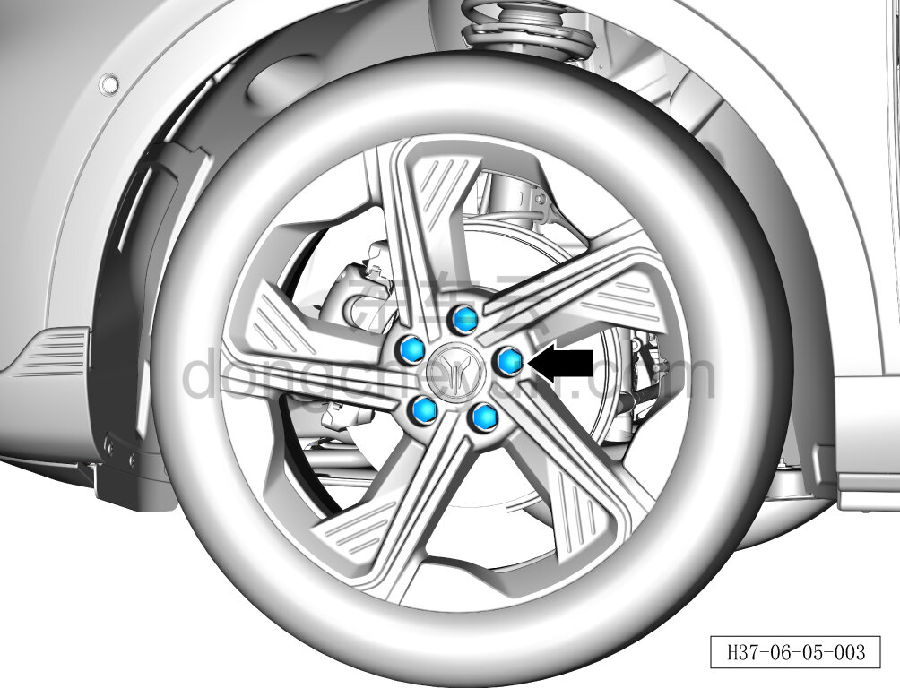

# Снятие и установка декоративного колпачка колёсного болта

> Система шасси › Ходовая часть › Декоративные колпаки колёс  
> Оригинал: `拆卸与安装车轮螺栓装饰盖` · [dongcheyun 56746](https://dongcheyun.com/p/56746), страница `61a8894a569845719935e658a24d1797` · [оглавление](../README.md)

Порядок снятия

1. Снимите декоративный колпачок колёсного болта.

a. Используя съёмник декоративных колпачков, снимите 5 декоративных колпачков колёсных болтов.

**Порядок установки**

Установка выполняется в обратном порядке.

**Внимание:**

**- Проверьте декоративный колпачок колёсного болта на старение или повреждение; при их наличии замените его на новый.**
