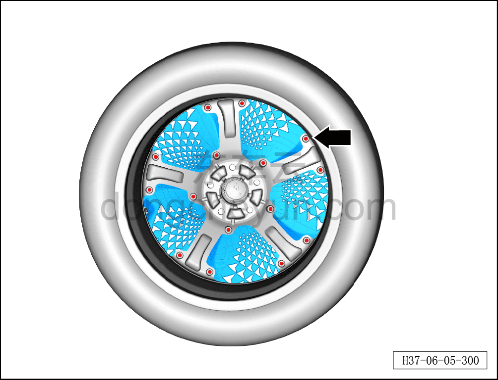
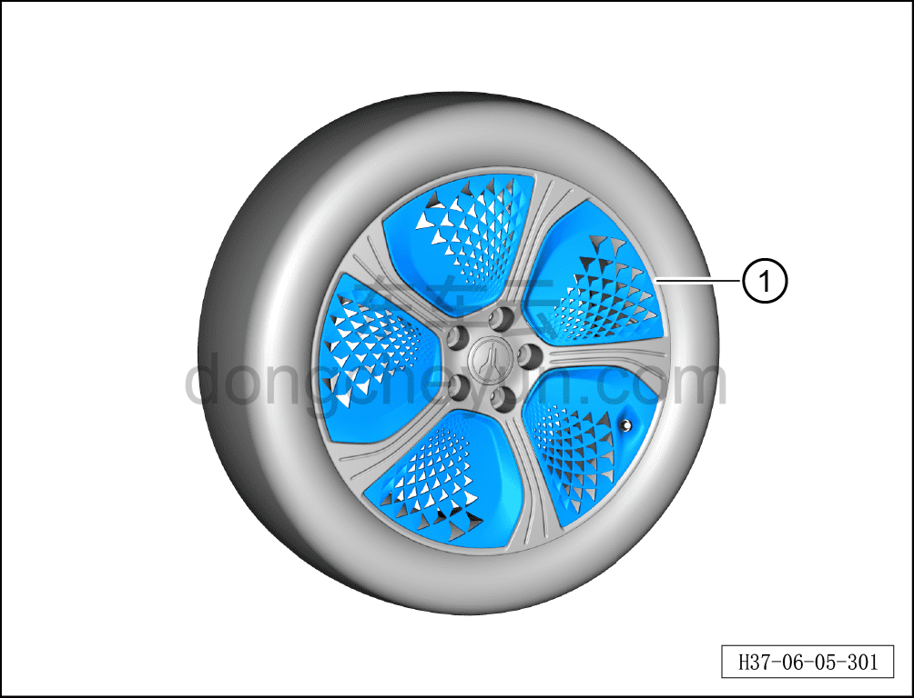

# Снятие и установка вставки колеса

> Система шасси › Ходовая часть › Декоративные колпаки колёс  
> Оригинал: `拆卸与安装车轮插件` · [dongcheyun 56746](https://dongcheyun.com/p/56746), страница `28f93d4f63ae4cc4b1477edb8f1b16f0` · [оглавление](../README.md)

**Порядок снятия**

1. Снимите колесо. См. [6.5.8.1 Снятие и установка колеса](064-снятие-и-установка-колеса.md)

2. Снимите вставку колеса.

a. Используя биту отвёртки, выверните 15 крепёжных винтов вставки колеса.

b. Используя инструмент для снятия обивки, снимите вставку колеса ①.

**Порядок установки**

Установка выполняется в обратном порядке.

**Внимание:**

**- Проверьте вставку колеса на старение или повреждение; при их наличии замените её на новую.**
