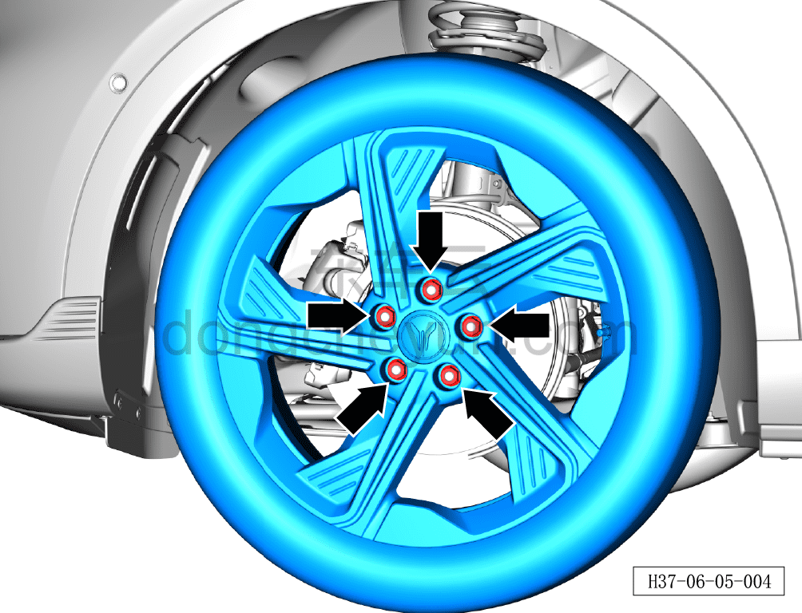
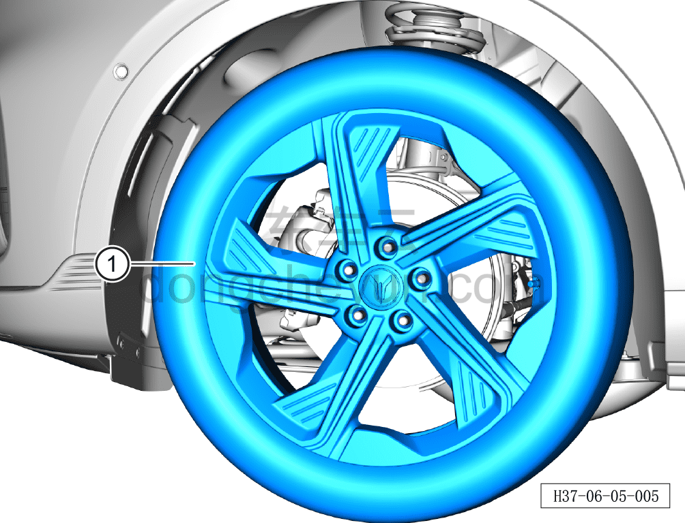

# Снятие и установка колеса

> Система шасси › Ходовая часть › Колесо  
> Оригинал: `拆卸与安装车轮` · [dongcheyun 56746](https://dongcheyun.com/p/56746), страница `5b8f89ae4b5546389d74e84d3373d57a` · [оглавление](../README.md)

**Порядок снятия**

**Внимание:**

**- Отворачивать гайки колеса необходимо по диагонали снизу вверх.**

1. Снимите декоративный колпачок колёсного болта. См. [6.5.7.2 Снятие и установка декоративного колпачка колёсного болта](062-снятие-и-установка-декоративного-колпачка-колёсного.md)

2. Поднимите автомобиль на подъёмнике на соответствующую высоту.

3. Снимите колесо.

a. Используя торцевую головку на 21 мм, отверните 5 крепёжных гаек колеса.

Момент затяжки гайки: 160±10 Н·м

b. Снимите колесо ①.

**Порядок установки**

Установка выполняется в обратном порядке.

**Внимание:**

**- Нанесите антикоррозионное покрытие на центрирующую посадочную поверхность колеса.**

**- Не допускается нанесение воска на контактные поверхности колеса и ступицы; резьбу колёсных болтов запрещается обрабатывать смазочными материалами или антикоррозионными средствами.**

**- Заворачивать гайки необходимо по диагонали сверху вниз.**

**- При замене шины необходимо выполнить её динамическую балансировку.**

**- После завершения ремонта необходимо провести дорожное испытание и убедиться в отсутствии посторонних шумов ходовой части и уводов автомобиля.**
