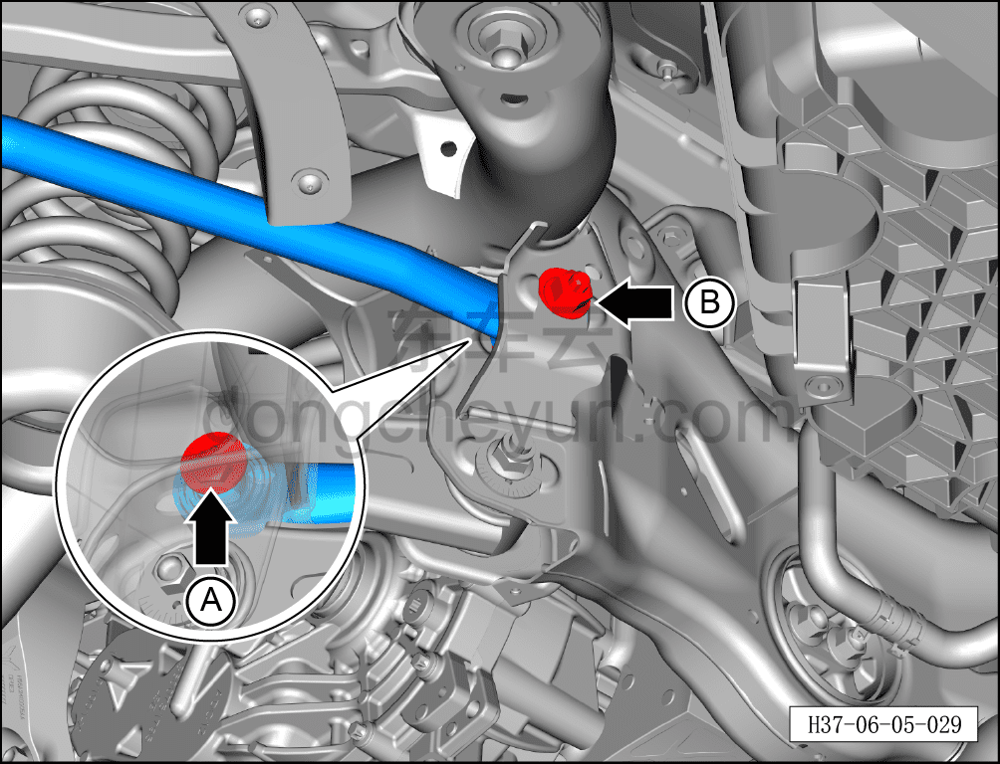
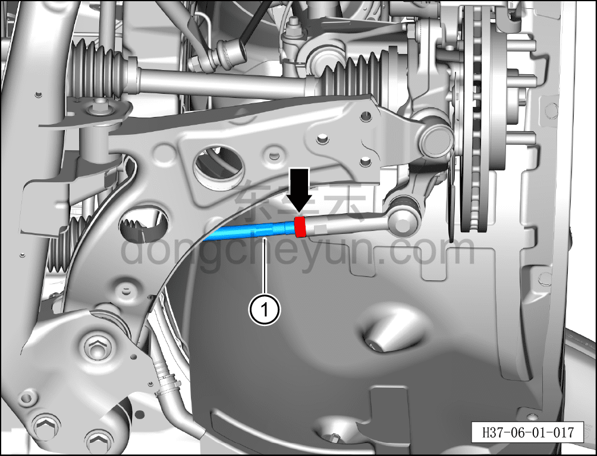
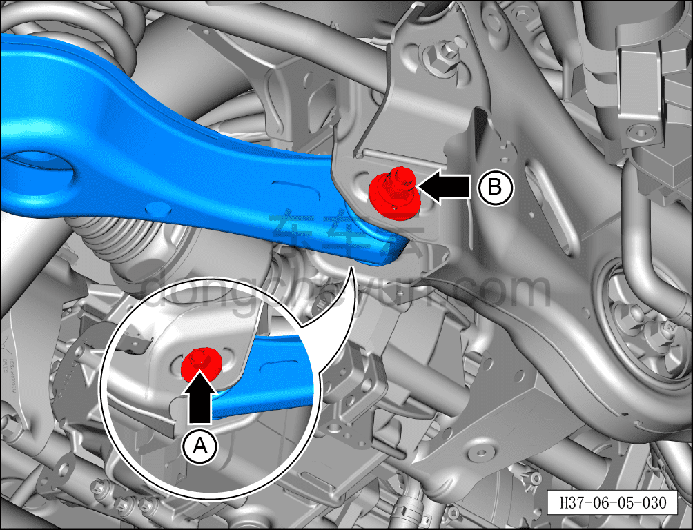

# Порядок выполнения развал-схождения

> Система шасси › Ходовая часть › Колесо  
> Оригинал: `四轮定位操作步骤` · [dongcheyun 56746](https://dongcheyun.com/p/56746), страница `7cda59d6a728486ba4b543eb6b470e3f` · [оглавление](../README.md)

**Внимание:**

**- Перед выполнением развал-схождения необходимо привести давление во всех четырёх шинах к одному значению, иначе это повлияет на точность данных развал-схождения.**

**Порядок выполнения**

1. Подготовительные операции перед регулировкой

a. Установите колёса в положение прямо и зафиксируйте рулевое колесо в горизонтальном положении с помощью фиксатора рулевого колеса.

2. Отрегулируйте схождение задних колёс.

a. Установите автомобиль на подъёмник стенда развал-схождения.

b. Ослабьте стопорную гайку B, отрегулируйте эксцентриковый регулировочный болт A и установите значение схождения заднего колеса (на одну сторону) в пределах нормы.

c. После регулировки затяните стопорную гайку B и повторно проверьте значение схождения заднего колеса (на одну сторону).

Момент затяжки болта A: 115±10 Н·м

Момент затяжки гайки B: 115±10 Н·м

**Внимание:**

**- После затяжки стопорной гайки значение схождения может незначительно измениться.**

3. Отрегулируйте схождение передних колёс.

a. Ослабьте гайку.

b. Установите рулевой вал ① в требуемое положение и затяните гайку.

Момент затяжки гайки: 72±8 Н·м

**Примечание:**

**- Выше описана регулировка гайки левого рулевого вала, для правой стороны см. левую.**

**Внимание:**

**- Проверьте давление во всех четырёх шинах; требуется, чтобы давление во всех четырёх шинах составляло 2,5 бар.**

4. Проверьте развал передних колёс.

a. Развал передних колёс не регулируется. Если измеренное значение выходит за допустимые пределы, необходимо проверить подрамник кузова на повреждения.

5. Отрегулируйте развал задних колёс.

a. Ослабьте стопорную гайку A, отрегулируйте эксцентриковый регулировочный болт B и установите значение схождения заднего колеса (на одну сторону) в пределах нормы.

b. После регулировки затяните стопорную гайку A и повторно проверьте значение схождения заднего колеса (на одну сторону).

Момент затяжки болта A: 120±12 Н·м

Момент затяжки гайки B: 180±10 Н·м

**Внимание:**

**- После затяжки стопорной гайки значение схождения может незначительно измениться;**

**- После завершения развал-схождения необходимо провести дорожное испытание, проверить правильность установки и убедиться в отсутствии посторонних шумов ходовой части и уводов автомобиля**.

6. Значения параметров развал-схождения:

<table>
<tr><td colspan=2>Наименование</td><td>Параметр</td></tr>
<tr><td rowspan=4>Передний свес</td><td>Схождение (на одну сторону)</td><td>0°90'±0°3'</td></tr>
<tr><td>Развал</td><td>-0°24'±0°45'</td></tr>
<tr><td>Продольный наклон оси поворота (кастор)</td><td>4°57'±0°30'</td></tr>
<tr><td>Поперечный наклон оси поворота</td><td>12°38'±0°30'</td></tr>
<tr><td rowspan=2>Задний свес</td><td>Схождение (на одну сторону)</td><td>0°6'±0°3'</td></tr>
<tr><td>Развал</td><td>-1°0'±0°30'</td></tr>
</table>

7. Меры предосторожности при проверке равномерного увода автомобиля вправо:

a. Ослабьте следующие по четыре втулки слева и справа (до состояния свободного проворачивания, не снимая их):

- крепёжный болт соединения тяги переднего стабилизатора с вилкой амортизатора

- крепёжный болт соединения тяги переднего стабилизатора со стабилизатором

- задний крепёжный болт соединения подрамника передней подвески с нижним рычагом

- передний крепёжный болт соединения подрамника передней подвески с нижним рычагом

b. Поверните рулевое колесо влево и вправо до упора два раза, затем поверните рулевое колесо до упора влево и удерживайте его в этом положении.

c. Используя динамометрический ключ, затяните болты во всех точках заданным моментом в следующем порядке: левый1 → левый2 → правый1 → правый2 → левый3 → правый3 → левый4 → правый4.

d. Ниже приведены все критичные моменты затяжки:

- крепёжный болт соединения тяги переднего стабилизатора с вилкой амортизатора: 60 Н·м + 45°

- крепёжный болт соединения тяги переднего стабилизатора со стабилизатором: 60 Н·м + 45°

- задний крепёжный болт соединения переднего подрамника с нижним рычагом: 130 Н·м + 90°

- передний крепёжный болт соединения переднего подрамника с нижним рычагом: 130 Н·м + 90°

e. Повторно отрегулируйте параметры развал-схождения автомобиля.

**Указания по безопасности**

**1. В течение всей операции следите за защитой датчика скорости колеса и других деталей, чтобы не допустить их повреждения.**

**2. После затяжки всех критичных точек моментом необходимо измерить статический момент и зафиксировать результат;**

**3. После завершения развал-схождения выполните калибровку угла поворота EPS согласно следующим шагам:**

**- Установите колёса в положение прямо и зафиксируйте рулевое колесо в горизонтальном положении с помощью фиксатора рулевого колеса;**

**- Поднимите автомобиль на подъёмнике и выполните регулировку развал-схождения;**

**- После завершения развал-схождения опустите подъёмник, оставив фиксатор рулевого колеса в прежнем положении;**

**- С помощью диагностического сканера выполните операцию калибровки угла поворота EPS;**

**- После успешной калибровки угла поворота снимите фиксатор рулевого колеса.**
