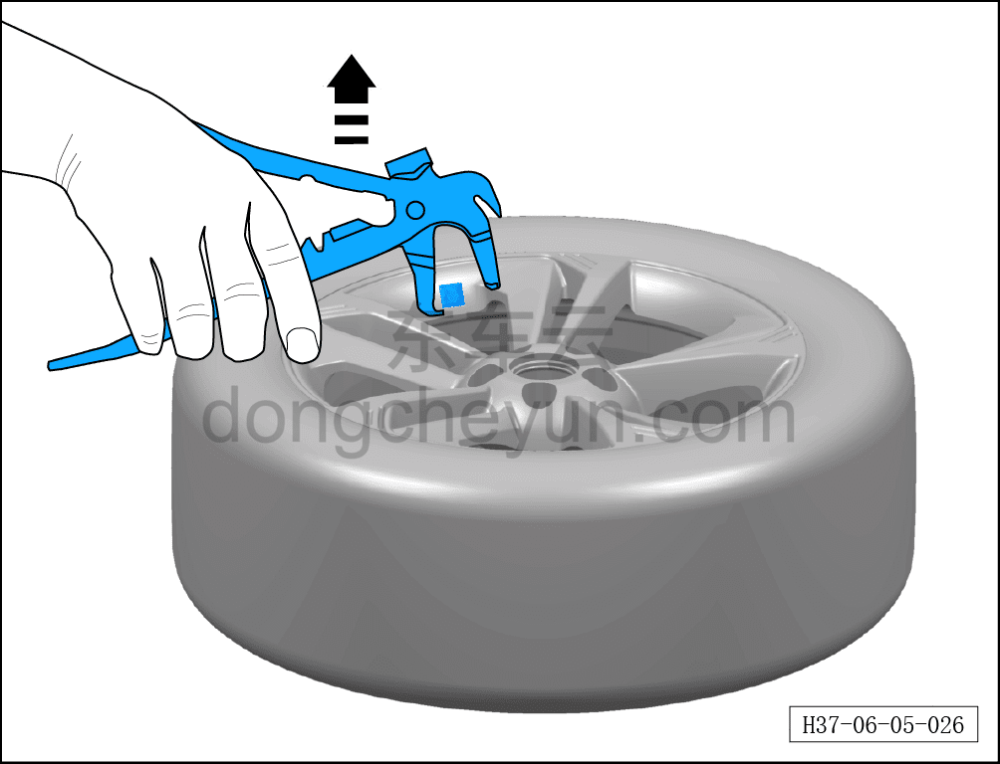

# Снятие и установка балансировочных грузиков

> Система шасси › Ходовая часть › Колесо  
> Оригинал: `拆卸与安装平衡块` · [dongcheyun 56746](https://dongcheyun.com/p/56746), страница `67712ae771f44cc5884789fbde63f3cb` · [оглавление](../README.md)

**Порядок снятия**

1. Снимите декоративный колпачок колёсного болта. См. [6.5.7.2 Снятие и установка декоративного колпачка колёсного болта](062-снятие-и-установка-декоративного-колпачка-колёсного.md)

2. Поднимите автомобиль на подъёмнике на соответствующую высоту.

3. Снимите колесо. См. [6.5.8.1 Снятие и установка колеса](064-снятие-и-установка-колеса.md)

4. Снимите балансировочные грузики колеса.

a. Снимите балансировочный грузик.

**Порядок установки**

Установка выполняется в обратном порядке.

**Внимание:**

**- При установке балансировочных грузиков необходимо выполнить динамическую балансировку шины.**

**- После завершения ремонта необходимо провести дорожное испытание и убедиться в отсутствии увода автомобиля.**
