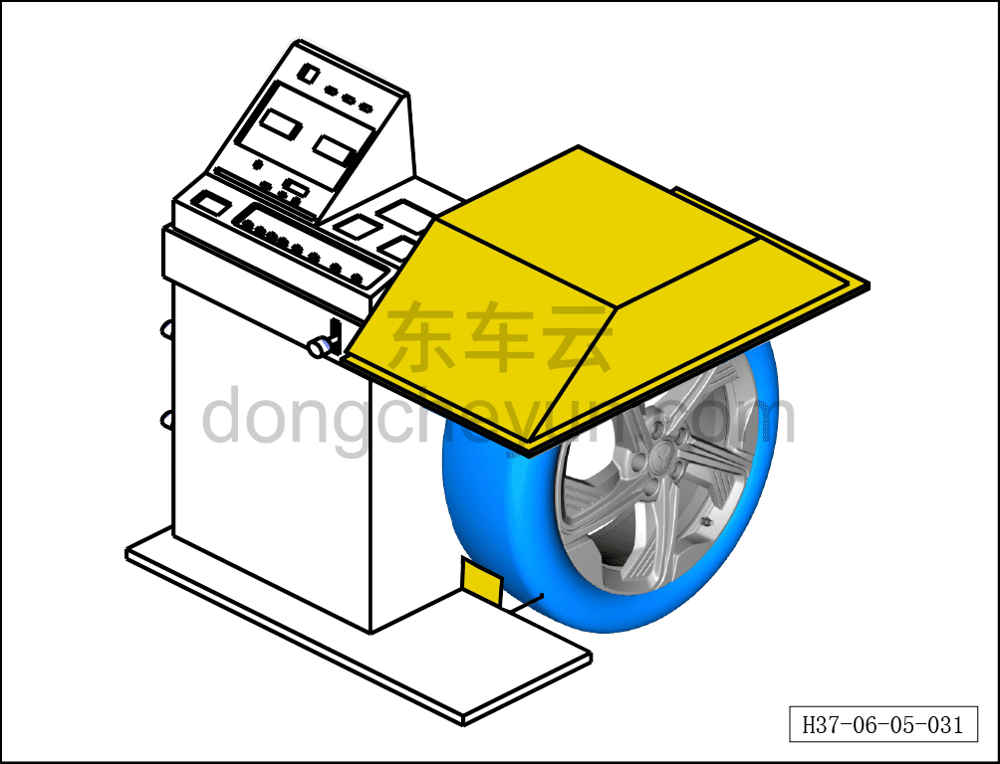

# Снятие, установка и динамическая балансировка шины

> Система шасси › Ходовая часть › Колесо  
> Оригинал: `拆卸与安装轮胎动平衡` · [dongcheyun 56746](https://dongcheyun.com/p/56746), страница `2a424f8d711c4fe78cff3c018697fc7f` · [оглавление](../README.md)

**Внимание:**

**- Неуравновешенность шины или диска автомобиля приводит к возникновению вибрации при высокоскоростном вращении колеса; эта вибрация вызывает раскачивание автомобиля, снижает безопасность и плавность движения, а также увеличивает износ шины, поэтому проверка и регулировка динамической балансировки шины очень важны.**

**1. Подготовительные работы перед проверкой.**

**a. Очистите проверяемое колесо от грязи, песка и камней.**

**- Если не удалить посторонние предметы из протектора, они могут под действием центробежной силы вылететь из шины и привести к травмированию людей.**

**- Проверьте протектор и боковину шины на наличие дефектов. Эти дефекты влияют на балансировку колеса.**

**b. Снимите ранее установленные балансировочные грузики.**

**c. Накачайте шину до стандартного значения давления.**

**2. Проверьте балансировку колеса.**

**a. Правильно установите колесо на балансировочный станок.**

**b. Зафиксируйте шину и введите три параметра: ширину и диаметр колеса, а также расстояние от наружного края колеса до балансировочного станка.**

**c. Опустите защитный кожух, запустите балансировочный станок и начните измерение.**

**d. Остановите вращение шины, затем откройте защитный кожух, вручную поверните шину и по показаниям левого и правого дисплеев определите величину и место неуравновешенности.**

**3. Отрегулируйте балансировку колеса.**

**a. При установке балансировочного грузика на колесо совместите его центр с положением (или углом), указанным балансировочным станком.**

**b. Для одного колеса в сборе неуравновешенность с внутренней стороны должна быть ≤60 г, с наружной ≤80 г; устанавливайте балансировочные грузики по одной линии.**

**Внимание:**

**- Балансировочные грузики нельзя использовать повторно, каждый раз следует устанавливать новые.**

**- Всегда используйте оригинальные балансировочные грузики.**

**- На данном автомобиле с внутренней и наружной стороны алюминиевого диска используются приклеиваемые грузики; запрещается использовать набиваемые свинцовые грузики, чтобы не повредить сам диск.**

**- Не устанавливайте балансировочный грузик на другой балансировочный грузик.**

**c. Повторно запустите балансировочный станок и убедитесь, что остаточная неуравновешенность не превышает 5 г; если остаточная неуравновешенность с любой стороны превышает 5 г, повторите шаги установки балансировочного грузика.**

a. Снимите балансировочный грузик.

b. Отладка балансировочного грузика.

**Порядок установки**

Установка выполняется в обратном порядке.

**Внимание:**

**- При установке балансировочных грузиков необходимо выполнить динамическую балансировку шины.**

**- После завершения установки необходимо выполнить развал-схождение;**

**- После завершения ремонта обязательно выполните дорожное испытание, убедитесь в отсутствии посторонних шумов со стороны шасси и явления увода.**
