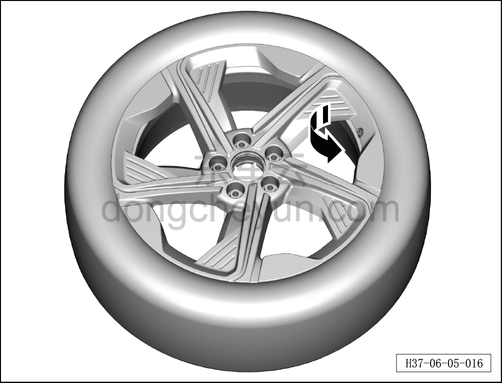
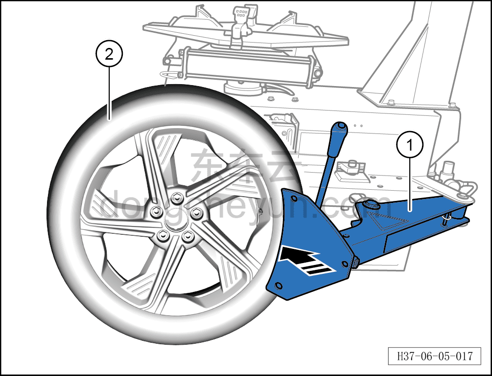
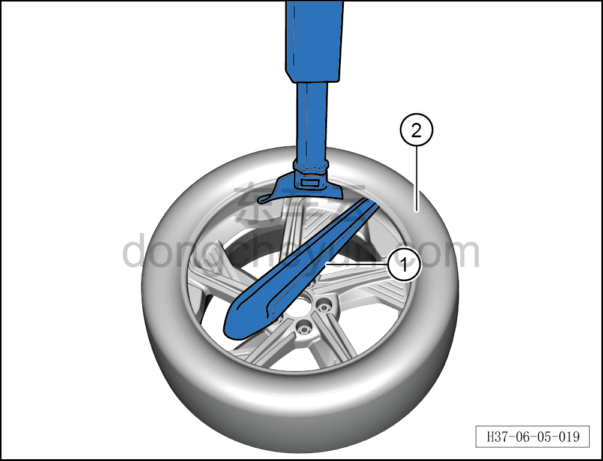
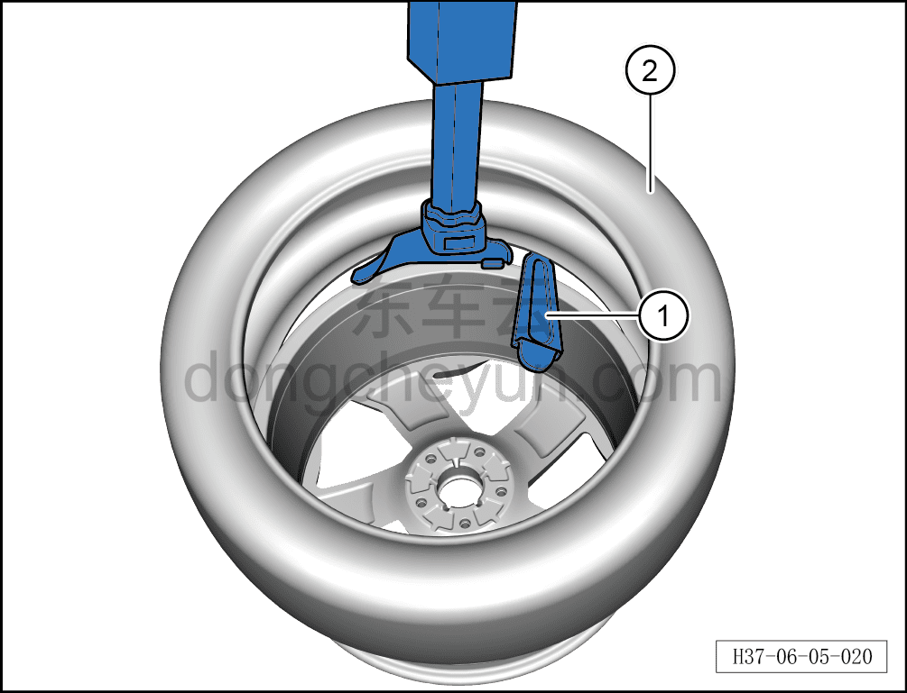

# Снятие и установка шины

> Система шасси › Ходовая часть › Шины  
> Оригинал: `拆卸与安装轮胎` · [dongcheyun 56746](https://dongcheyun.com/p/56746), страница `5e2ca91468ed40e8b78b2de3781d27c4` · [оглавление](../README.md)

**Порядок снятия**

1. Снимите колесо. См. [6.5.8.1 Снятие и установка колеса](064-снятие-и-установка-колеса.md)

2. Снимите шину.

a. Отверните колпачок вентиля. Используя инструмент для выпуска воздуха, выверните золотник вентиля в направлении стрелки и выпустите воздух.

b. Используя шиномонтажный станок ① в направлении стрелки, выдавите шину ② из паза диска.

**Примечание:**

**- При использовании шиномонтажного станка не касайтесь диска, чтобы не повредить его.**

**- При использовании шиномонтажного станка избегайте зоны расположения вентиля, чтобы не повредить датчик давления в шине.**

c. Используя монтажную лопатку ①, приподнимите шину ②, нажмите переключатель вращения и извлеките шину ②.

**Примечание:**

**- В процессе монтажа или демонтажа шины следите за расстоянием между монтажной головкой шиномонтажного станка и диском, чтобы не повредить его поверхность.**

**- При демонтаже шины надёжно зафиксируйте диск, проверьте фиксацию перед запуском станка; во время вращения категорически запрещается разделять шину и диск руками.**

**- При монтаже и демонтаже шины следите за тем, чтобы не повредить борт шины, чтобы избежать утечки воздуха.**

d. Используя монтажную лопатку ①, приподнимите шину ②, нажмите переключатель вращения и извлеките шину ②.

**Порядок установки**

Установка выполняется в обратном порядке.

**Внимание:**

**- После установки шины необходимо выполнить её динамическую балансировку.**

**- После установки новой шины или перестановки шин необходимо выполнить сопоставление (привязку) датчика давления в шине с блоком управления датчиками давления в шинах.**
