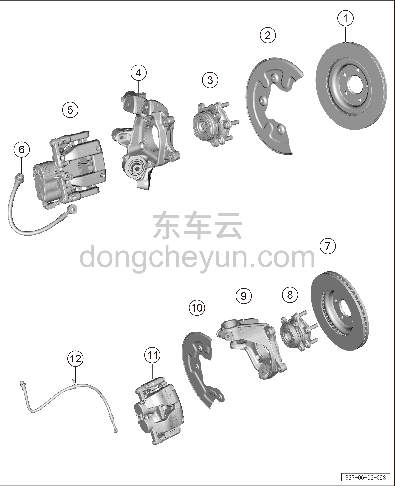
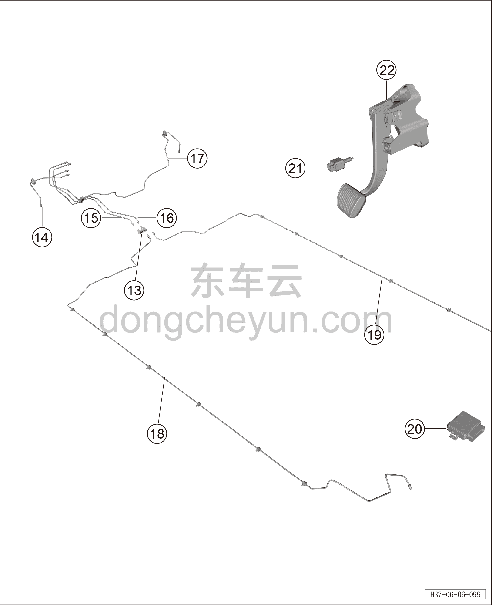

# Покомпонентный вид (деталировка)

> Система шасси › Тормозная система  
> Оригинал: `结构分解图` · [dongcheyun 56746](https://dongcheyun.com/p/56746), страница `68283f6aa93a432290cb2c22d6e71b7b` · [оглавление](../README.md)

| № | Наименование детали | Кол-во на автомобиль | Примечание |
|---|---|---|---|
| 1 | Задний тормозной диск | 2 |   |
| 2 | Защитный кожух заднего тормозного диска | 2 |   |
| 3 | Задний ступичный подшипник в сборе | 2 |   |
| 4 | Левый задний поворотный кулак | 2 |   |
| 5 | Задний тормозной суппорт | 2 |   |
| 6 | Левый задний тормозной шланг | 2 |   |
| 7 | Передний тормозной диск | 2 |   |
| 8 | Передний ступичный подшипник в сборе | 2 |   |
| 9 | Передний поворотный кулак | 2 |   |
| 10 | Защитный кожух переднего тормозного диска | 2 |   |
| 11 | Передний тормозной суппорт | 2 |   |
| 12 | Передний тормозной шланг | 2 |   |

| № | Наименование детали | Кол-во на автомобиль | Примечание |
|---|---|---|---|
| 13 | Четырёхходовой соединитель | 1 |   |
| 14 | Тормозная трубка (от интегрированного интеллектуального блока управления тормозами до левого переднего тормозного шланга) | 1 |   |
| 15 | Тормозная трубка (от интегрированного интеллектуального блока управления тормозами до четырёхходового соединителя 1) | 1 |   |
| 16 | Тормозная трубка (от интегрированного интеллектуального блока управления тормозами до четырёхходового соединителя 2) | 1 |   |
| 17 | Тормозная трубка (от интегрированного интеллектуального блока управления тормозами до правого переднего тормозного шланга) | 1 |   |
| 18 | Тормозная трубка (от четырёхходового соединителя до левого заднего шланга) | 1 |   |
| 19 | Тормозная трубка (от четырёхходового соединителя до правого заднего шланга) | 1 |   |
| 20 | Контроллер EPB | 1 |   |
| 21 | Выключатель стоп-сигнала | 1 |   |
| 22 | Педаль тормоза в сборе | 1 |   |
