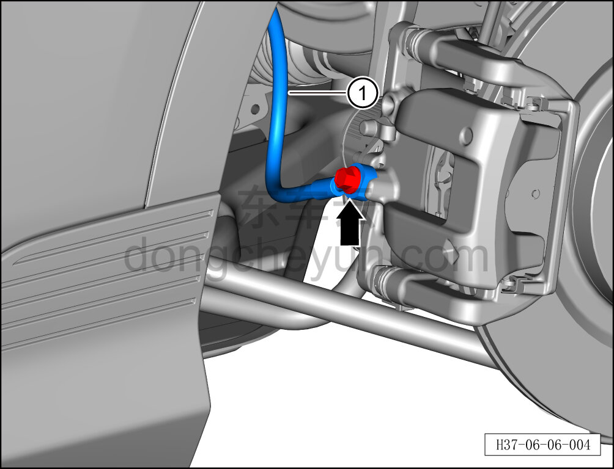
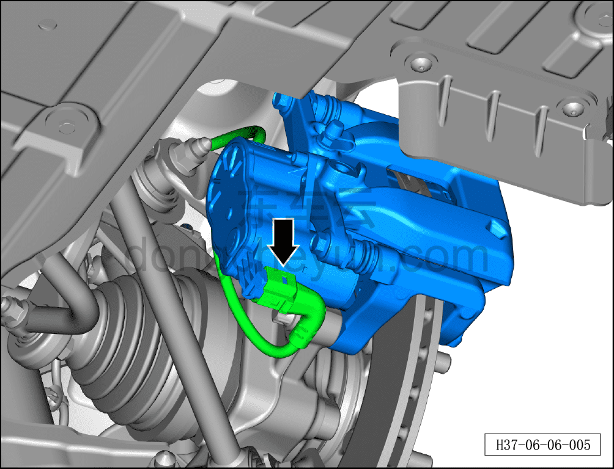
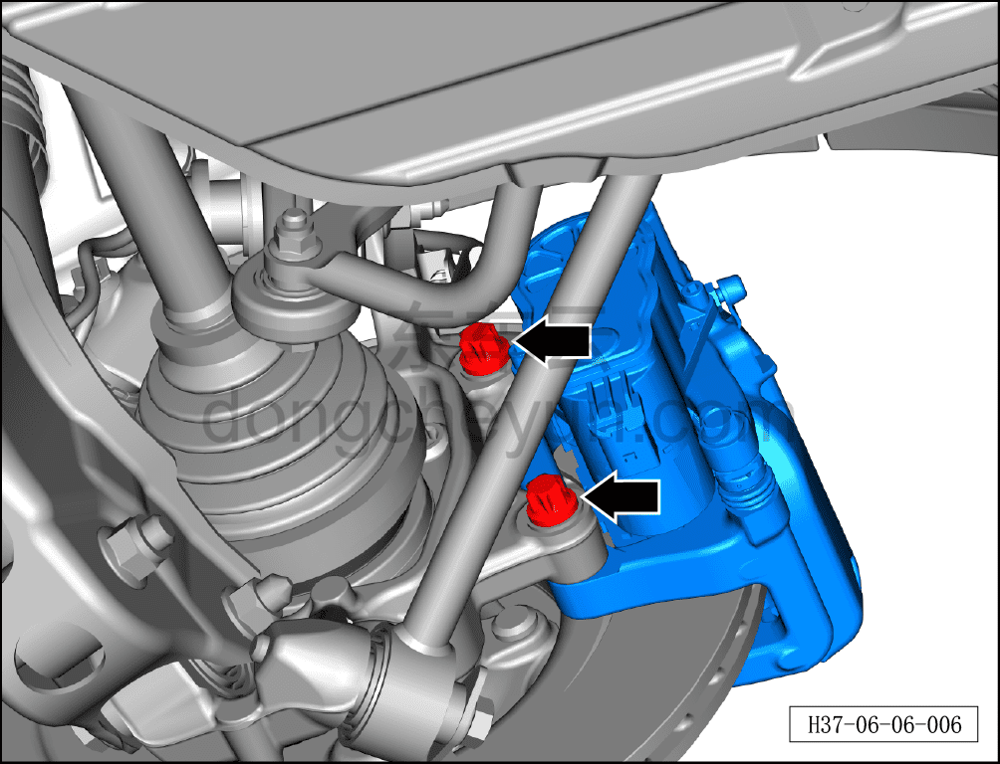
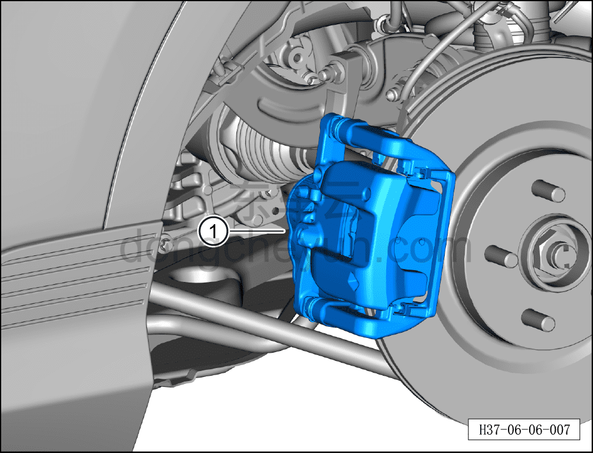

# Снятие и установка левого заднего тормозного суппорта

> Система шасси › Тормозная система › Тормозной суппорт  
> Оригинал: `拆卸与安装左后制动钳` · [dongcheyun 56746](https://dongcheyun.com/p/56746), страница `c84dbdf593a44ece8eb7580984757644` · [оглавление](../README.md)

**Порядок снятия**

**Примечание:**

**- Ниже описаны снятие и установка левого заднего тормозного суппорта, для правой стороны см. левую.**

**- При снятии нанесите метки на тормозные колодки, которые будут использоваться повторно, и обеспечьте их установку на те же места, иначе эффективность торможения будет неравномерной.**

1. Снимите заднее колесо. См. [6.5.8.1 Снятие и установка колеса](064-снятие-и-установка-колеса.md)

2. Используя инструмент для прокачки тормозной жидкости, откачайте тормозную жидкость из бачка через левый задний тормозной суппорт. См. [3.1.5.3 Замена тормозной жидкости](../03-техническое-обслуживание/008-замена-тормозной-жидкости.md)

3. Снимите левый задний тормозной суппорт.

a. Используя торцевую головку на 12 мм, отверните соединительный болт левого заднего тормозного шланга и отсоедините левый задний тормозной шланг ①.

Момент затяжки болта: 35±2 Н·м

**Внимание:**

**- Подложите ветошь непосредственно под соединение шланга.**

**- Тормозная жидкость токсична и обладает коррозионным действием, не допускайте её контакта с лакокрасочным покрытием кузова.**

**- После каждого снятия уплотнительного кольца маслопровода тормозного суппорта его необходимо заменить на новое, иначе использование старого кольца может привести к утечке жидкости и серьёзной аварии.**

b. Отсоедините разъём жгута проводов.

c. Используя торцевую головку E14, отверните 2 крепёжных болта левого заднего тормозного суппорта.

Момент затяжки болта: 110±10 Н·м

d. Извлеките левый задний тормозной суппорт ①.

**Порядок установки**

Установка выполняется в обратном порядке.

**Внимание:**

**- После завершения установки подключите диагностический сканер, войдите в систему IPB, перейдите в управление процедурами и выберите операцию IPB «Замена тормозного суппорта».**

**- Залейте тормозную жидкость, см. [3.1.5.3 Замена тормозной жидкости](../03-техническое-обслуживание/008-замена-тормозной-жидкости.md)**

**- После завершения установки необходимо несколько раз нажать на педаль тормоза и убедиться в надёжности торможения.**

**- Проверьте шланг и соединения трубопроводов на отсутствие утечек, при необходимости подтяните их.**

**- При каждой установке тормозного суппорта в сборе или тормозного шланга обязательно расправьте тормозной шланг, убедившись, что он имеет естественный изгиб.**

**- После завершения ремонта обязательно выполните дорожное испытание, убедитесь в отсутствии посторонних шумов со стороны шасси и явления увода.**
