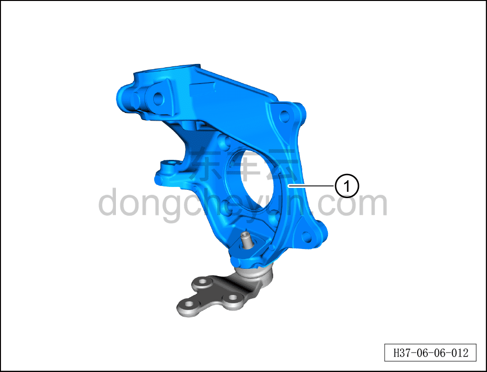

# Снятие и установка левого переднего поворотного кулака

> Система шасси › Тормозная система › Тормозной суппорт  
> Оригинал: `拆卸与安装左前转向节` · [dongcheyun 56746](https://dongcheyun.com/p/56746), страница `dcfdb14d03e94c8f9902cc88e28cd247` · [оглавление](../README.md)

**Порядок снятия**

**Примечание:**

**- Ниже описаны снятие и установка левого переднего поворотного кулака, для правой стороны см. левую.**

1. Выключите все электроприборы, отключите питание.

2. Выполните операцию обесточивания автомобиля для ремонта. См. [3.1.4.1 Обесточивание автомобиля](../03-техническое-обслуживание/005-обесточивание-автомобиля.md)

3. Снимите переднее колесо. См. [6.5.8.1 Снятие и установка колеса](064-снятие-и-установка-колеса.md)

4. Поднимите автомобиль на подъёмнике на подходящую высоту.

5. Снимите левый передний нижний рычаг с шаровым пальцем в сборе. См. [6.2.7.1 Снятие и установка нижнего рычага передней подвески с шаровым пальцем в сборе](019-снятие-и-установка-нижнего-рычага-передней-подвески-с.md)

6. Снимите левый передний поворотный кулак.

a. Используя гаечный ключ на 21 мм, отверните крепёжную гайку шарового шарнира переднего нижнего рычага.

b. Извлеките левый передний поворотный кулак ①.

**Порядок установки**

Установка выполняется в обратном порядке. Поскольку задний рычаг передней подвески и шаровой палец являются одной сборочной единицей, соединительные болты шарового пальца с задним рычагом передней подвески имеют строгие требования к сборке. После снятия болтов необходимо заменить левый передний нижний рычаг с шаровым пальцем в сборе на новый, разборка при установке не допускается.

**Внимание:**

**- Выполните развал-схождение;**

**- После завершения ремонта обязательно выполните дорожное испытание, убедитесь в отсутствии посторонних шумов со стороны шасси и явления увода.**
