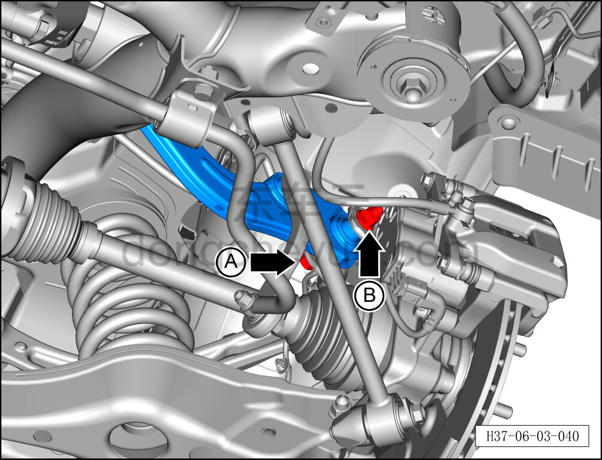
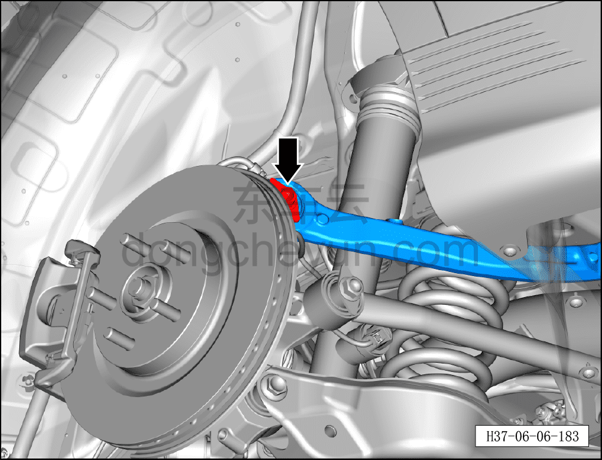
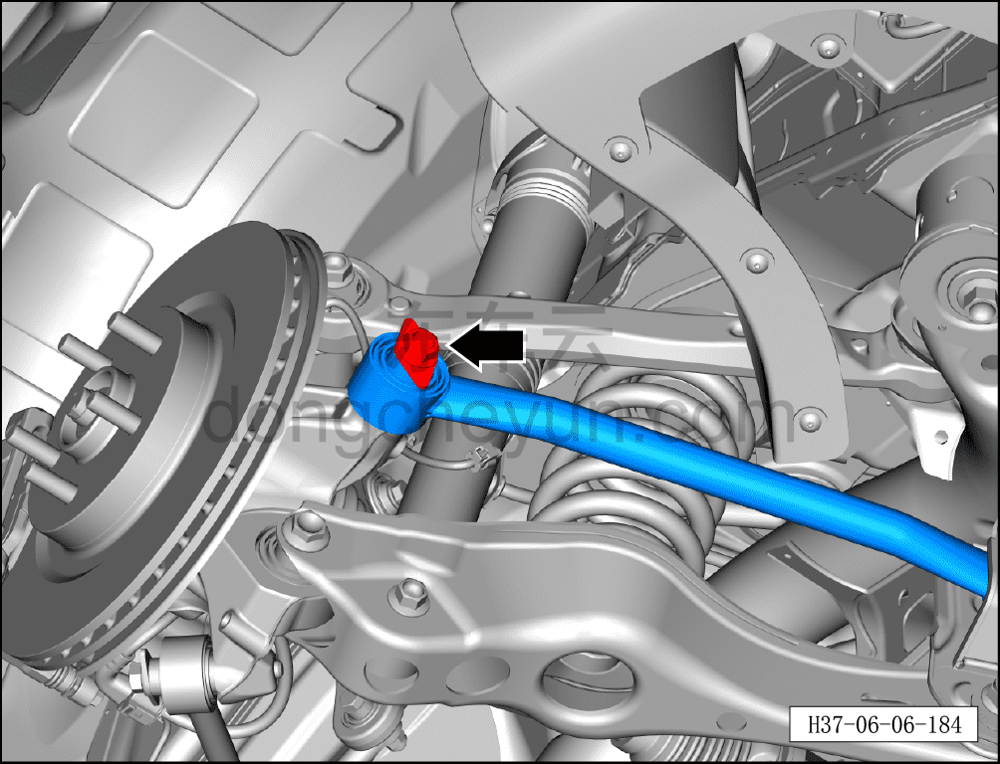
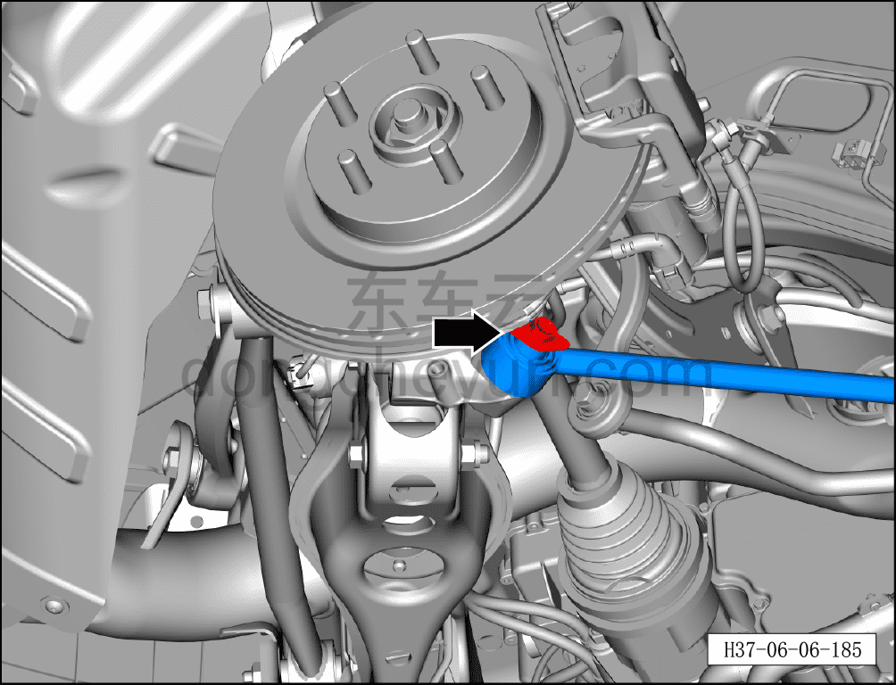
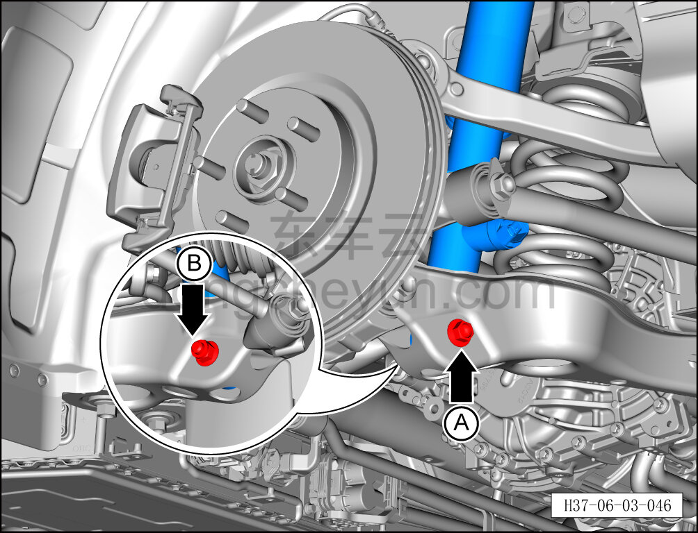
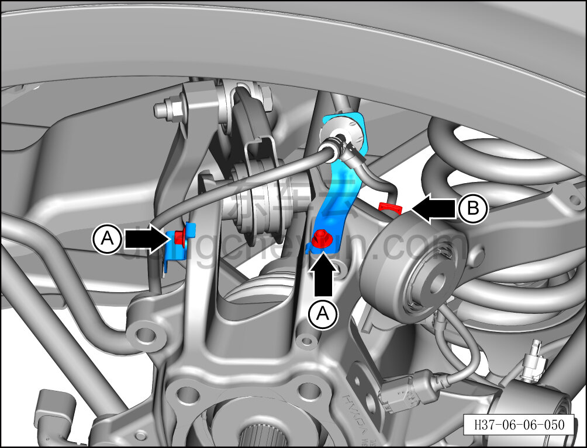
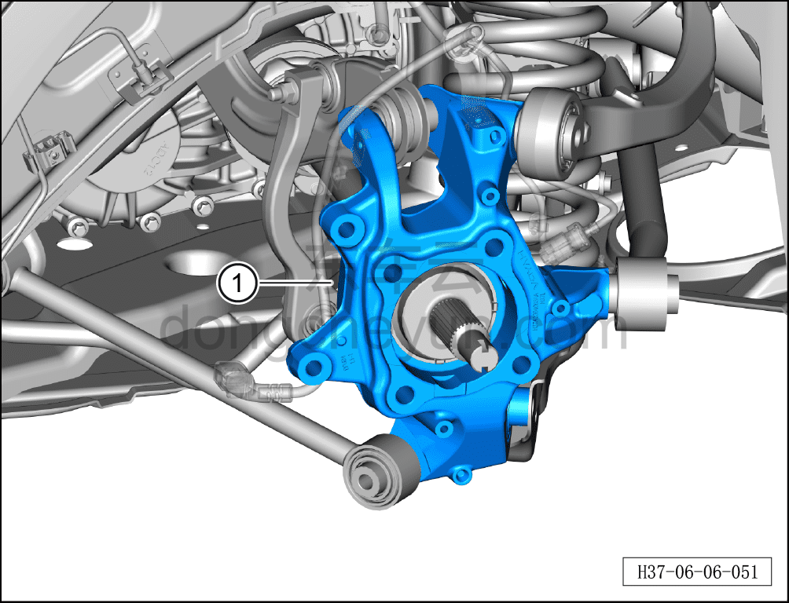

# Снятие и установка левого заднего поворотного кулака

> Система шасси › Тормозная система › Тормозной суппорт  
> Оригинал: `拆卸与安装左后转向节` · [dongcheyun 56746](https://dongcheyun.com/p/56746), страница `9ab3188872e34b338e4fbd775406bbdc` · [оглавление](../README.md)

**Порядок снятия**

**Примечание:**

**- Выше описаны снятие и установка левого заднего поворотного кулака, для правой стороны см. левую.**

1. Выключите все электроприборы, отключите питание.

2. Выполните операцию обесточивания автомобиля для ремонта. См. [3.1.4.1 Обесточивание автомобиля](##)

3. Снимите заднее колесо. См. [6.5.8.1 Снятие и установка колеса](064-снятие-и-установка-колеса.md)

4. Поднимите автомобиль на подъёмнике на подходящую высоту.

5. Снимите защитный кожух заднего тормозного диска. См. [6.6.7.4 Снятие и установка защитного кожуха заднего тормозного диска](087-снятие-и-установка-защитного-кожуха-заднего-тормозного.md)

6. Снимите ступичный подшипник в сборе. См. [6.6.6.8 Снятие и установка заднего ступичного подшипника (заднее колесо)](080-снятие-и-установка-ступичного-подшипника-заднее-колесо.md)

7. Снимите задний датчик скорости колеса. См. [6.7.6.1 Снятие и установка левого датчика скорости колеса в сборе](104-снятие-и-установка-датчика-скорости-колеса.md)

8. Снимите левый задний поворотный кулак.

a. Удерживая крепёжный болт A гаечным ключом на 18 мм, отверните торцевой головкой на 18 мм крепёжную гайку B соединения переднего верхнего рычага задней подвески с поворотным кулаком и извлеките крепёжный болт.

Момент затяжки гайки: 60 Н·м+45°

b. Используя торцевую головку на 18 мм, отверните крепёжный болт левого заднего верхнего рычага задней подвески.

Момент затяжки болта: 180±10 Н·м

c. Используя торцевую головку на 21 мм, отверните крепёжный болт соединения тяги схождения с поворотным кулаком.

Момент затяжки крепёжного болта: 180±10 Н·м

d. Используя торцевую головку на 18 мм, отверните крепёжный болт соединения переднего нижнего рычага задней подвески с поворотным кулаком.

Момент затяжки болта: 115±10 Н·м

e. Удерживая гаечным ключом на 21 мм крепёжный болт A соединения левой задней стойки амортизатора в сборе с левым задним нижним рычагом задней подвески, отверните торцевой головкой на 21 мм крепёжную гайку B и извлеките крепёжный болт.

Момент затяжки гайки: 120±12 Н·м

**Примечание:**

**- При снятии болта соединения левого заднего нижнего рычага задней подвески с левым задним поворотным кулаком необходимо сначала поднять высокую стойку подъёмника и подпереть ею левый задний нижний рычаг задней подвески, чтобы после снятия пружина подвески не выскочила и не привела к травмированию людей и повреждению деталей.**

f. Используя торцевую головку на 8 мм, отверните 2 крепёжных болта A кронштейна жгута проводов датчика скорости заднего колеса.

g. Отсоедините фиксирующую защёлку B жгута проводов датчика скорости заднего колеса.

h. Извлеките левый задний поворотный кулак ①.

**Внимание:**

**- После отсоединения полуоси от левого заднего поворотного кулака зафиксируйте полуось на кузове проволокой, чтобы предотвратить её выпадение и утечку масла редуктора.**

**Порядок установки**

Установка выполняется в обратном порядке.

**Внимание:**

**- Выполните развал-схождение;**

**- После завершения ремонта обязательно выполните дорожное испытание, убедитесь в отсутствии посторонних шумов со стороны шасси и явления увода.**
