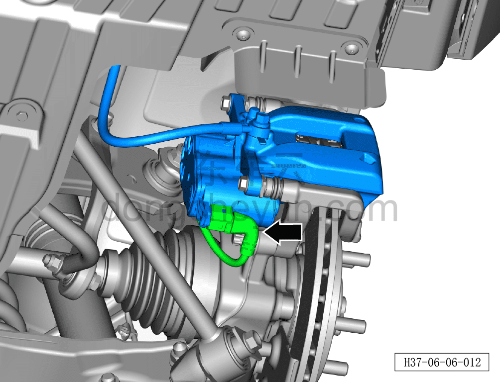
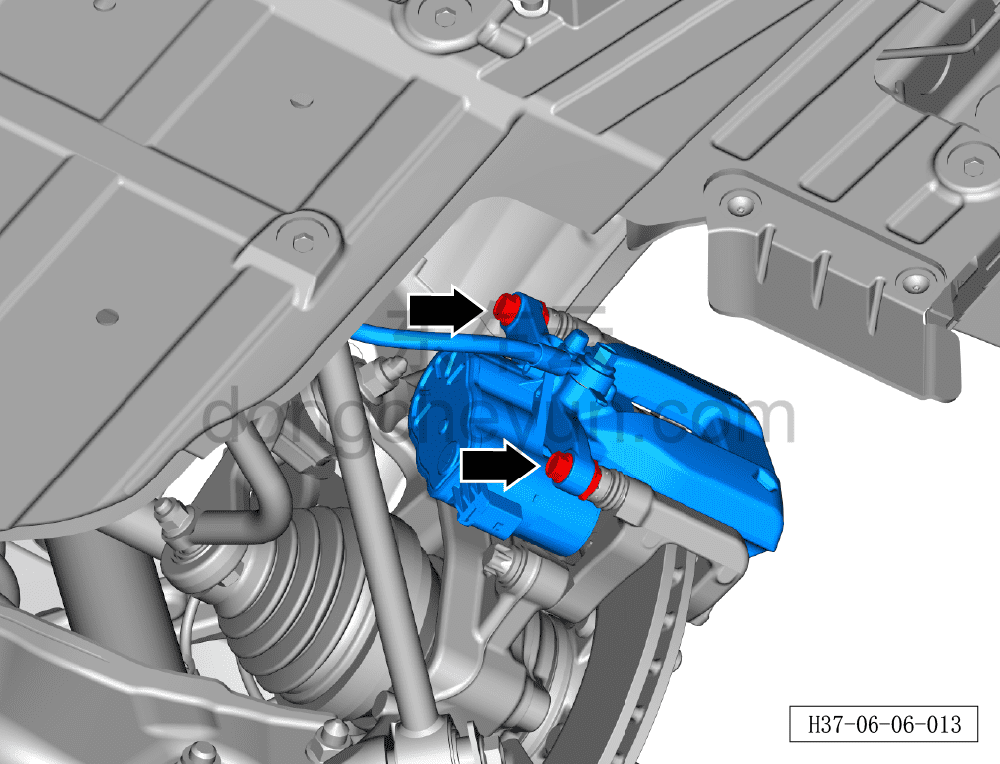
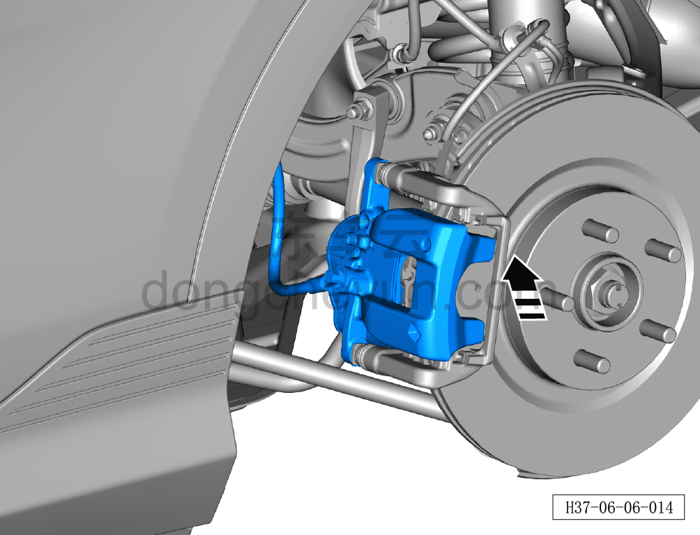
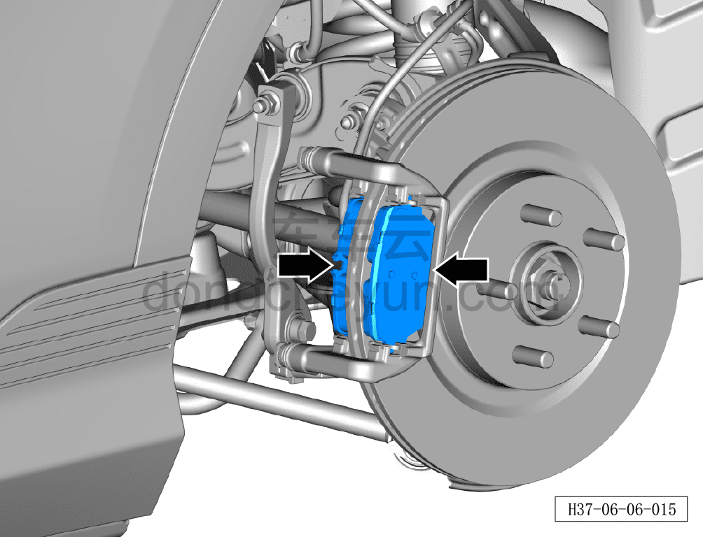
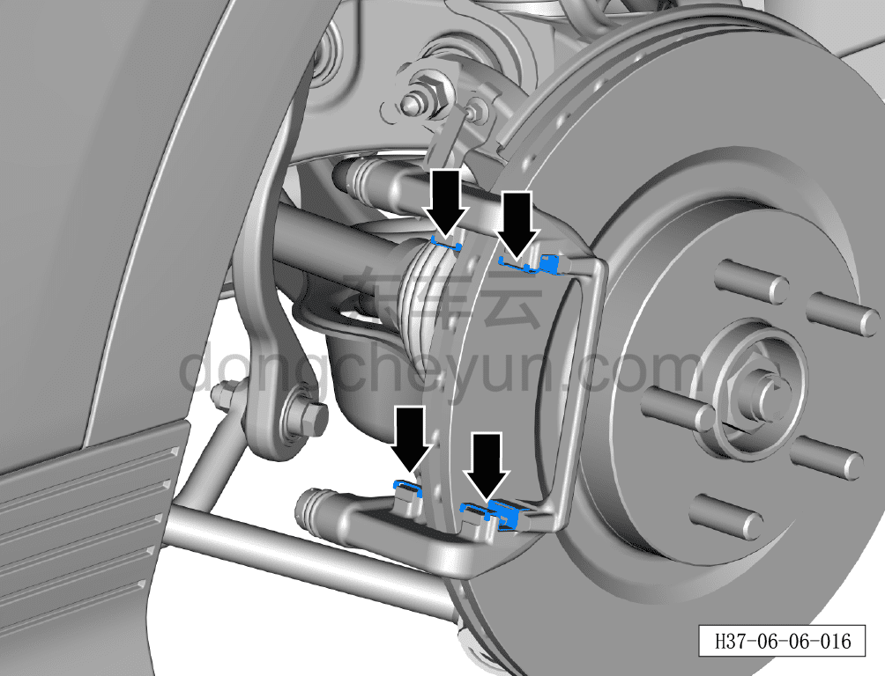
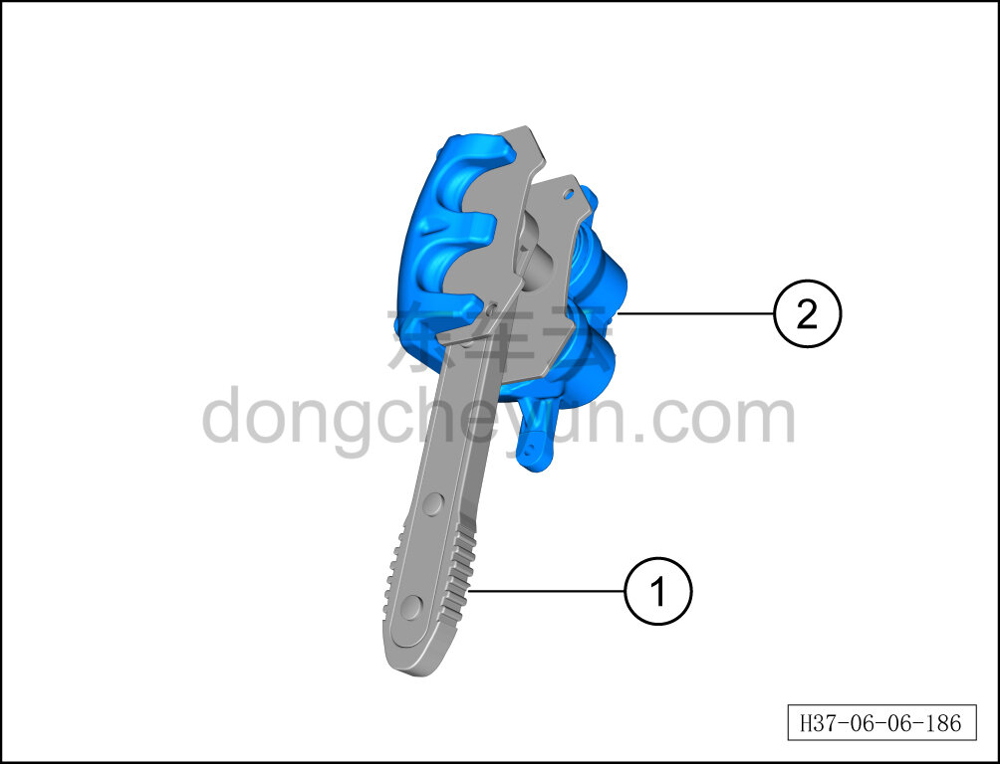

# Снятие и установка задних тормозных колодок

> Система шасси › Тормозная система › Тормозной суппорт  
> Оригинал: `拆卸与安装后制动摩擦块` · [dongcheyun 56746](https://dongcheyun.com/p/56746), страница `ed928152fb064a56a0bce898c9a896de` · [оглавление](../README.md)

**Порядок снятия**

**Примечание:**

**- Ниже описаны снятие и установка левых задних тормозных колодок, для правой стороны см. левую.**

**- При снятии нанесите метки на тормозные колодки, которые будут использоваться повторно, и обеспечьте их установку на те же места.**

1. Выключите все электроприборы, отключите питание.

2. Выполните обесточивание автомобиля для ремонта. См. [3.1.4.1 Обесточивание автомобиля](../03-техническое-обслуживание/005-обесточивание-автомобиля.md)

3. Снимите заднее колесо. См. [6.5.8.1 Снятие и установка колеса](064-снятие-и-установка-колеса.md)

4. Снимите задние тормозные колодки.

a. Отсоедините разъём жгута проводов датчика.

b. Удерживая гаечным ключом на 15 мм 2 паза скобы суппорта, отверните торцевой головкой на 13 мм крепёжные болты.

Момент затяжки болта: 110±10 Н·м

c. Извлеките суппорт в направлении стрелки и зафиксируйте его на кузове проволокой, чтобы избежать повреждения тормозного шланга под нагрузкой.

**Внимание:**

**- При снятии суппорта не допускайте случайного выпадения задних тормозных колодок.**

**- После отсоединения суппорта от тормозного суппорта в сборе зафиксируйте суппорт на кузове проволокой, следя за тем, чтобы не повредить тормозной шланг.**

d. Извлеките задние тормозные колодки.

e. Снимите ограничительную пружину задних тормозных колодок ①.

**Внимание:**

**- Проверьте состояние износа задних тормозных колодок, при необходимости замените их.**

**- Тщательно очистите задний суппорт и рабочую поверхность заднего тормозного диска.**

**Порядок установки**

**Установка выполняется в обратном порядке.**

**Внимание:**

**- При замене тормозных колодок не допускайте их неправильной установки относительно ограничительной пружины колодок.**

**- Используя инструмент для возврата поршня суппорта ①, верните задний тормозной поршень в исходное положение ②.**

**- При установке заднего суппорта обязательно расправьте тормозной шланг, убедившись, что он имеет естественный изгиб.**

**- Перед тем как с помощью инструмента для возврата поршня вдавить тормозной поршень обратно в цилиндр, необходимо откачать небольшое количество тормозной жидкости из бачка, иначе при возврате поршня жидкость может перелиться и вызвать повреждение.**

**- После каждой замены тормозных колодок при неподвижном автомобиле несколько раз с усилием нажмите на педаль тормоза, чтобы восстановить её нормальный ход.**

**- После замены тормозных колодок проверьте уровень тормозной жидкости.**

**- Проверьте шланг и соединения трубопроводов на отсутствие утечек, при необходимости подтяните их.**

Параметры задних тормозных колодок

| Предельный износ |
|---|
| 2 мм  (без учёта опорной пластины колодки) |

**Внимание:**

**- Необходимо провести дорожное испытание, проверить эффективность торможения, правильность установки и убедиться в отсутствии посторонних шумов ходовой части и уводов автомобиля.**
