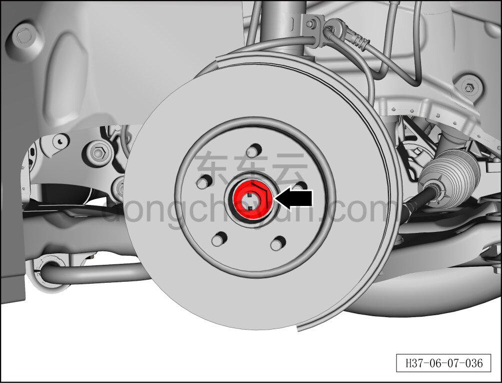
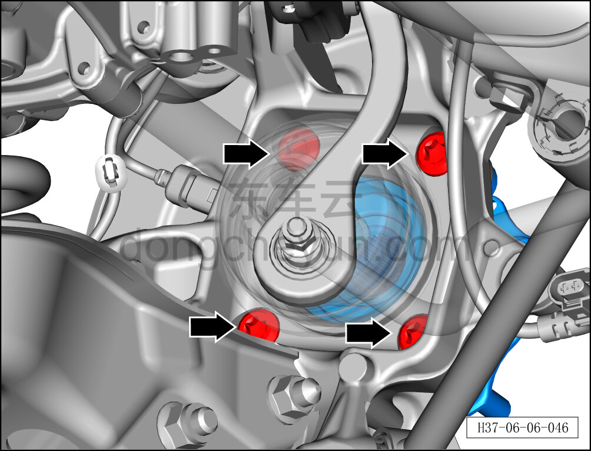
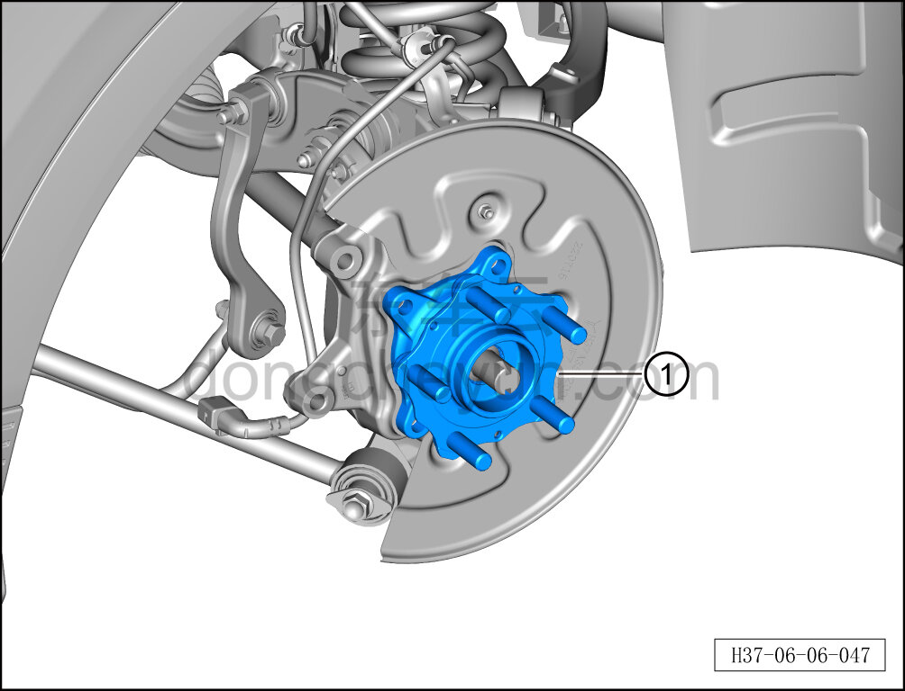

# Снятие и установка ступичного подшипника (заднее колесо)

> Система шасси › Тормозная система › Тормозной суппорт  
> Оригинал: `拆卸与安装轮毂轴承（后轮）` · [dongcheyun 56746](https://dongcheyun.com/p/56746), страница `314b6d0bf69f46e5836e8ae063d8a515` · [оглавление](../README.md)

**Порядок снятия**

**Примечание:**

- **Ниже описаны снятие и установка левого заднего ступичного подшипника, для правой стороны см. левую.**

1. Снимите заднее колесо. См. [6.5.8.1 Снятие и установка колеса](064-снятие-и-установка-колеса.md)

2. Поднимите автомобиль на подъёмнике на соответствующую высоту.

3. Снимите задний тормозной диск. См. [6.6.7.2 Снятие и установка заднего тормозного диска](085-снятие-и-установка-заднего-тормозного-диска.md)

4. Снимите задний ступичный подшипник в сборе.

a. Используя усиленную торцевую головку на 36 мм, отверните гайку ступицы колеса.

Момент затяжки гайки: 330±15 Н·м

**Примечание**:

**- Необходимо использовать инструмент фиксации ступицы для удержания тормозного диска.**

**- При установке гайки не используйте пневматический инструмент — это может привести к повреждению резьбы гайки.**

b. Используя биту TX60, отверните 4 крепёжных болта заднего ступичного подшипника в сборе.

Момент затяжки болта: 160±24 Н·м

c. Извлеките задний ступичный подшипник в сборе ①.

**Порядок установки**

Установка выполняется в обратном порядке.

**Внимание:**

**- Выполните развал-схождение;**

**- После завершения ремонта обязательно выполните дорожное испытание, убедитесь в отсутствии посторонних шумов со стороны шасси и явления увода.**
