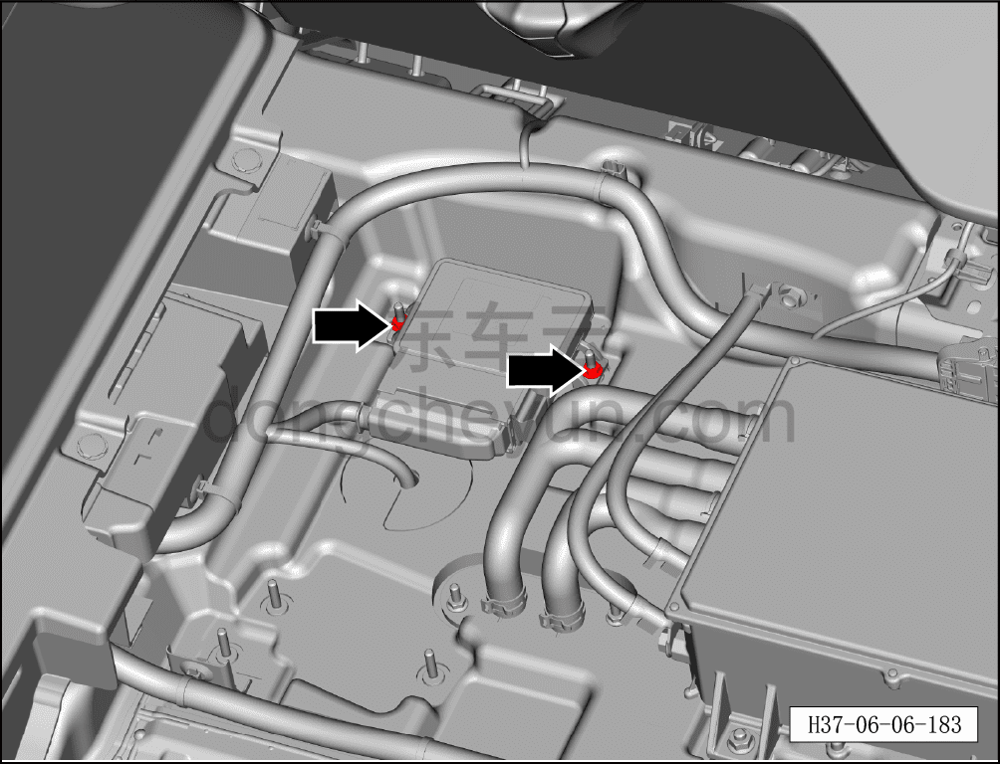
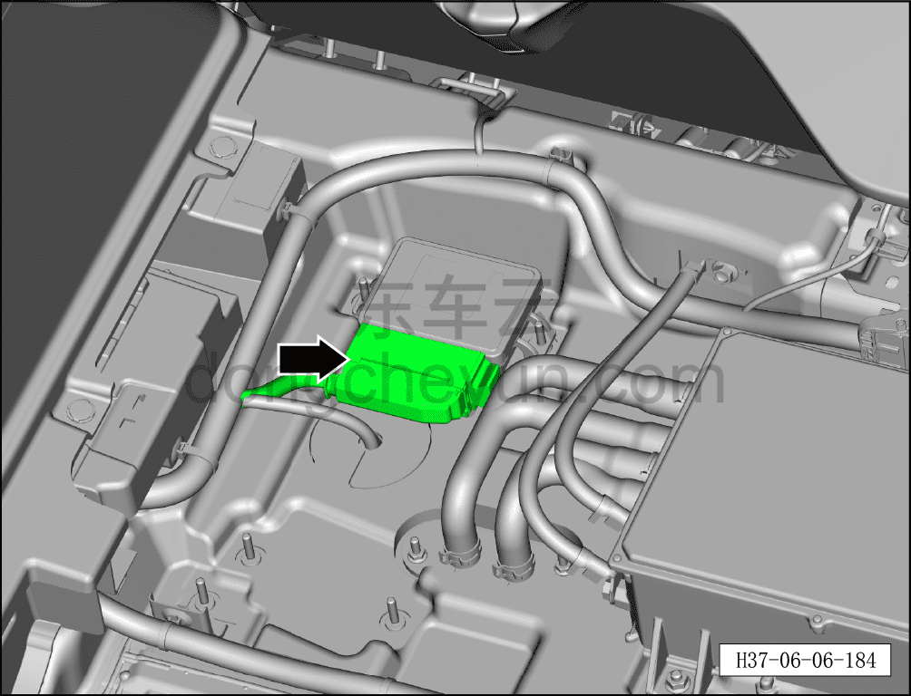
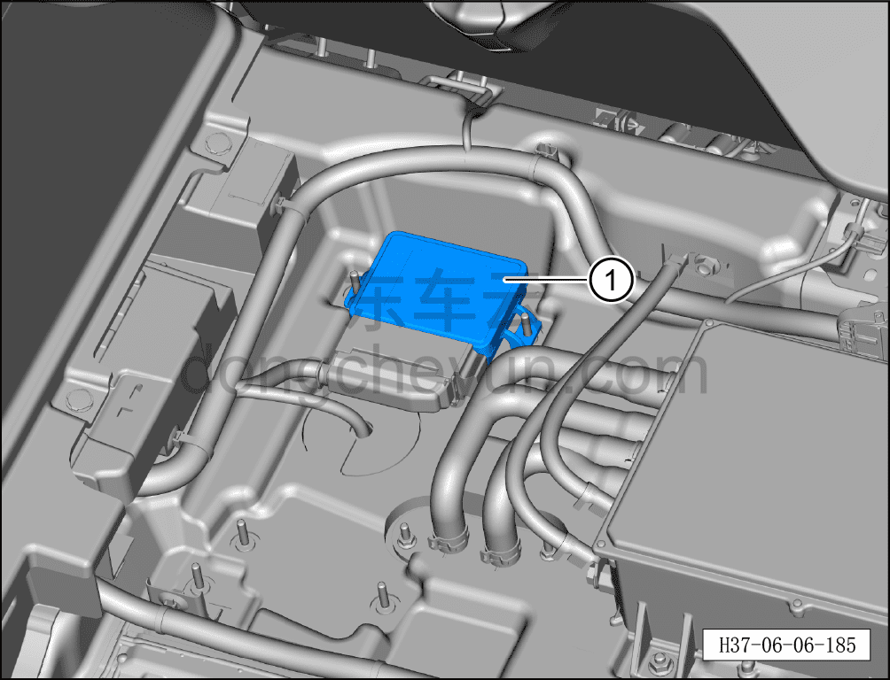

# Снятие и установка контроллера EPB

> Система шасси › Тормозная система › Тормозной суппорт  
> Оригинал: `拆卸与安装EPB控制器` · [dongcheyun 56746](https://dongcheyun.com/p/56746), страница `f3ae33e2f8fc41839078104b46e50147` · [оглавление](../README.md)

**Порядок снятия**

1. Выключите все электроприборы, отключите питание.

2. Выполните обесточивание автомобиля для ремонта. См. [3.1.4.1 Обесточивание автомобиля](../03-техническое-обслуживание/005-обесточивание-автомобиля.md)

3. Снимите крышку багажника. См. [8.5.8.2 Снятие и установка крышки багажника](../08-внутренняя-и-внешняя-отделка/147-снятие-и-установка-крышки-пола-багажника.md)

4. Снимите контроллер EPB.

a. Используя торцевую головку на 10 мм, отверните 2 крепёжные гайки контроллера EPB.

b. Отсоедините разъём контроллера EPB.

c. Извлеките контроллер EPB ①.

**Порядок установки**

Установка выполняется в обратном порядке.

**Внимание:**

**- Перед установкой контроллера EPB проверьте его на повреждения и искривление контактов; при их наличии немедленно замените контроллер EPB на новый.**

**- После завершения установки необходимо выполнить проверку сборки контроллера EPB.**
