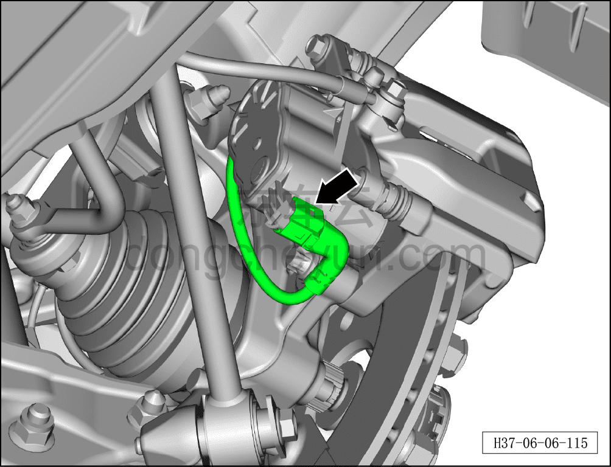
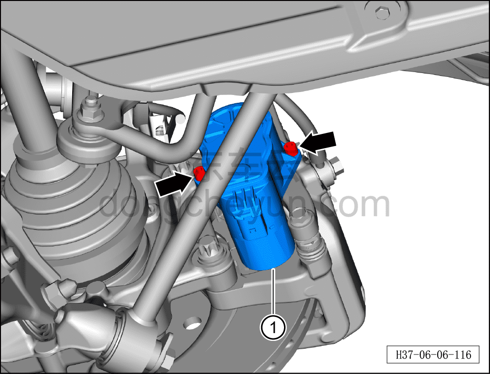
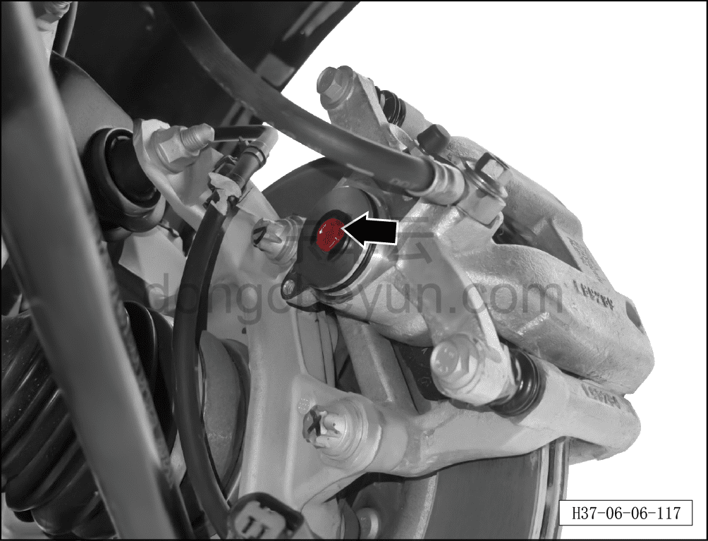

# Ручная разблокировка стояночного тормоза

> Система шасси › Тормозная система › Тормозной суппорт  
> Оригинал: `手动解锁驻车制动` · [dongcheyun 56746](https://dongcheyun.com/p/56746), страница `ebaf5704d2e24ba9ae31febb632bc059` · [оглавление](../README.md)

**Порядок разблокировки**

1. Выключите все электроприборы, отключите питание.

2. Выполните операцию обесточивания автомобиля для ремонта. См. [3.1.4.1 Обесточивание автомобиля](../03-техническое-обслуживание/005-обесточивание-автомобиля.md)

3. Снимите заднее колесо. См. [6.5.8.1 Снятие и установка колеса](064-снятие-и-установка-колеса.md)

4. Выполните ручную разблокировку стояночного тормоза.

a. Отсоедините разъём жгута проводов датчика.

b. Используя торцевой шестигранный инструмент 1/4", отверните 2 крепёжных болта электродвигателя левого заднего тормозного суппорта.

Момент затяжки болта: 8–11 Н·м

c. Извлеките электродвигатель левого заднего тормозного суппорта ① из левого заднего тормозного суппорта.

**Примечание:**

**- Здесь описано снятие электродвигателя левого заднего тормозного суппорта, для правой стороны см. левую.**

d. Используя инструмент T50, ослабьте вращением по часовой стрелке болт разблокировки стояночного тормоза.
