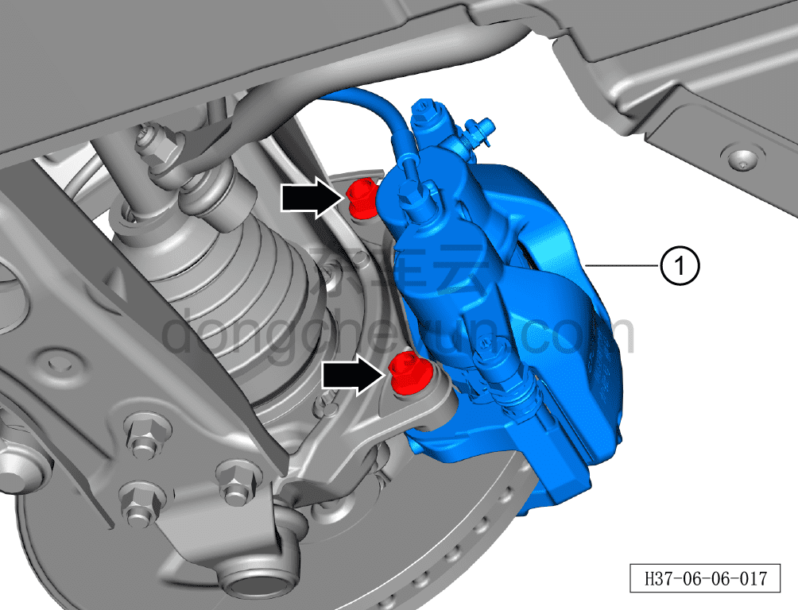
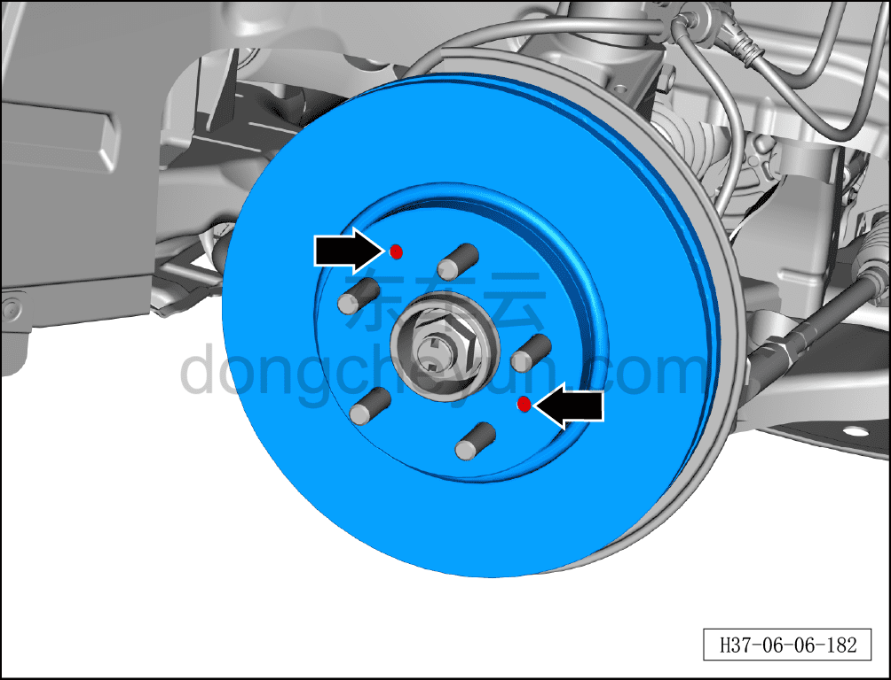
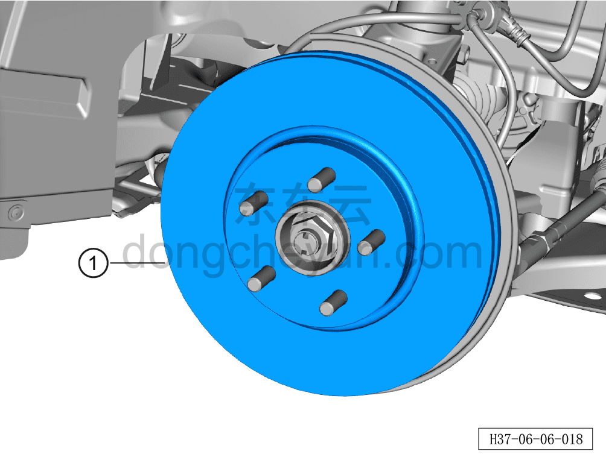

# Снятие и установка переднего тормозного диска

> Система шасси › Тормозная система › Тормозной диск  
> Оригинал: `拆卸与安装前制动盘` · [dongcheyun 56746](https://dongcheyun.com/p/56746), страница `5f0ee0adda0c43229748ab96276955d6` · [оглавление](../README.md)

**Порядок снятия**

**Примечание:**

**- Ниже описаны снятие и установка левого переднего тормозного диска, для правой стороны см. левую.**

1. Выключите все электроприборы, отключите питание.

2. Выполните обесточивание автомобиля для ремонта. См. [3.1.4.1 Обесточивание автомобиля](../03-техническое-обслуживание/005-обесточивание-автомобиля.md)

3. Снимите переднее колесо. См. [6.5.8.1 Снятие и установка колеса](064-снятие-и-установка-колеса.md)

4. Снимите передний тормозной диск.

a. Используя торцевую головку на 17 мм, отверните 2 крепёжных болта левого переднего тормозного суппорта.

Момент затяжки болта: 120 Н·м + 45°

b. Снимите левый передний тормозной суппорт ① с переднего тормозного диска.

**Примечание:**

**- При замене тормозного диска не требуется отворачивать соединительный болт тормозного шланга с суппортом.**

**- После снятия тормозного суппорта в сборе подвесьте его на проволоке в месте, не мешающем демонтажу и не создающем натяжения тормозного шланга.**

c. Используя биту TX30, отверните 2 крепёжных винта переднего тормозного диска.

d. Снимите передний тормозной диск ①.

**Внимание:**

**- Если на тормозном диске есть коррозия, это может привести к его прилипанию к ступичному подшипнику; при снятии поворачивайте диск и одновременно постукивайте по нему резиновым молотком до тех пор, пока диск не снимется.**

**Порядок установки**

Установка выполняется в обратном порядке.

**Внимание:**

**- Строго в соответствии с требованиями производителя измерьте штангенциркулем толщину тормозной колодки; если она меньше нормативного значения, необходимо заменить пару колодок.**

**- Измерьте штангенциркулем толщину тормозного диска и по нормативному значению рассчитайте величину износа; если величина износа достигает или превышает нормативное значение, необходимо заменить пару тормозных дисков на новые.**

**- После установки тормозного диска на автомобиль необходимо измерить индикатором биение тормозного диска и проверить его плоскостность. Если значения не соответствуют нормативному диапазону, необходимо заменить пару тормозных дисков на новые.**

**- Биение тормозного диска составляет 0,02 мм, биение после сборки тормозного механизма в сборе — 0,05 мм.**

**- После завершения установки необходимо выполнить развал-схождение.**

**- Необходимо провести дорожное испытание, проверить эффективность торможения, правильность установки и убедиться в отсутствии посторонних шумов ходовой части и уводов автомобиля.**
