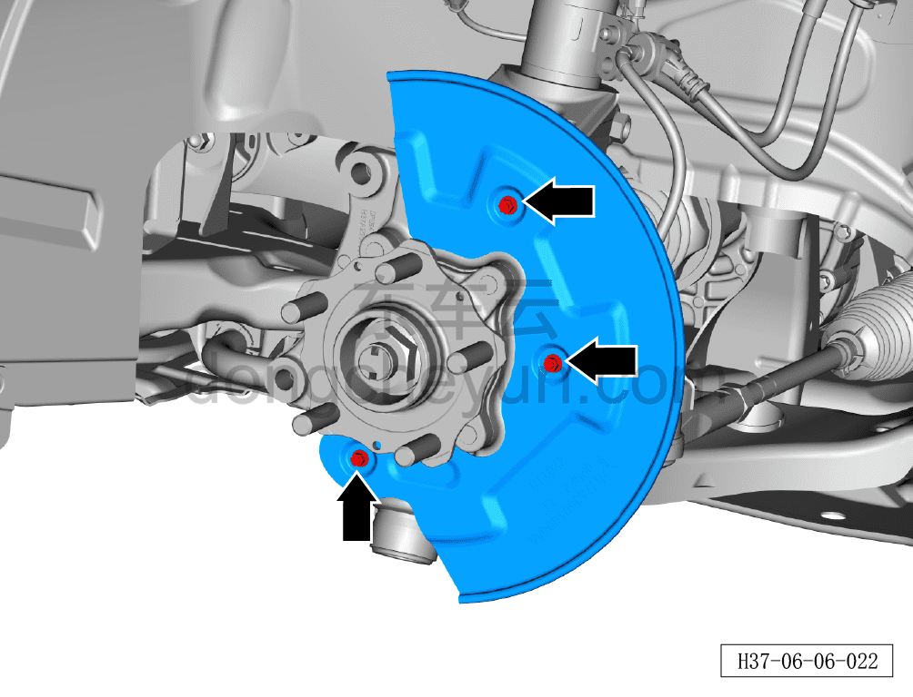

# Снятие и установка защитного кожуха переднего тормозного диска

> Система шасси › Тормозная система › Тормозной диск  
> Оригинал: `拆卸与安装前制动盘保护罩` · [dongcheyun 56746](https://dongcheyun.com/p/56746), страница `eba9de80ac1c439680f81304ffc2815f` · [оглавление](../README.md)

**Порядок снятия**

**Примечание:**

**- Ниже описаны снятие и установка левого защитного кожуха переднего тормозного диска, для снятия и установки правого защитного кожуха переднего тормозного диска см. левую сторону.**

1. Снимите переднее колесо. См. [6.5.8.1 Снятие и установка колеса](064-снятие-и-установка-колеса.md)

2. Снимите передний тормозной диск. См. [6.6.7.1 Снятие и установка переднего тормозного диска](084-снятие-и-установка-переднего-тормозного-диска.md)

3. Снимите защитный кожух переднего тормозного диска.

a. Используя торцевую головку на 8 мм, отверните 3 крепёжных болта защитного кожуха переднего тормозного диска.

Момент затяжки болта A: 8±1 Н·м.

b. Снимите защитный кожух переднего тормозного диска ①.

**Порядок установки**

Установка выполняется в обратном порядке.

**Внимание:**

**- После завершения установки необходимо выполнить развал-схождение;**

**- Необходимо провести дорожное испытание, проверить правильность установки и убедиться в отсутствии посторонних шумов ходовой части и уводов автомобиля.**
