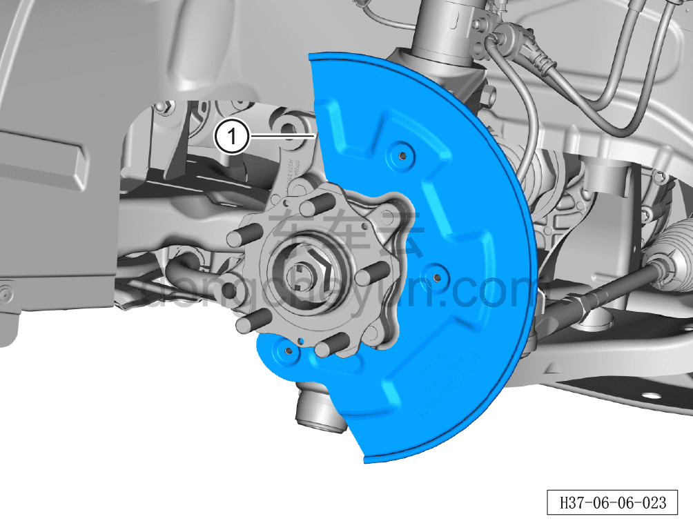

# Снятие и установка защитного кожуха заднего тормозного диска

> Система шасси › Тормозная система › Тормозной диск  
> Оригинал: `拆卸与安装后制动盘保护罩` · [dongcheyun 56746](https://dongcheyun.com/p/56746), страница `19b778a4bba34fada15861e5c1cf3502` · [оглавление](../README.md)

**Порядок снятия**

**Примечание:**

**- Ниже описаны снятие и установка левого защитного кожуха заднего тормозного диска, для правой стороны см. левую.**

1. Снимите заднее колесо. См. [6.5.8.1 Снятие и установка колеса](064-снятие-и-установка-колеса.md)

2. Снимите задний тормозной диск. См. [6.6.7.2 Снятие и установка заднего тормозного диска](085-снятие-и-установка-заднего-тормозного-диска.md)

3. Снимите защитный кожух заднего тормозного диска.

a. Используя торцевую головку на 8 мм, отверните 3 крепёжных болта защитного кожуха заднего тормозного диска.

Момент затяжки болта: 8±1 Н·м

b. Снимите защитный кожух заднего тормозного диска ①.

**Порядок установки**

Установка выполняется в обратном порядке.

**Внимание:**

**- После завершения установки необходимо выполнить развал-схождение;**

**- Необходимо провести дорожное испытание, проверить правильность установки и убедиться в отсутствии посторонних шумов ходовой части и уводов автомобиля.**
