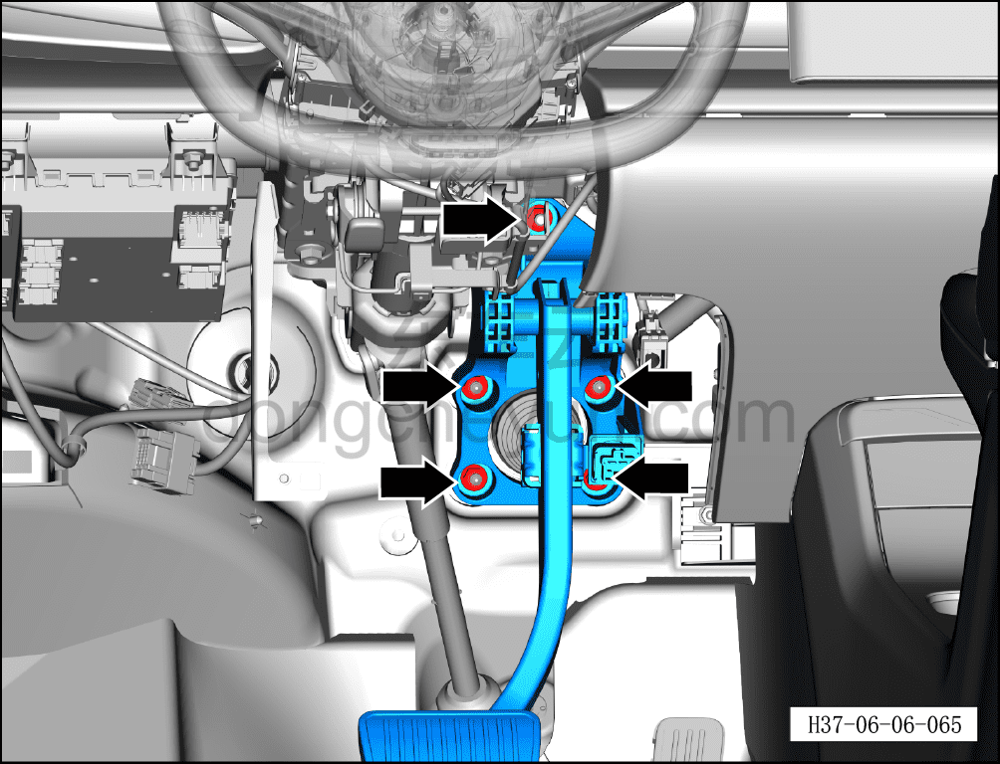
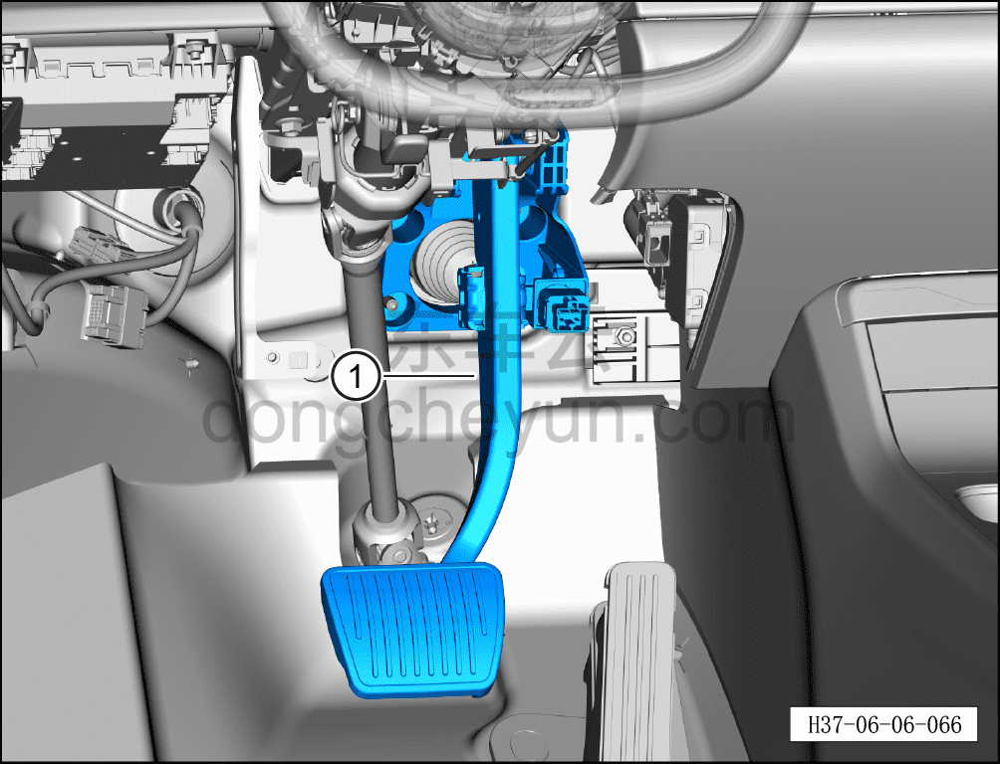

# Снятие и установка педали тормоза

> Система шасси › Тормозная система › Педаль тормоза в сборе  
> Оригинал: `拆卸与安装制动踏板` · [dongcheyun 56746](https://dongcheyun.com/p/56746), страница `167a688211a143b5b7bcaf6b88c01296` · [оглавление](../README.md)

**Порядок снятия**

**Внимание:**

**- Не допускается укладывать ковровое покрытие — оно сокращает ход педали тормоза.**

1. Выключите все электроприборы, отключите питание.

2. Выполните обесточивание автомобиля для ремонта. См. [3.1.4.1 Обесточивание автомобиля](../03-техническое-обслуживание/005-обесточивание-автомобиля.md)

3. Снимите левую нижнюю защитную панель в сборе. См. [8.2.4.2 Снятие и установка левой нижней защитной панели в сборе](../08-внутренняя-и-внешняя-отделка/055-снятие-и-установка-нижней-левой-защитной-накладки-в.md)

4. Снимите педаль тормоза.

a. Отсоедините разъём жгута проводов педали тормоза.

b. Нажмите и отсоедините стопорный штифт соединения педали тормоза с интегрированным интеллектуальным блоком управления тормозами.

c. Используя торцевую головку на 13 мм, отверните 5 крепёжных гаек педали тормоза.

Момент затяжки гайки: 23±3 Н·м

d. Извлеките педаль тормоза ①.

**Порядок установки**

Установка выполняется в обратном порядке.

**Внимание:**

**- Необходимо провести дорожное испытание, проверить эффективность торможения, правильность установки и убедиться в отсутствии посторонних шумов ходовой части и уводов автомобиля.**
