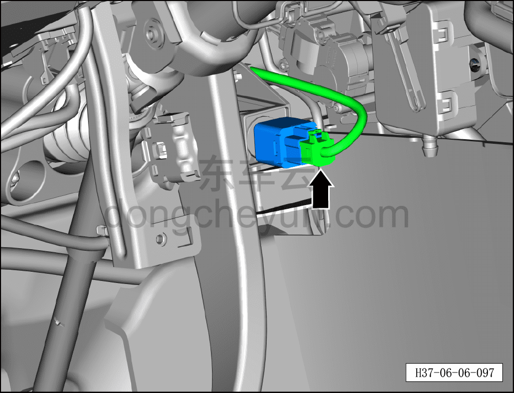
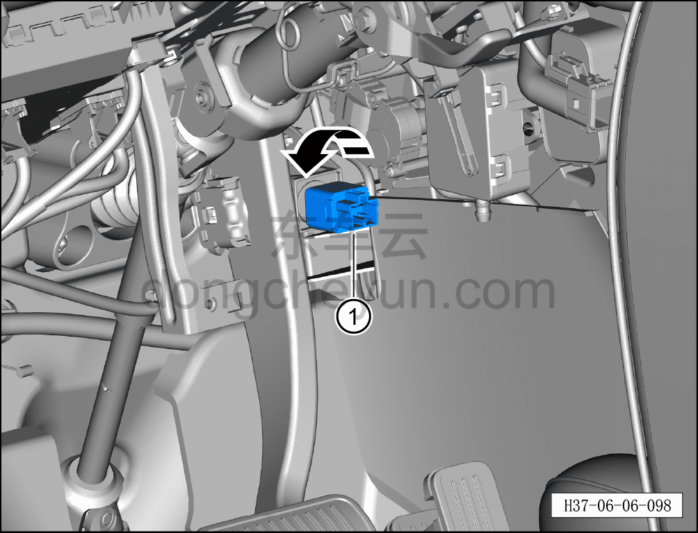

# Снятие и установка выключателя стоп-сигнала

> Система шасси › Тормозная система › Педаль тормоза в сборе  
> Оригинал: `拆卸与安装制动开关` · [dongcheyun 56746](https://dongcheyun.com/p/56746), страница `3fbd5771e256438f85c2008d6bbd4476` · [оглавление](../README.md)

**Порядок снятия**

1. Выключите все электроприборы, отключите питание.

2. Выполните обесточивание автомобиля для ремонта. См. [3.1.4.1 Обесточивание автомобиля](../03-техническое-обслуживание/005-обесточивание-автомобиля.md)

3. Снимите левую нижнюю защитную панель в сборе. См. [8.2.4.2 Снятие и установка левой нижней защитной панели в сборе](../08-внутренняя-и-внешняя-отделка/055-снятие-и-установка-нижней-левой-защитной-накладки-в.md)

4. Снимите выключатель стоп-сигнала.

a. Отсоедините разъём жгута проводов выключателя стоп-сигнала.

**Внимание:**

**- В процессе снятия запрещается нажимать на педаль тормоза.**

b. Отверните выключатель стоп-сигнала ① против часовой стрелки.

**Внимание:**

**- С помощью мультиметра проверьте выключатель стоп-сигнала на повреждения; при их наличии замените его на новый.**

**- Перед установкой проверьте, свободно ли перемещается толкатель выключателя стоп-сигнала; при явном заклинивании установка не допускается.**

**Порядок установки**

Установка выполняется в обратном порядке.

**Внимание:**

**- После завершения установки нажмите на педаль тормоза и убедитесь, что стоп-сигналы загораются нормально.**
