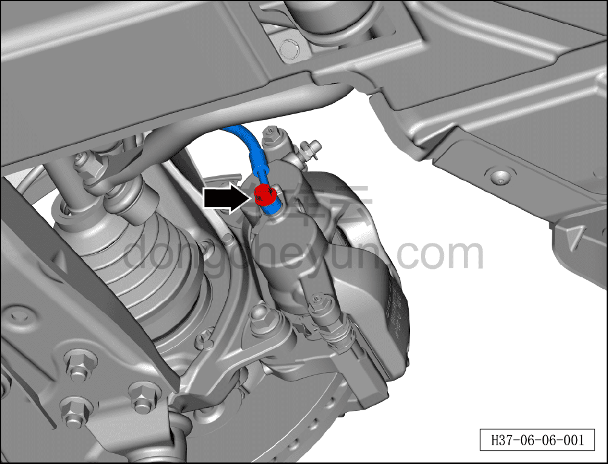
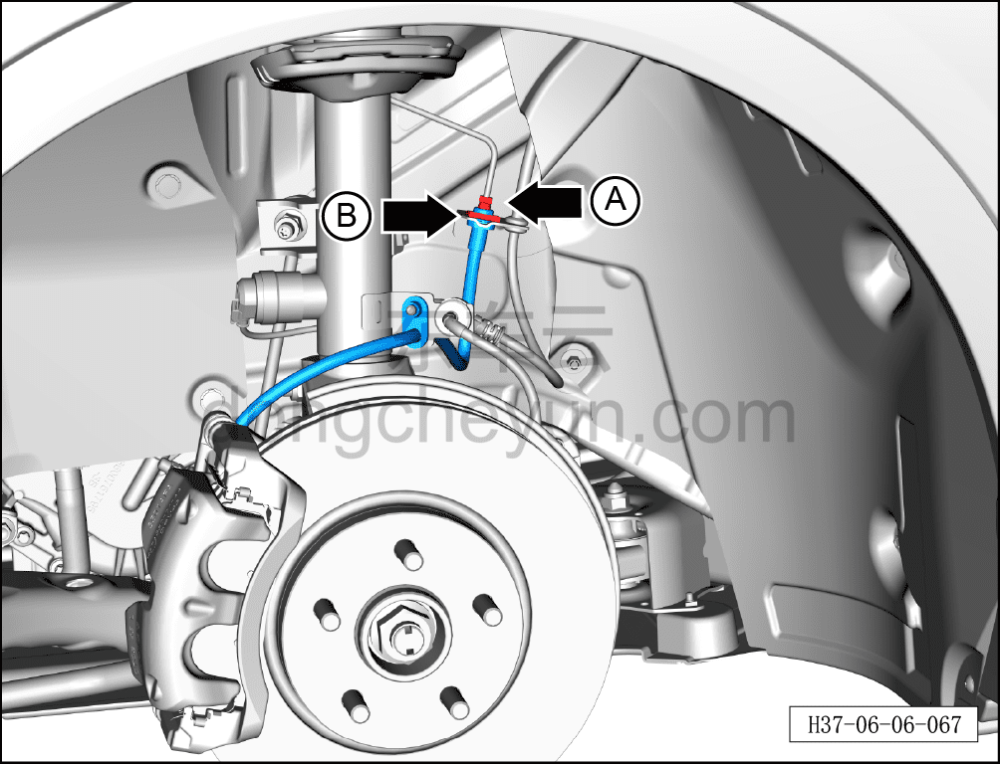
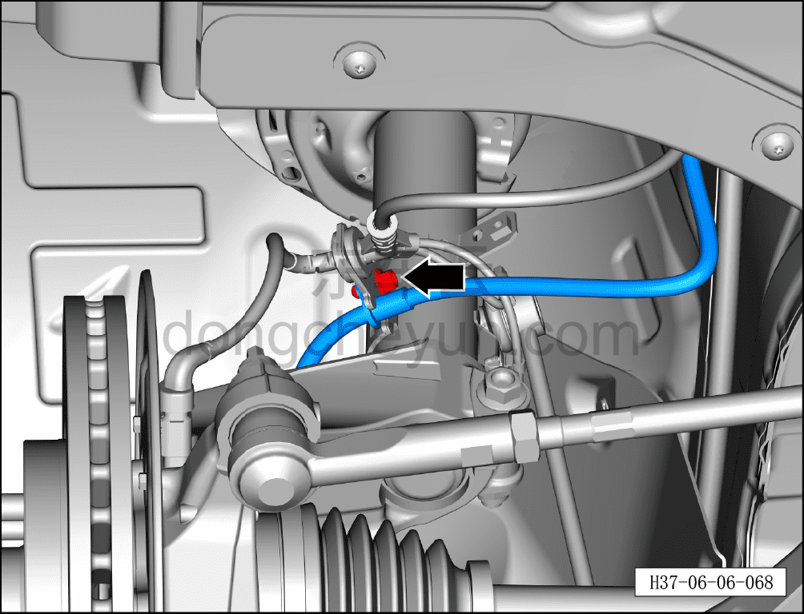
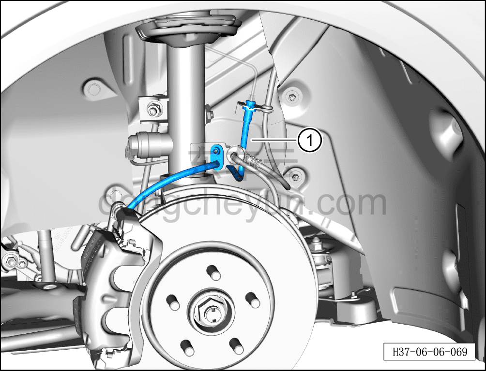

# Снятие и установка левого переднего тормозного шланга

> Система шасси › Тормозная система › Тормозной шланг  
> Оригинал: `拆卸与安装左前制动软管` · [dongcheyun 56746](https://dongcheyun.com/p/56746), страница `c0742cf128ff4981973c7886540f1f58` · [оглавление](../README.md)

**Порядок снятия**

**Внимание:**

**- Ниже описаны снятие и установка левого переднего тормозного шланга, для правой стороны см. левую.**

1. Выключите все электроприборы, отключите питание.

2. Выполните обесточивание автомобиля для ремонта. См. [3.1.4.1 Обесточивание автомобиля](../03-техническое-обслуживание/005-обесточивание-автомобиля.md)

3. Снимите переднее колесо. См. [6.5.8.1 Снятие и установка колеса](064-снятие-и-установка-колеса.md)

4. Слейте тормозную жидкость. См. [3.1.5.3 Замена тормозной жидкости](../03-техническое-обслуживание/008-замена-тормозной-жидкости.md)

5. Снимите левый передний тормозной шланг.

a. Используя торцевую головку на 12 мм, отверните соединительный болт левого переднего тормозного шланга и отсоедините левый передний тормозной шланг.

Момент затяжки болта: 35±2 Н·м

**Внимание:**

**- Подложите ветошь непосредственно под соединение шланга.**

**- Тормозная жидкость токсична и обладает коррозионным действием, не допускайте её контакта с лакокрасочным покрытием кузова.**

**- После каждого снятия уплотнительного кольца маслопровода тормозного суппорта его необходимо заменить на новое, иначе использование старого кольца может привести к утечке жидкости и серьёзной аварии.**

b. Используя гаечный ключ на 11 мм, отверните крепёжную гайку A тормозной трубки (от интегрированного интеллектуального блока управления тормозами до левого переднего тормозного шланга).

Момент затяжки гайки: 30±2 Н·м

c. Извлеките стопорное кольцо E-типа B.

Момент затяжки гайки: 30±2 Н·м

d. Используя торцевую головку на 10 мм, отверните крепёжный болт левого переднего тормозного шланга.

e. Извлеките левый передний тормозной шланг ①.

**Порядок установки**

Установка выполняется в обратном порядке.

**Внимание:**

**- После завершения установки необходимо несколько раз нажать на педаль тормоза и убедиться в надёжности торможения.**

**- Проверьте шланг и соединения трубопроводов на отсутствие утечек, при необходимости подтяните их.**

**- При каждой установке тормозного суппорта в сборе или тормозного шланга обязательно расправьте тормозной шланг, убедившись, что он имеет естественный изгиб.**

**- Необходимо провести дорожное испытание, проверить эффективность торможения, правильность установки и убедиться в отсутствии посторонних шумов ходовой части и уводов автомобиля.**
