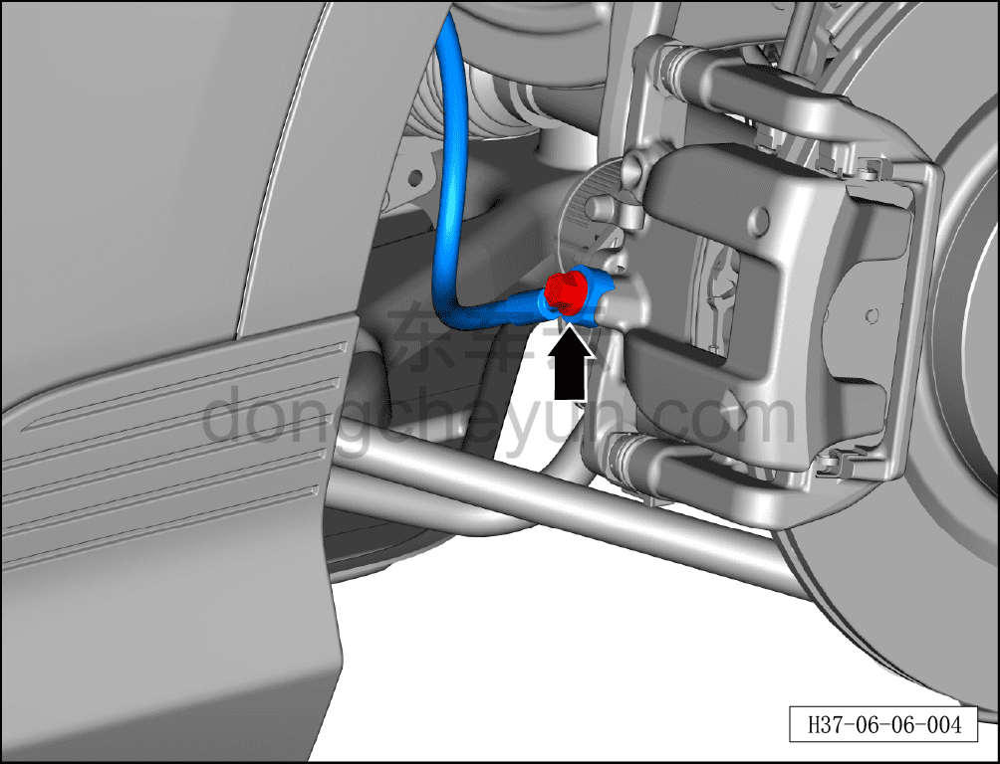
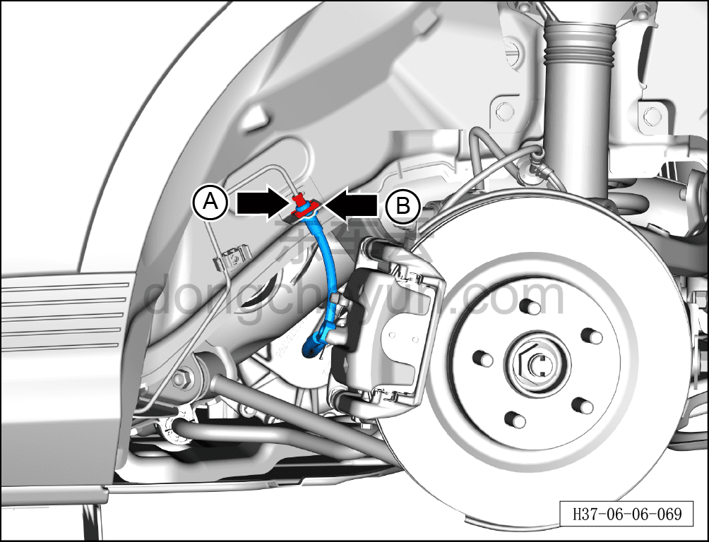
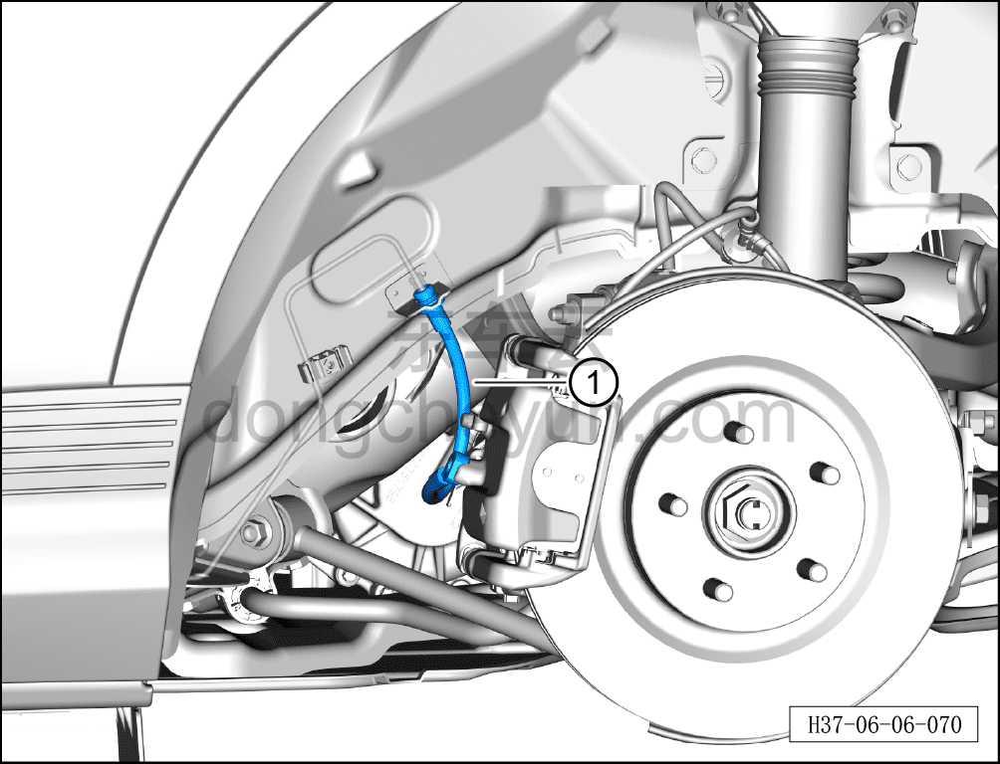

# Снятие и установка левого заднего тормозного шланга

> Система шасси › Тормозная система › Тормозной шланг  
> Оригинал: `拆卸与安装左后制动软管` · [dongcheyun 56746](https://dongcheyun.com/p/56746), страница `109e42576ec945bda76130e6bfb5d8b7` · [оглавление](../README.md)

**Порядок снятия**

**Внимание:**

**- Ниже описаны снятие и установка левого заднего тормозного шланга, для правой стороны см. левую.**

1. Выключите все электроприборы, отключите питание.

2. Выполните обесточивание автомобиля для ремонта. См. [3.1.4.1 Обесточивание автомобиля](../03-техническое-обслуживание/005-обесточивание-автомобиля.md)

3. Снимите левое заднее колесо. См. [6.5.8.1 Снятие и установка колеса](064-снятие-и-установка-колеса.md)

4. Слейте тормозную жидкость. См. [3.1.5.3 Замена тормозной жидкости](../03-техническое-обслуживание/008-замена-тормозной-жидкости.md)

5. Снимите левый задний тормозной шланг.

a. Используя торцевую головку на 12 мм, отверните соединительный болт левого заднего тормозного шланга и отсоедините левый задний тормозной шланг.

Момент затяжки болта: 35±2 Н·м

**Внимание:**

**- Подложите ветошь непосредственно под соединение шланга.**

**- Тормозная жидкость токсична и обладает коррозионным действием, не допускайте её контакта с лакокрасочным покрытием кузова.**

**- После каждого снятия уплотнительного кольца маслопровода тормозного суппорта его необходимо заменить на новое, иначе использование старого кольца может привести к утечке жидкости и серьёзной аварии.**

b. Используя гаечный ключ на 11 мм, отверните крепёжную гайку A тормозной трубки (от четырёхходового соединителя до левого заднего шланга).

Момент затяжки гайки A: 16±1 Н·м

c. Извлеките стопорное кольцо E-типа B.

d. Извлеките левый задний тормозной шланг ①.

**Порядок установки**

Установка выполняется в обратном порядке.

**Внимание:**

**- Проверьте уровень тормозной жидкости, при необходимости долейте. См. [3.1.5.3 Замена тормозной жидкости](../03-техническое-обслуживание/008-замена-тормозной-жидкости.md)**

**- После завершения установки прокачайте тормозную систему. См. [3.1.5.3 Замена тормозной жидкости](../03-техническое-обслуживание/008-замена-тормозной-жидкости.md)**

**- Отработанную жидкость собирайте и утилизируйте централизованно.**

**- Необходимо провести дорожное испытание, проверить эффективность торможения, правильность установки и убедиться в отсутствии посторонних шумов ходовой части и уводов автомобиля.**
