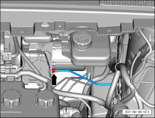
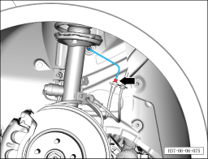
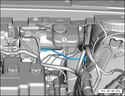

# Снятие и установка тормозной трубки (от интегрированного интеллектуального блока управления тормозами до левого переднего тормозного шланга)

> Система шасси › Тормозная система › Тормозная трубка  
> Оригинал: `拆卸与安装制动管路（智能集成制动控制单元至左前制动软管）` · [dongcheyun 56746](https://dongcheyun.com/p/56746), страница `e975079f75ec460e90d9b60c1d3800ec` · [оглавление](../README.md)

**Порядок снятия**

1. Выключите все электроприборы, отключите питание.

2. Выполните обесточивание автомобиля для ремонта. См. [3.1.4.1 Обесточивание автомобиля](../03-техническое-обслуживание/005-обесточивание-автомобиля.md)

3. Снимите левое переднее колесо. См. [6.5.8.1 Снятие и установка колеса](064-снятие-и-установка-колеса.md)

4. Слейте тормозную жидкость. См. [3.1.5.3 Замена тормозной жидкости](../03-техническое-обслуживание/008-замена-тормозной-жидкости.md)

5. Снимите тормозную трубку (от интегрированного интеллектуального блока управления тормозами до левого переднего тормозного шланга).

a. Используя гаечный ключ на 11 мм, отверните крепёжный болт тормозной трубки (от интегрированного интеллектуального блока управления тормозами до левого переднего тормозного шланга).

Момент затяжки болта: 16±1 Н·м

b. Используя гаечный ключ на 11 мм, отверните крепёжный болт тормозной трубки (от интегрированного интеллектуального блока управления тормозами до левого переднего тормозного шланга).

Момент затяжки болта: 16±1 Н·м

c. Извлеките тормозную трубку (от интегрированного интеллектуального блока управления тормозами до левого переднего тормозного шланга) ①.

**Порядок установки**

Установка выполняется в обратном порядке.

**Внимание:**

**- Проверьте уровень тормозной жидкости, при необходимости долейте. См. [3.1.5.3 Замена тормозной жидкости](../03-техническое-обслуживание/008-замена-тормозной-жидкости.md)**

**- После завершения установки прокачайте тормозную систему. См. [3.1.5.3 Замена тормозной жидкости](../03-техническое-обслуживание/008-замена-тормозной-жидкости.md)**

**- Отработанную жидкость собирайте и утилизируйте централизованно.**

**- Необходимо провести дорожное испытание, проверить эффективность торможения, правильность установки и убедиться в отсутствии посторонних шумов ходовой части и уводов автомобиля.**
