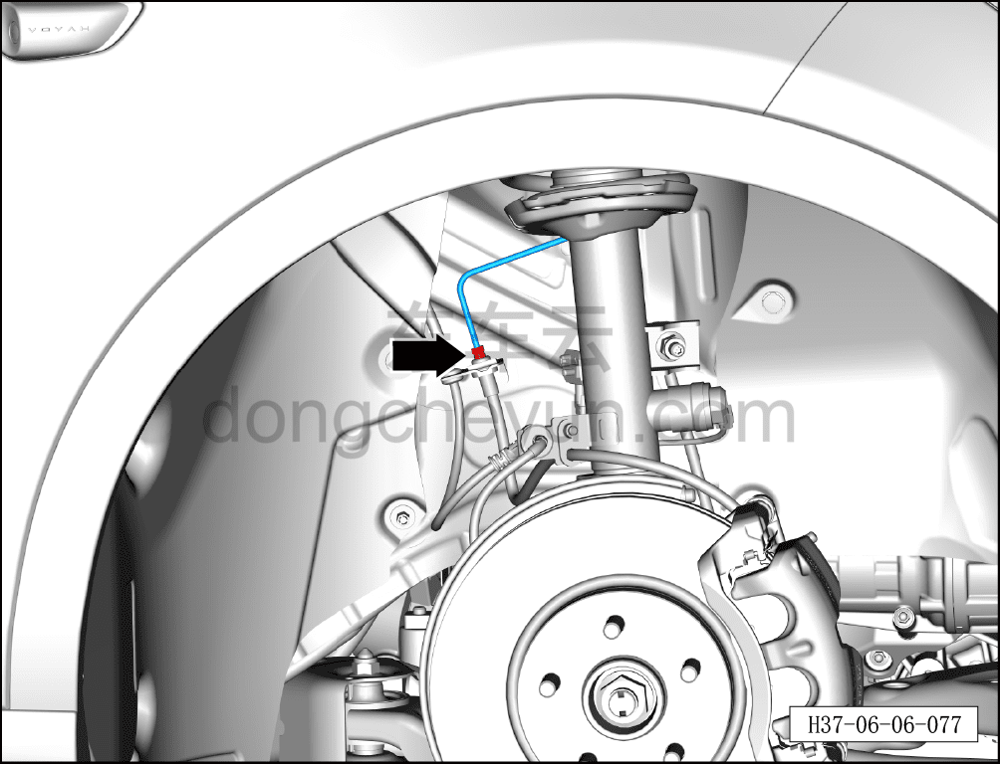
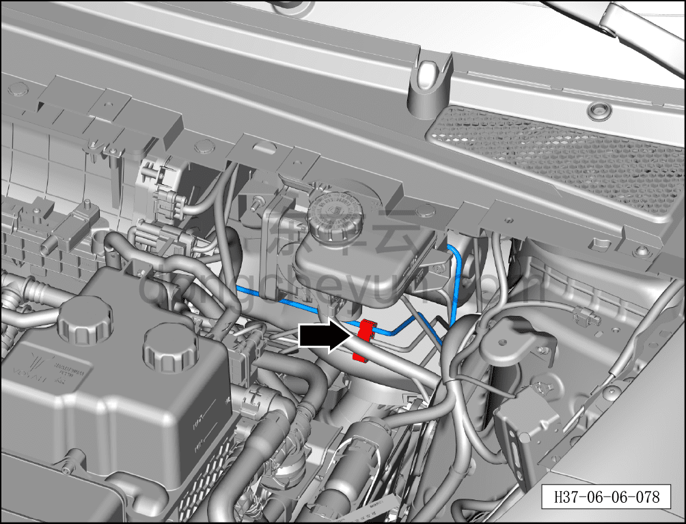
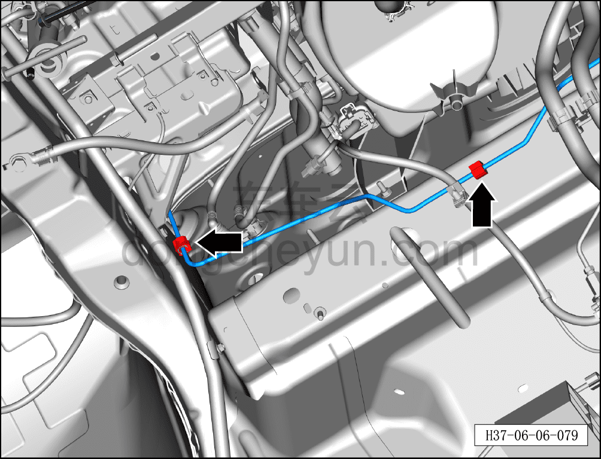
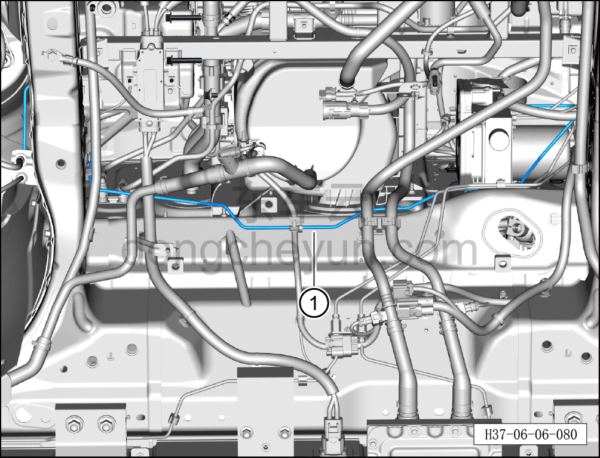

# Снятие и установка тормозной трубки (от интегрированного интеллектуального блока управления тормозами до правого переднего тормозного шланга)

> Система шасси › Тормозная система › Тормозная трубка  
> Оригинал: `拆卸与安装制动管路（智能集成制动控制单元至右前制动软管）` · [dongcheyun 56746](https://dongcheyun.com/p/56746), страница `fccaa6cde392407f9da3c1daf54d60a2` · [оглавление](../README.md)

**Порядок снятия**

1. Выключите все электроприборы, отключите питание.

2. Откройте капот.

3. Выполните операцию обесточивания автомобиля для ремонта. См. [3.1.4.1 Обесточивание автомобиля](../03-техническое-обслуживание/005-обесточивание-автомобиля.md)

4. Слейте тормозную жидкость. См. [3.1.5.3 Замена тормозной жидкости](../03-техническое-обслуживание/008-замена-тормозной-жидкости.md)

5. Поднимите автомобиль на подъёмнике на соответствующую высоту.

6. Снимите правое переднее колесо. См. [6.5.8.1 Снятие и установка колеса](064-снятие-и-установка-колеса.md)

7. Снимите передний подрамник и передний тяговый электродвигатель в сборе. См. [6.2.9.1 Снятие и установка переднего подрамника и переднего тягового электродвигателя в сборе (полный привод)](022-снятие-и-установка-переднего-подрамника-и-переднего.md)

8. Снимите крепёжный болт соединения тормозной трубки (от интегрированного интеллектуального блока управления тормозами до правого переднего тормозного шланга) с интегрированным интеллектуальным блоком управления тормозами. См. [6.7.7.3 Снятие и установка интегрированного интеллектуального блока управления тормозами](108-снятие-и-установка-интегрированного-интеллектуального.md)

9. Снимите тормозную трубку (от интегрированного интеллектуального блока управления тормозами до правого переднего тормозного шланга)

a. Используя гаечный ключ на 11 мм, отверните крепёжный болт соединения тормозной трубки (от интегрированного интеллектуального блока управления тормозами до правого переднего тормозного шланга) с тормозным шлангом.

Момент затяжки болта: 16±1 Н·м

b. Отсоедините тормозную трубку (от интегрированного интеллектуального блока управления тормозами до правого переднего тормозного шланга) от тройного зажима тормозных трубок.

c. Отсоедините тормозную трубку (от интегрированного интеллектуального блока управления тормозами до правого переднего тормозного шланга) от одинарного зажима тормозной трубки.

d. Извлеките тормозную трубку (от интегрированного интеллектуального блока управления тормозами до правого переднего тормозного шланга) ①.

**Порядок установки**

Установка выполняется в обратном порядке.

**Внимание:**

**- Проверьте уровень тормозной жидкости, при необходимости долейте. См. [3.1.5.3 Замена тормозной жидкости](../03-техническое-обслуживание/008-замена-тормозной-жидкости.md)**

**- После завершения установки прокачайте тормозную систему. См. [3.1.5.3 Замена тормозной жидкости](../03-техническое-обслуживание/008-замена-тормозной-жидкости.md)**

**- Отработанную жидкость собирайте и утилизируйте централизованно.**

**- Необходимо провести дорожное испытание, проверить эффективность торможения, правильность установки и убедиться в отсутствии посторонних шумов ходовой части и уводов автомобиля.**
