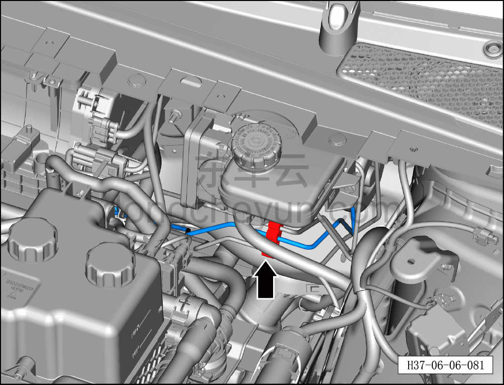
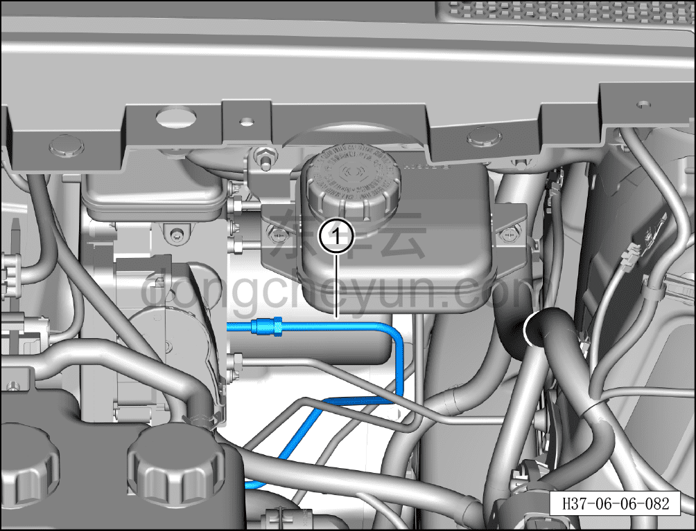

# Снятие и установка тормозной трубки (от интегрированного интеллектуального блока управления тормозами до четырёхходового соединителя 2)

> Система шасси › Тормозная система › Тормозная трубка  
> Оригинал: `拆卸与安装制动管路（智能集成制动控制单元至四通接头2）` · [dongcheyun 56746](https://dongcheyun.com/p/56746), страница `be4c6c6d6d4d40928849d87d9f5bc94e` · [оглавление](../README.md)

**Порядок снятия**

1. Выключите все электроприборы, отключите питание.

2. Откройте капот.

3. Выполните операцию обесточивания автомобиля для ремонта. См. [3.1.4.1 Обесточивание автомобиля](../03-техническое-обслуживание/005-обесточивание-автомобиля.md)

4. Слейте тормозную жидкость. См. [3.1.5.3 Замена тормозной жидкости](../03-техническое-обслуживание/008-замена-тормозной-жидкости.md)

5. Поднимите автомобиль на подъёмнике на соответствующую высоту.

6. Снимите крепёжный болт соединения тормозной трубки (от интегрированного интеллектуального блока управления тормозами до четырёхходового соединителя 2) с интегрированным интеллектуальным блоком управления тормозами. См. [6.7.7.3 Снятие и установка интегрированного интеллектуального блока управления тормозами](108-снятие-и-установка-интегрированного-интеллектуального.md)

7. Снимите крепёжный болт соединения тормозной трубки (от интегрированного интеллектуального блока управления тормозами до четырёхходового соединителя 2) с четырёхходовым соединителем. См. [6.6.10.7 Снятие и установка четырёхходового соединителя](098-снятие-и-установка-четырёхходового-соединителя.md)

8. Снимите тормозную трубку (от интегрированного интеллектуального блока управления тормозами до четырёхходового соединителя 2).

a. Отсоедините тормозную трубку (от интегрированного интеллектуального блока управления тормозами до четырёхходового соединителя 2) от тройного зажима тормозных трубок.

b. Извлеките тормозную трубку (от интегрированного интеллектуального блока управления тормозами до четырёхходового соединителя 2) ①.

**Порядок установки**

Установка выполняется в обратном порядке.

**Внимание:**

**- Проверьте уровень тормозной жидкости, при необходимости долейте. См. [3.1.5.3 Замена тормозной жидкости](../03-техническое-обслуживание/008-замена-тормозной-жидкости.md)**

**- После завершения установки прокачайте тормозную систему. См. [3.1.5.3 Замена тормозной жидкости](../03-техническое-обслуживание/008-замена-тормозной-жидкости.md)**

**- Отработанную жидкость собирайте и утилизируйте централизованно.**

**- Необходимо провести дорожное испытание, проверить эффективность торможения, правильность установки и убедиться в отсутствии посторонних шумов ходовой части и уводов автомобиля.**
