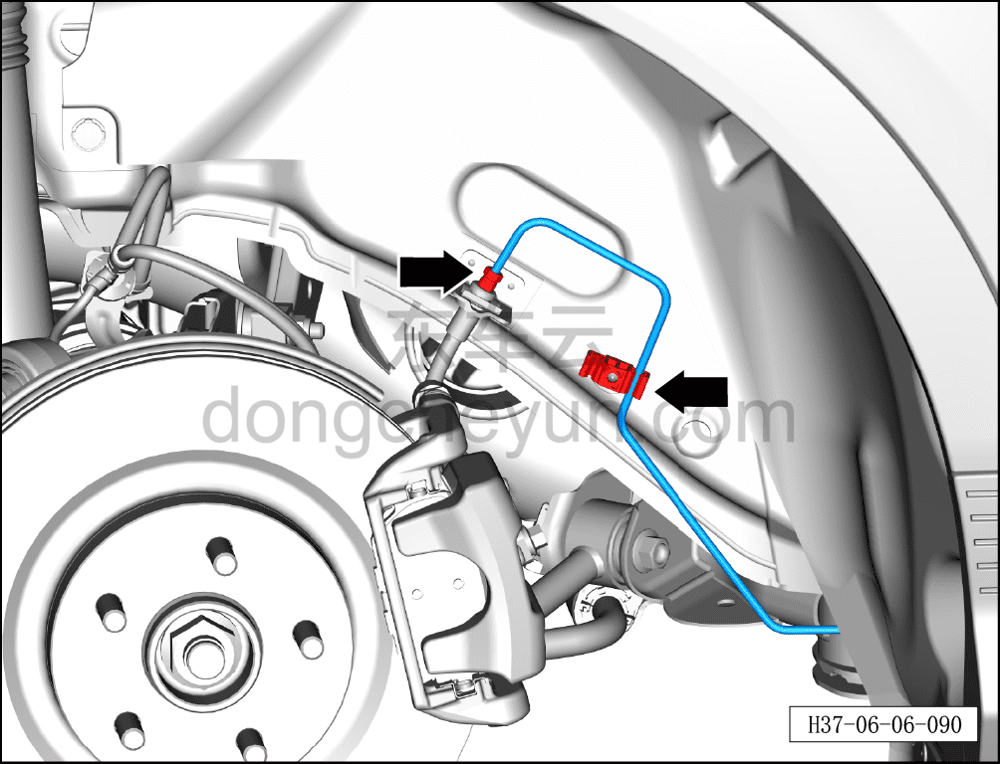
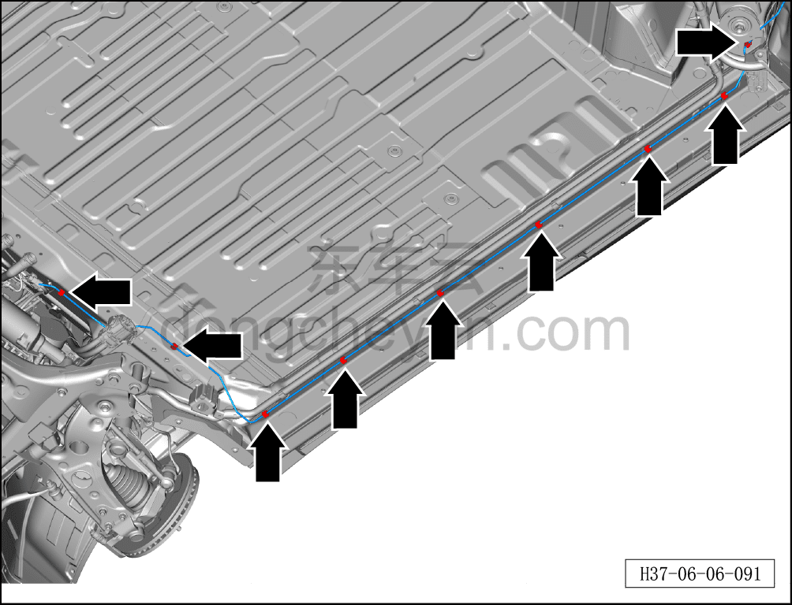
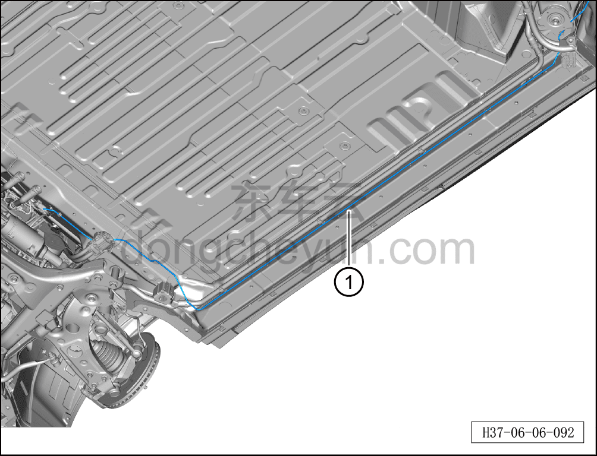

# Снятие и установка тормозной трубки (от четырёхходового соединителя до правого заднего шланга)

> Система шасси › Тормозная система › Тормозная трубка  
> Оригинал: `拆卸与安装制动管路（四通接头至右后软管）` · [dongcheyun 56746](https://dongcheyun.com/p/56746), страница `c032a539d0e0485ba6f41fb97e0a3abd` · [оглавление](../README.md)

**Порядок снятия**

1. Выключите все электроприборы, отключите питание.

2. Откройте капот.

3. Выполните операцию обесточивания автомобиля для ремонта. См.

4. Слейте тормозную жидкость. См. [3.1.5.3 Замена тормозной жидкости](../03-техническое-обслуживание/008-замена-тормозной-жидкости.md)

5. Поднимите автомобиль на подъёмнике на соответствующую высоту.

6. Снимите правое заднее колесо. См. [6.5.8.1 Снятие и установка колеса](064-снятие-и-установка-колеса.md)

7. Снимите блок тяговой батареи в сборе в зависимости от комплектации автомобиля. См. [5.1.6.1 Снятие и установка тяговой батареи (полный привод)](../05-силовая-система-на-новых-источниках/010-снятие-и-установка-тяговой-батареи-полный-привод.md), [5.1.6.2 Снятие и установка тяговой батареи (задний привод)](../05-силовая-система-на-новых-источниках/011-снятие-и-установка-тяговой-батареи-задний-привод.md) или [5.1.6.3 Снятие и установка тяговой батареи (800 В)](../05-силовая-система-на-новых-источниках/012-снятие-и-установка-тяговой-батареи-800-в.md)

8. Снимите крепёжный болт соединения тормозной трубки (от четырёхходового соединителя до правого заднего шланга) с четырёхходовым соединителем. См. [6.6.10.7 Снятие и установка четырёхходового соединителя](098-снятие-и-установка-четырёхходового-соединителя.md)

9. Снимите тормозную трубку (от четырёхходового соединителя до правого заднего шланга).

a. Используя гаечный ключ на 11 мм, отверните крепёжный болт соединения тормозной трубки (от четырёхходового соединителя до правого заднего шланга) с тормозным шлангом.

b. Отсоедините тормозную трубку (от четырёхходового соединителя до правого заднего шланга) от двойного зажима трубок.

Момент затяжки болта: 16±1 Н·м

c. Отсоедините тормозную трубку (от четырёхходового соединителя до правого заднего шланга) от 9 одинарных зажимов тормозных трубок.

d. Извлеките тормозную трубку (от четырёхходового соединителя до правого заднего шланга) ①.

**Порядок установки**

Установка выполняется в обратном порядке.

**Внимание:**

**- Проверьте уровень тормозной жидкости, при необходимости долейте.**

**- После завершения установки прокачайте тормозную систему. См. [3.1.5.3 Замена тормозной жидкости](../03-техническое-обслуживание/008-замена-тормозной-жидкости.md)**

**- Отработанную жидкость собирайте и утилизируйте централизованно.**

**- Необходимо провести дорожное испытание, проверить эффективность торможения, правильность установки и убедиться в отсутствии посторонних шумов ходовой части и уводов автомобиля.**
