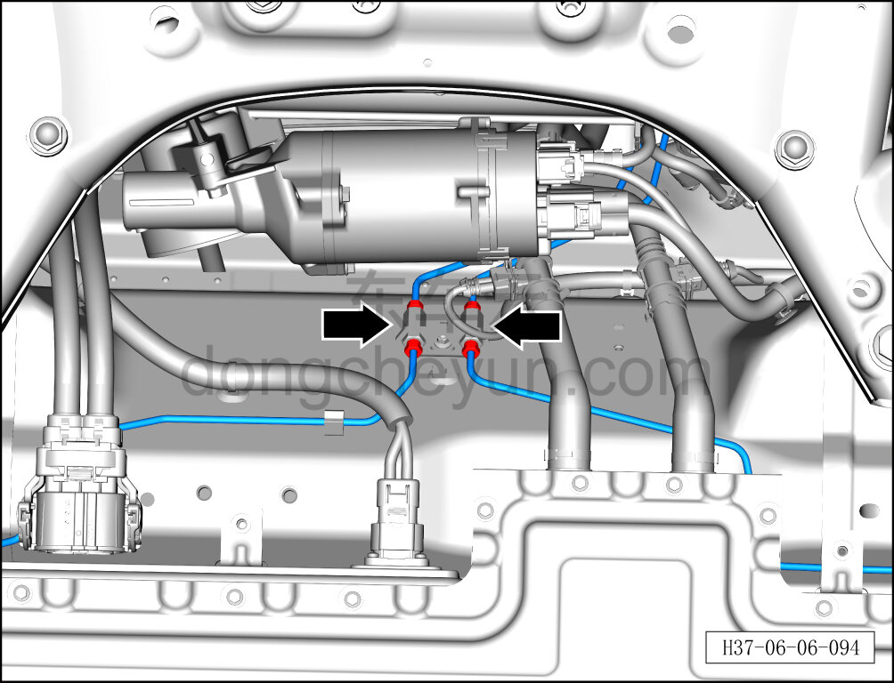
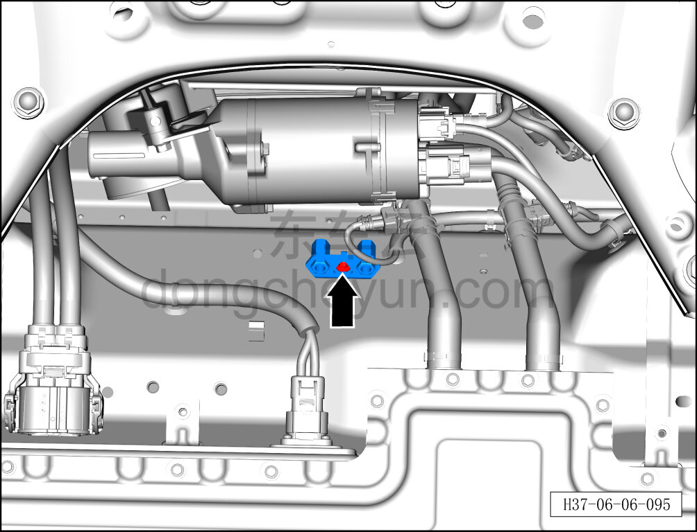
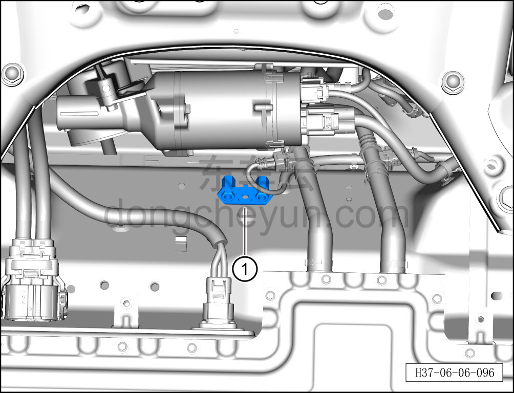

# Снятие и установка четырёхходового соединителя

> Система шасси › Тормозная система › Тормозная трубка  
> Оригинал: `拆卸与安装四通接头` · [dongcheyun 56746](https://dongcheyun.com/p/56746), страница `83a84e7b9e8f4996b478928fbcab6f8e` · [оглавление](../README.md)

**Порядок снятия**

1. Выключите все электроприборы, отключите питание.

2. Выполните обесточивание автомобиля для ремонта. См. [3.1.4.1 Обесточивание автомобиля](../03-техническое-обслуживание/005-обесточивание-автомобиля.md)

3. Слейте тормозную жидкость. См. [3.1.5.3 Замена тормозной жидкости](../03-техническое-обслуживание/008-замена-тормозной-жидкости.md)

4. Поднимите автомобиль на подъёмнике на подходящую высоту.

5. Снимите четырёхходовой соединитель.

a. Используя односторонний гаечный ключ на 11 мм, отверните 4 соединительных болта тормозных трубок и отсоедините 4 тормозные трубки.

Момент затяжки болта: 30±2 Н·м

**Внимание:**

**- Подложите ветошь непосредственно под соединение тормозной трубки.**

**- Тормозная жидкость токсична и обладает коррозионным действием, не допускайте её контакта с лакокрасочным покрытием кузова.**

b. Используя торцевую головку на 10 мм, отверните крепёжный болт четырёхходового соединителя.

Момент затяжки болта: 8±1 Н·м

c. Извлеките четырёхходовой соединитель ①.

**Порядок установки**

Установка выполняется в обратном порядке.

**Внимание:**

**- Проверьте уровень тормозной жидкости, при необходимости долейте. См. [3.1.5.3 Замена тормозной жидкости](../03-техническое-обслуживание/008-замена-тормозной-жидкости.md)**

**- После завершения установки прокачайте тормозную систему. См. [3.1.5.3 Замена тормозной жидкости](../03-техническое-обслуживание/008-замена-тормозной-жидкости.md)**

**- Отработанную жидкость собирайте и утилизируйте централизованно.**

**- Необходимо провести дорожное испытание, проверить эффективность торможения, правильность установки и убедиться в отсутствии посторонних шумов ходовой части и уводов автомобиля.**
