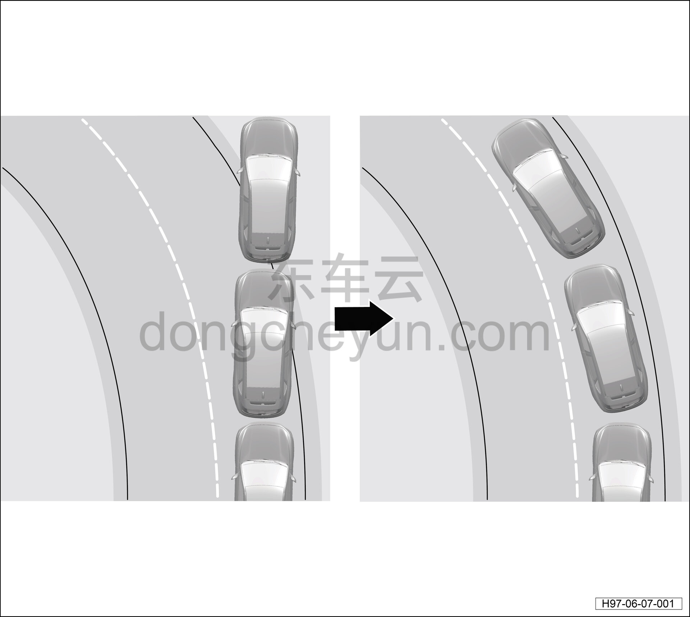
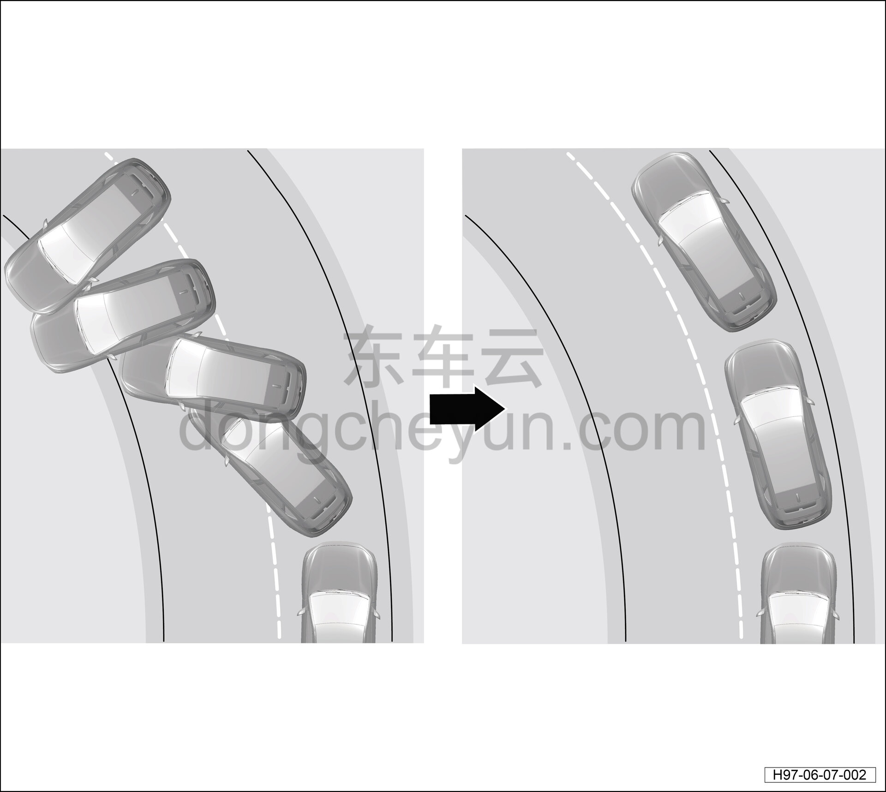

# Описание и принцип работы

> Система шасси › Электронные системы шасси  
> Оригинал: `描述和操作` · [dongcheyun 56746](https://dongcheyun.com/p/56746), страница `3e9e836ce4d34d2b99a0409b9b8a70df` · [оглавление](../README.md)

На данной модели применяется динамическая система электронного контроля устойчивости ESP, которая интегрирует систему антиблокировки тормозов (ABS), систему электронного контроля устойчивости (ESP), систему помощи при движении на склоне (HHC), систему гидравлического усиления торможения (HBA), систему контроля тяги (TCS), систему электронного распределения тормозных усилий (EBD).

Обзор системы антиблокировки тормозов

- Электронная система антиблокировки тормозов (ABS) является активным устройством безопасности; на английском языке называется Anti-lock Brake System, сокращённо: ABS.

- При торможении автомобиля, если передние колёса блокируются, автомобиль теряет способность к управлению; необходимые для объезда препятствий, пешеходов и движения в повороте рулевые манипуляции водителя во время торможения становятся невозможны; если блокируются задние колёса, устойчивость автомобиля при торможении снижается, и даже под воздействием небольшой боковой силы (например, бокового ветра) автомобиль может пойти в снос задней осью или даже развернуться, что представляет опасность. Кроме того, при блокировке колёс интенсивное локальное трение шины значительно сокращает срок её службы.

- Электронная система антиблокировки тормозов (ABS), установленная на автомобиле, дополняет штатную тормозную систему электронным устройством управления, функция которого заключается в автоматическом регулировании тормозного усилия на колёсах в процессе торможения автомобиля, предотвращении блокировки колёс и, таким образом, достижении оптимальной эффективности торможения, что значительно повышает безопасность движения.

Преимущества системы ABS

- Полностью реализует эффективность тормозного механизма, сокращая время и путь торможения.

- Эффективно предотвращает боковое скольжение и снос задней оси автомобиля при экстренном торможении, обеспечивая хорошую устойчивость движения.

- Позволяет выполнять рулевое управление при экстренном торможении, обеспечивая хорошую управляемость.

- Позволяет избежать интенсивного трения шины с дорогой, снижая её износ.

ABS система состоит из электронной системы управления, предотвращающей блокировку колёс, и обычной тормозной системы; электронная система управления антиблокировкой состоит из датчиков, контроллера и исполнительных механизмов.

Устройство управления ABS с помощью датчиков скорости колёс измеряет частоту вращения колёс и контролирует, блокируются ли колёса при торможении автомобиля; при обычном торможении усилие водителя на педали тормоза невелико, колёса не блокируются, контроллер не выдаёт управляющий сигнал, и система ABS не срабатывает. При экстренном торможении или скольжении колёс по дороге во время торможения коэффициент скольжения каждого колеса становится повышенным, колёса блокируются; в этом случае контроллер ABS выдаёт управляющий сигнал, приказывающий исполнительным механизмам сработать и отрегулировать тормозное усилие тормозного механизма, предотвращая блокировку колёс.

Общие сведения

- Тормозная система ABS имеет диагональную схему распределения контуров; вакуумный усилитель создаёт усиление тормозного усилия за счёт пневматического воздействия.

- На автомобилях, оснащённых ABS, отсутствует механический регулятор тормозных усилий; распределение тормозных усилий выполняет контроллер ABS.

- Неисправность ABS не влияет на работу штатной тормозной системы, которая продолжает функционировать в обычном режиме, однако характеристики торможения изменяются.

- После включения индикатора ABS задние колёса при торможении могут блокироваться раньше.

Система контроля тяги (TCS)

Система контроля тяги (Traction Control System), то есть система трекшн-контроля, определяет наличие проскальзывания приводных колёс по частоте вращения приводных колёс и колёс, не являющихся приводными; если первая величина превышает вторую, система ограничивает частоту вращения приводных колёс — это система противоскольжения. При торможении на скользком покрытии колёса могут проскальзывать, что может привести даже к потере управления. Аналогично, при старте или резком разгоне приводные колёса также могут проскальзывать, а на скользком покрытии, например на льду или снегу, это может привести к потере управления и создать опасность. Задача системы контроля тяги — автоматически регулировать тяговое усилие при разгоне автомобиля, чтобы величина проскальзывания шин оставалась в допустимых пределах, обеспечивая тем самым устойчивость движения автомобиля.

Датчик скорости колеса

Датчик скорости колеса относится к датчикам эффекта Холла и устанавливается над передним поворотным кулаком или задним ступичным узлом в сборе. При вращении колеса датчик генерирует сигнал прямоугольной формы; частота этого сигнала (1–2000 Гц) изменяется вместе с вращением колеса за счёт изменения числа магнитных полюсов, проходящих через магнитный кодер, благодаря чему сигнал скорости изменяется пропорционально скорости колеса; при этом напряжение сигнала переключается в диапазоне примерно 1,1–1,9 В. Электронный блок ABS/ESP получает информацию о скорости каждого колеса по сигналам датчиков скорости колёс и использует её как опорный сигнал для соответствующих систем управления.

Система электронного распределения тормозных усилий (EBD)

Система электронного распределения тормозных усилий (EBD) является частью системы антиблокировки тормозов (ABS); при обычном торможении автомобиля EBD выравнивает распределение тормозных усилий между передними и задними колёсами в зависимости от загрузки автомобиля. EBD за счёт регулирования коэффициента скольжения прилагает большее тормозное давление к задним колёсам, обеспечивая минимальный тормозной путь при сохранении устойчивости торможения. Особенно на плохом или мокром дорожном покрытии это повышает устойчивость и управляемость автомобиля при торможении.

Система электронного контроля устойчивости (ESP)

Система электронного контроля устойчивости — это новый тип активной системы безопасности автомобиля, представляющий собой дальнейшее расширение функций системы антиблокировки тормозов (ABS) и системы контроля тяги (TCS); на этой основе добавлены датчик угловой скорости рыскания, датчик угла поворота рулевого колеса и другие датчики, используемые при повороте автомобиля; через ЭБУ управляются тяговое и тормозное усилия передних и задних, левых и правых колёс, обеспечивая боковую устойчивость движения автомобиля.

Данная система состоит из трёх основных частей: датчиков, электронного блока управления (ЭБУ) и исполнительных механизмов; электронный блок управления контролирует режим работы автомобиля и осуществляет управляющее воздействие на силовой агрегат и тормозную систему автомобиля. Типовая система электронного контроля устойчивости включает в себя, среди датчиков, главным образом 4 датчика скорости колёс, датчик угла поворота рулевого колеса, датчик угловой скорости рыскания и другие; исполнительная часть включает традиционную тормозную систему (вакуумный усилитель, магистрали и тормозные механизмы), гидравлический модулятор и другие компоненты; электронный блок управления взаимодействует с системой управления силовым агрегатом и может оказывать управляющее воздействие на выходную мощность силового агрегата и регулировать её.

Данная система в основном контролирует продольную и боковую устойчивость автомобиля, обеспечивая движение автомобиля в соответствии с намерением водителя. Основой системы электронного контроля устойчивости является функция антиблокировки тормозов ABS: когда при торможении автомобиля шина готова заблокироваться, система выполняет до сотни последовательных подтормаживаний в секунду, что несколько напоминает механическое «прерывистое торможение». Благодаря этому при торможении автомобиля с полной силой шина продолжает вращаться, эффект трения качения оказывается лучше, чем эффект трения скольжения при блокировке, и при этом сохраняется возможность управления направлением движения автомобиля.

Обеспечение боковой устойчивости автомобиля данной системой проявляется в том, что, обнаружив по сигналам датчика угла рыскания, датчика угла поворота рулевого колеса и датчиков скорости колёс недостаточную или избыточную поворачиваемость автомобиля, система подтормаживает одно или несколько колёс, регулируя положение кузова при смене полосы движения или прохождении поворота, что делает смену полосы движения и прохождение поворота более плавным и безопасным.

В процессе движения автомобиля датчики скорости колёс непрерывно передают сигналы скорости каждого колеса, предоставляя ЭБУ информацию о скорости автомобиля, положении дроссельной заслонки и т.д.; датчик угла поворота рулевого колеса предоставляет информацию о направлении и угле поворота, заданных водителем; датчик угловой скорости рыскания предоставляет информацию о крене автомобиля и скорости его наклона. Получив сигналы, ЭБУ определяет состояние безопасности движения автомобиля и намерения водителя по управлению, после чего выдаёт команды на регулирование частоты вращения двигателя и тормозного усилия на колёсах, корректируя избыточную и недостаточную поворачиваемость, а также с помощью мигания индикатора ESP предупреждает водителя о необходимости своевременной коррекции траектории автомобиля, предотвращая снос задней оси, избыточную и недостаточную поворачиваемость и блокировку колёс, что значительно повышает безопасность и устойчивость движения автомобиля.

Особенности ESP:

- Мониторинг режима движения в реальном времени: ESP способна в реальном времени контролировать действия водителя, состояние дорожного покрытия, динамику автомобиля и непрерывно регулировать работу силового агрегата и тормозной системы.

- Активное управление безопасностью: технологии безопасности, такие как ABS, в основном воздействуют на действия водителя и корректируют безопасность движения, но не могут управлять двигателем. Система ESP, напротив, может активно регулировать крутящий момент силового агрегата в зависимости от режима движения и регулировать тяговое и тормозное усилие каждого колеса, корректируя избыточную и недостаточную поворачиваемость автомобиля.

- Заблаговременное предупреждение: как система контроля тяги, ESP по сравнению с другими системами контроля тяги способна управлять не только приводными, но и неприводными колёсами. При неправильных действиях водителя или аномальном состоянии дороги ESP заранее предупреждает водителя световым индикатором о необходимости своевременно исправить ошибку управления, предотвращая её последствия. Например: при избыточной поворачиваемости у заднеприводного автомобиля задние колёса теряют управляемость и автомобиль идёт в снос, тогда ESP подтормаживает переднее колесо с внешней стороны поворота, стабилизируя автомобиль; при недостаточной поворачиваемости ESP подтормаживает заднее колесо с внутренней стороны поворота, корректируя траекторию движения автомобиля.

При недостаточной поворачиваемости автомобиля ESP отдаёт команду на торможение задним тормозным механизмом с внутренней стороны поворота, одновременно воздействуя на систему управления тяговым электродвигателем, чтобы предотвратить выход автомобиля за пределы поворота.

При избыточной поворачиваемости автомобиля ESP отдаёт команду на торможение передним тормозным механизмом с внешней стороны поворота, одновременно воздействуя на систему управления тяговым электродвигателем, чтобы предотвратить снос автомобиля.

Система помощи при старте на подъёме (HHC)

Обзор

- Система помощи при старте на подъёме (Hill-start hold control) — это активная система безопасности, реализованная как программное расширение функций системы ESP; предназначена главным образом для помощи водителю при плавном старте на крутом подъёме. После остановки автомобиля система с помощью датчика продольного ускорения определяет, находится ли автомобиль на подъёме. Затем, когда автомобиль начинает движение из состояния покоя вверх по склону (движение вперёд на подъём или движение назад на подъём), система автоматически переходит в рабочий режим. При старте, когда водитель отпускает педаль рабочего тормоза, система удерживает прежнее тормозное давление, обеспечивая неподвижность автомобиля, и по мере увеличения крутящего момента постепенно снижает тормозное давление, обеспечивая тем самым отсутствие скатывания автомобиля в обратном направлении без использования стояночного тормоза, что значительно облегчает старт на подъёме, частые остановки, старты и стоянку автомобиля.

- При старте на склоне данная система предотвращает скатывание автомобиля назад в интервале между отпусканием педали тормоза и нажатием педали акселератора, повышая безопасность и надёжность старта автомобиля на склоне.

Условия работы:

- Рычаг переключения передач находится в любом положении, кроме P (для автомобилей с автоматической трансмиссией).

- Педаль акселератора не нажата.

- Автомобиль находится в неподвижном состоянии.

- Стояночный тормоз не включён.

- При выполнении вышеуказанных базовых условий, если водитель при остановленном автомобиле дополнительно нажимает педаль тормоза, система активирует функцию помощи при старте на подъёме.

Система помощи при спуске (HDC)

Функция помощи при спуске HDC заключается в том, что на крутых спусках, скользких спусках и других сложных спусках ESP на основе входных сигналов частоты вращения, крутящего момента, передачи и т.д. выполняет активное торможение, поддерживая движение автомобиля с постоянной низкой скоростью, обеспечивая водителю возможность безопасно спуститься с крутого склона на низкой скорости.

Система гидравлического усиления торможения (HBA)

Система гидравлического усиления торможения (HBA, Hydraulic Brake Assist) помогает водителю при экстренном торможении. Она определяет наличие потребности в полном торможении по скорости нажатия водителем педали тормоза. Пока водитель удерживает педаль нажатой до конца, система автоматически увеличивает тормозное усилие до порогового значения срабатывания системы антиблокировки тормозов (ABS). Если водитель отпускает педаль тормоза, система снижает тормозное усилие до заданного значения.
