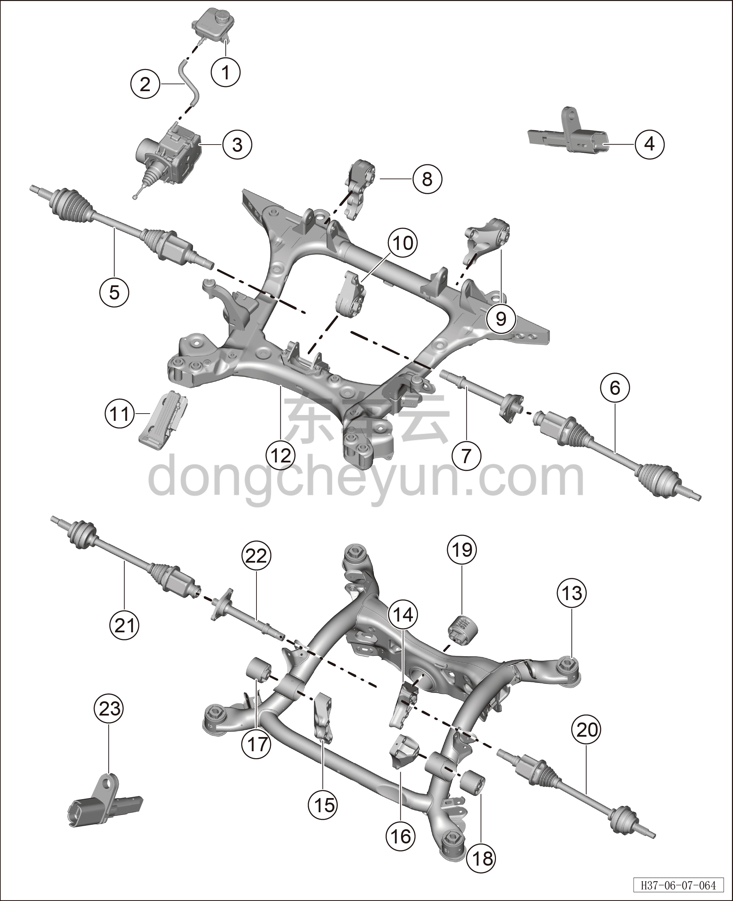

# Покомпонентный вид (деталировка)

> Система шасси › Электронные системы шасси  
> Оригинал: `结构分解图` · [dongcheyun 56746](https://dongcheyun.com/p/56746), страница `ffb34e244be84295894abeea44e385be` · [оглавление](../README.md)

| № | Наименование детали | Кол-во на автомобиль | Примечание |
|---|---|---|---|
| 1 | Бачок тормозной жидкости | 1 |   |
| 2 | Подводящий шланг бачка тормозной жидкости | 1 |   |
| 3 | Интегрированный интеллектуальный блок управления тормозами | 1 |   |
| 4 | Передний датчик скорости колеса | 2 |   |
| 5 | Левый передний приводной вал (полный привод) | 1 |   |
| 6 | Правый передний приводной вал (полный привод) | 1 |   |
| 7 | Передний соединительный вал в сборе | 1 |   |
| 8 | Левая передняя опора переднего электродвигателя | 1 |   |
| 9 | Правая передняя опора переднего электродвигателя | 1 |   |
| 10 | Задняя опора переднего электродвигателя в сборе | 1 |   |
| 11 | Педаль акселератора | 1 |   |
| 12 | Узел переднего подрамника | 1 |   |
| 13 | Узел переднего подрамника | 1 |   |
| 14 | Кронштейн задней опоры заднего электродвигателя | 1 |   |
| 15 | Кронштейн правой опоры заднего электродвигателя | 1 |   |
| 16 | Кронштейн левой опоры заднего электродвигателя | 1 |   |
| 17 | Правая опора заднего электродвигателя в сборе | 1 |   |
| 18 | Левая опора заднего электродвигателя в сборе | 1 |   |
| 19 | Задняя опора заднего электродвигателя в сборе | 1 |   |
| 20 | Левый задний приводной вал в сборе | 1 |   |
| 21 | Правый задний приводной вал в сборе | 1 |   |
| 22 | Задний соединительный вал в сборе | 1 |   |
| 23 | Задний датчик скорости колеса | 2 |   |
