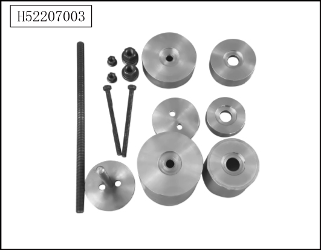
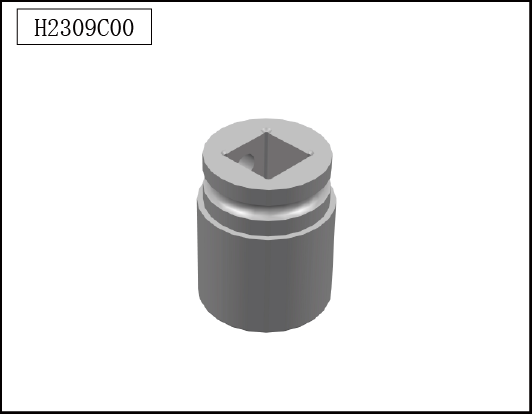

# Специальный инструмент

> Система шасси › Электронные системы шасси  
> Оригинал: `专用工具` · [dongcheyun 56746](https://dongcheyun.com/p/56746), страница `13560ca0407c4a27b66c85354a18da35` · [оглавление](../README.md)

| № | Иллюстрация | Номер инструмента | Наименование |
|---|---|---|---|
| 1 |  | H52207003 | Специальный инструмент для снятия резиновой втулки подрамника |
| 2 |  | H2309C00 | Торцевая головка для снятия гайки приводного вала |
