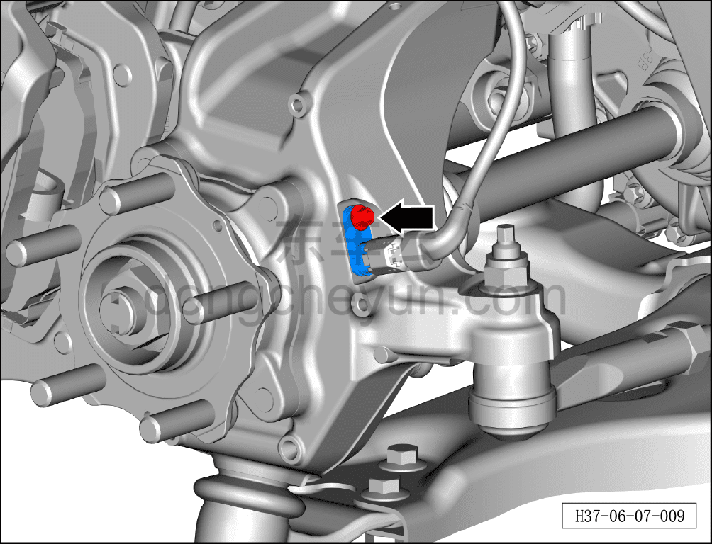
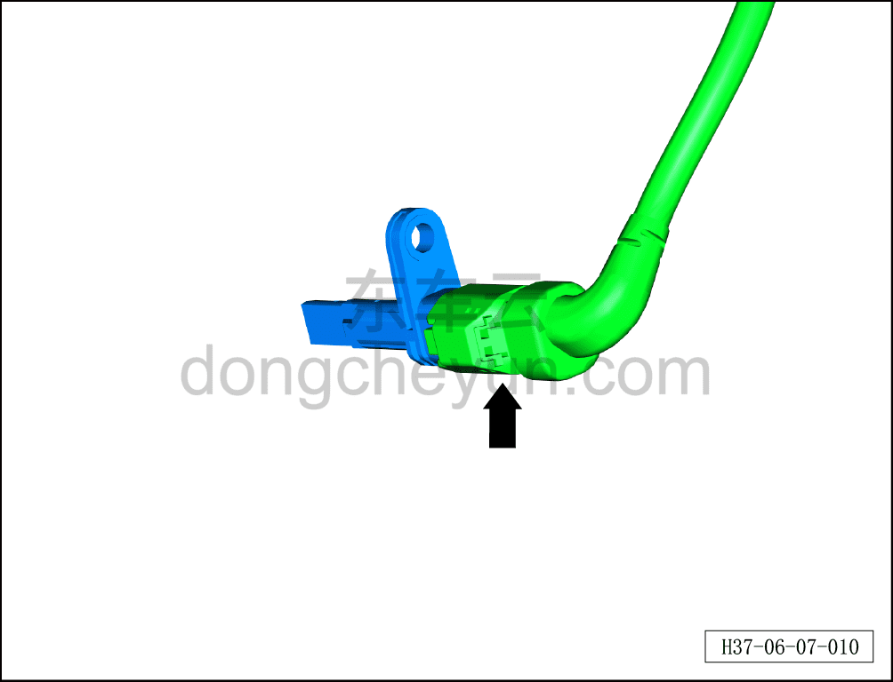
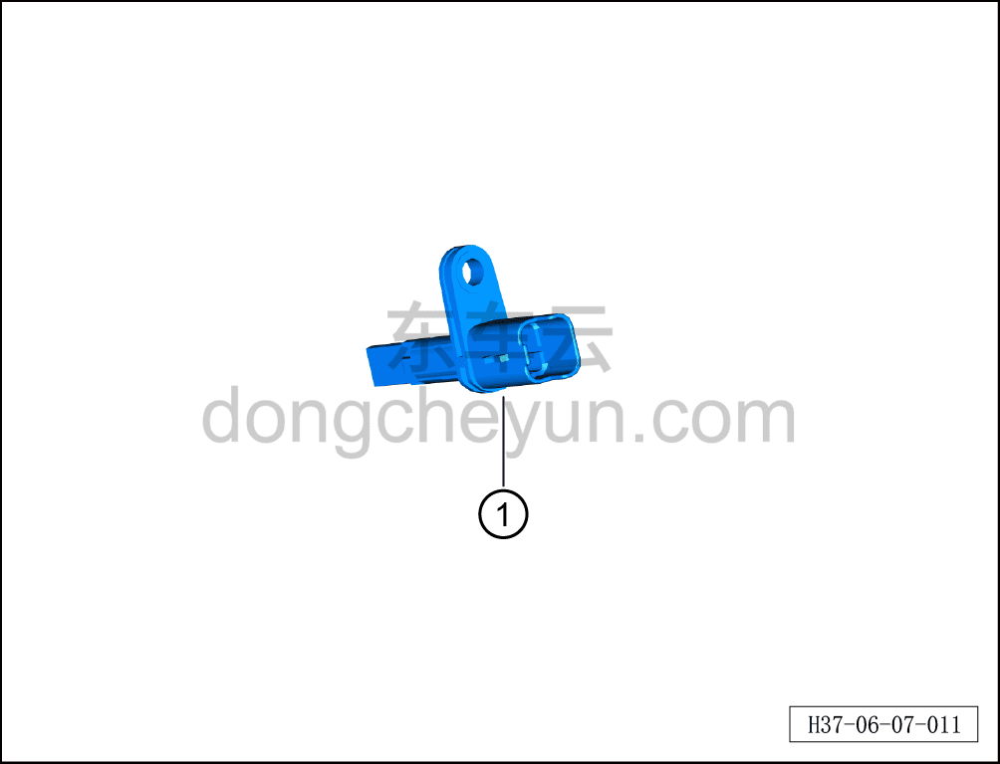

# Снятие и установка датчика скорости колеса

> Система шасси › Электронные системы шасси › Датчики шасси  
> Оригинал: `拆卸与安装轮速传感器` · [dongcheyun 56746](https://dongcheyun.com/p/56746), страница `b5a65eb6f0ef4a7b8be36f5ac3deeb7a` · [оглавление](../README.md)

**Порядок снятия**

**Примечание:**

**- Ниже описаны снятие и установка левого переднего датчика скорости колеса, для остальных см. данную процедуру.**

1. Выключите все электроприборы, отключите питание.

2. Выполните обесточивание автомобиля для ремонта. См. [3.1.4.1 Обесточивание автомобиля](../03-техническое-обслуживание/005-обесточивание-автомобиля.md)

3. Снимите переднее колесо. См. [6.5.8.1 Снятие и установка колеса](064-снятие-и-установка-колеса.md)

4. Поднимите автомобиль на подъёмнике на подходящую высоту.

5. Снимите левый датчик скорости колеса.

a. Используя торцевую головку на 8 мм, отверните крепёжный болт датчика скорости колеса и отсоедините датчик скорости колеса и жгут проводов датчика от поворотного кулака.

b. Нажмите и отсоедините жгут проводов датчика скорости колеса.

c. Извлеките левый датчик скорости колеса ①.

**Порядок установки**

Установка выполняется в обратном порядке.

**Внимание:**

**- После завершения установки подключите диагностический сканер и проверьте наличие кодов неисправностей; если таковые имеются, найдите причину и удалите коды неисправностей.**

**- После завершения установки необходимо провести дорожное испытание и проверить исправность функционирования датчика скорости колеса.**
