# Замена жгута проводов датчика скорости колеса

> Система шасси › Электронные системы шасси › Датчики шасси  
> Оригинал: `更换轮速传感器线束` · [dongcheyun 56746](https://dongcheyun.com/p/56746), страница `6eb1cc2c7c5b4e57962feba1b8ac9dd2` · [оглавление](../README.md)

1. Проявление проблемы.

Состояние автомобиля

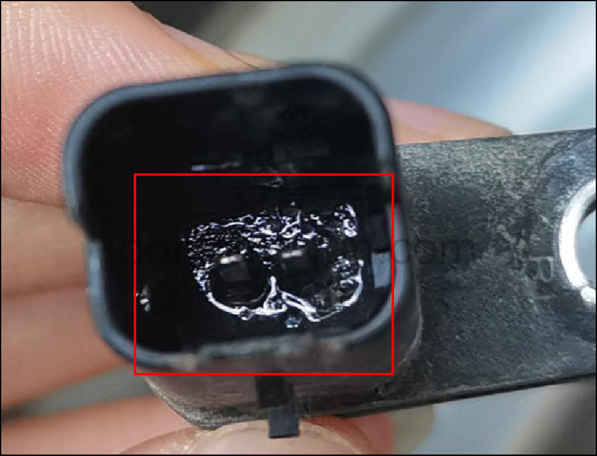

Проявление 1: попадание воды в датчик скорости колеса приводит к коррозии контактов.

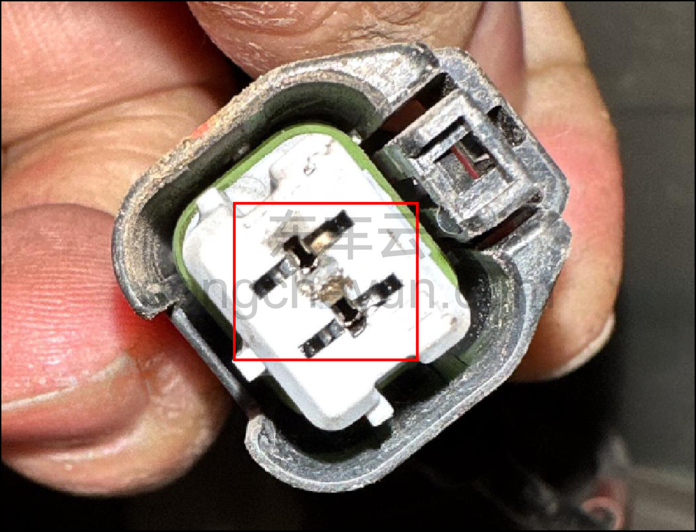

Проявление 2: попадание воды в контакты жгута проводов датчика скорости колеса приводит к коррозии контактов.

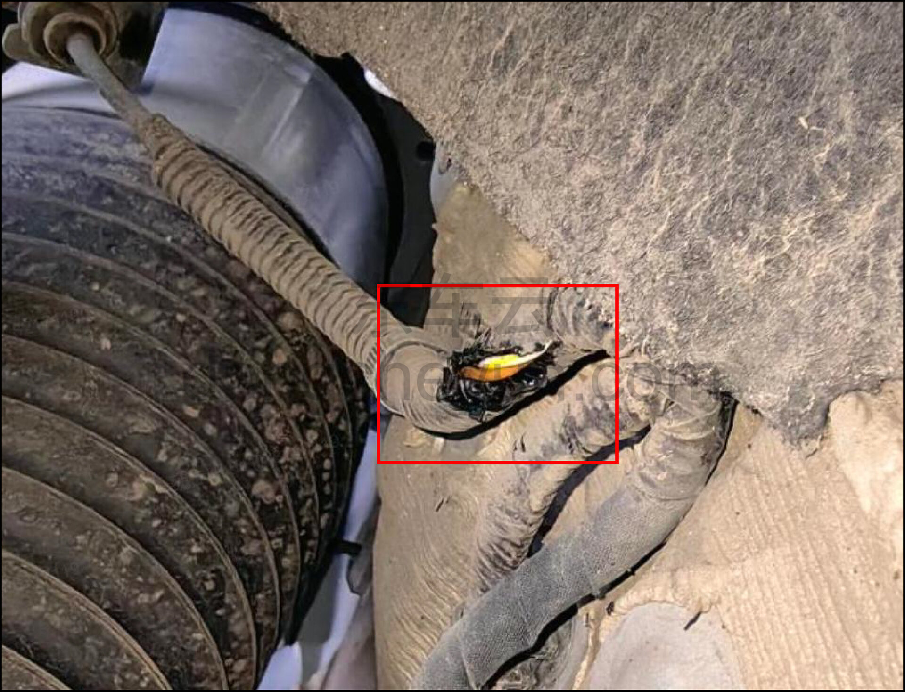

Проявление 3: скопление воды внутри гофрированной трубки жгута проводов датчика скорости колеса.

2. Ремонтный инструмент и запасные части

Отдельная запасная часть — жгут проводов датчика скорости колеса

372440003 H37A3724129AC Жгут проводов левого переднего датчика скорости колеса

372441003 H37A3724130AC Жгут проводов правого переднего датчика скорости колеса

Инструмент: ножницы, стриппер, фен горячего воздуха и др.

3. Метод ремонта

1. Разрежьте обмотку на участке провода датчика скорости колеса, подлежащего замене.

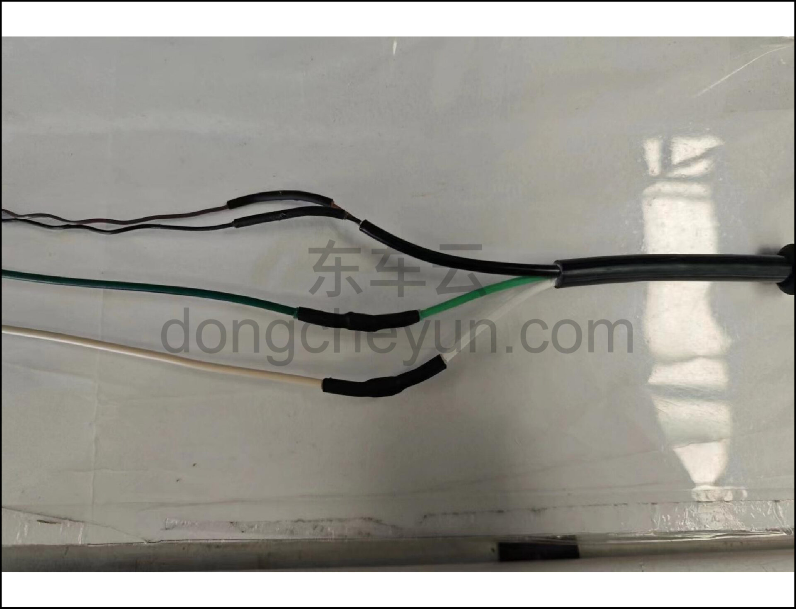

2. Снимите изоляционную ленту и стяжки, сдвиньте гофрированную трубку и резиновый элемент влево, обнажив точку обжима.

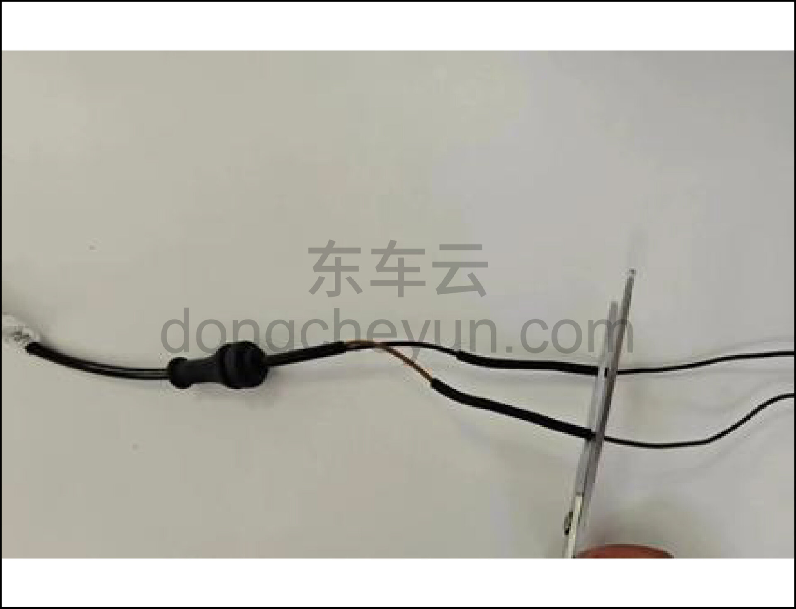

3. Как показано на рисунке, срежьте точку обжима ножницами с правой стороны.

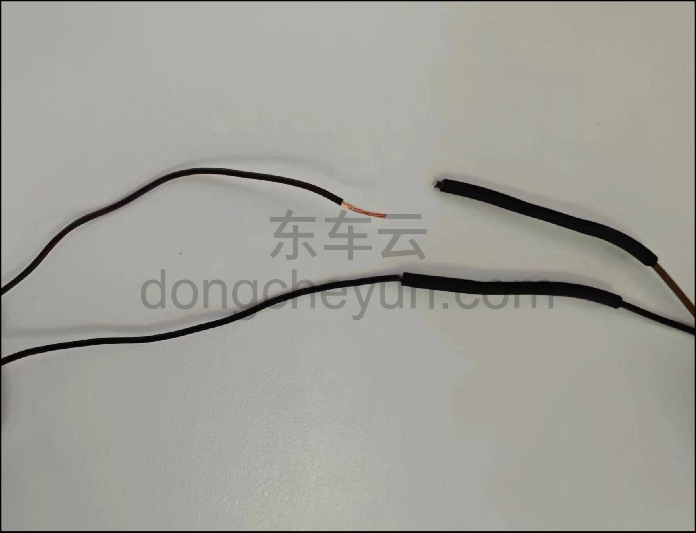

4. После срезания точки обжима повторно зачистите провод в соответствии с требованиями обжима: для клеммы типа 706U зачистка 11 мм.

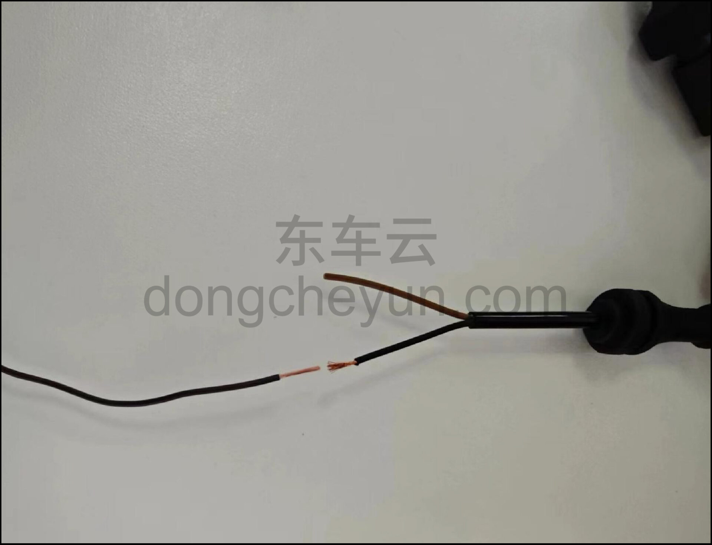

5. Зачистите новый провод датчика скорости колеса также в соответствии с требованиями обжима, затем обожмите его один к одному с ответным жгутом в соответствии с требованиями конструкции, защитите термоусадочной трубкой Ø4.

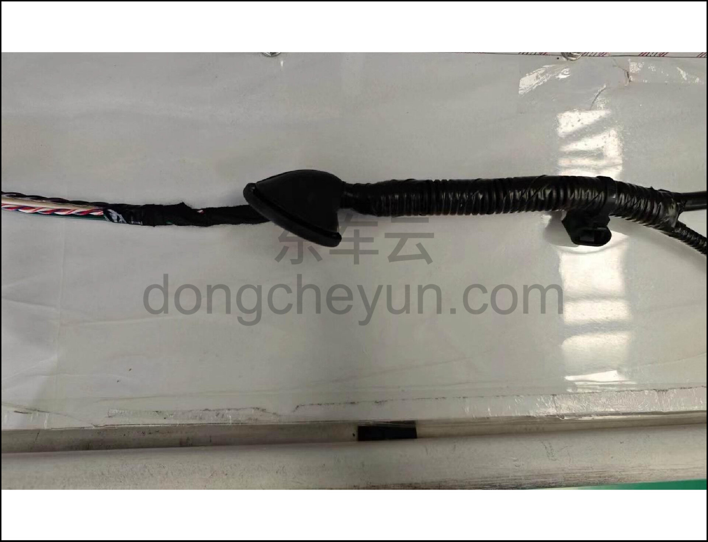

6. Верните гофрированную трубку и резиновый шланг в исходное положение, выполните обмотку в соответствии с требованиями чертежа и проверьте внешний вид.

4. Указания

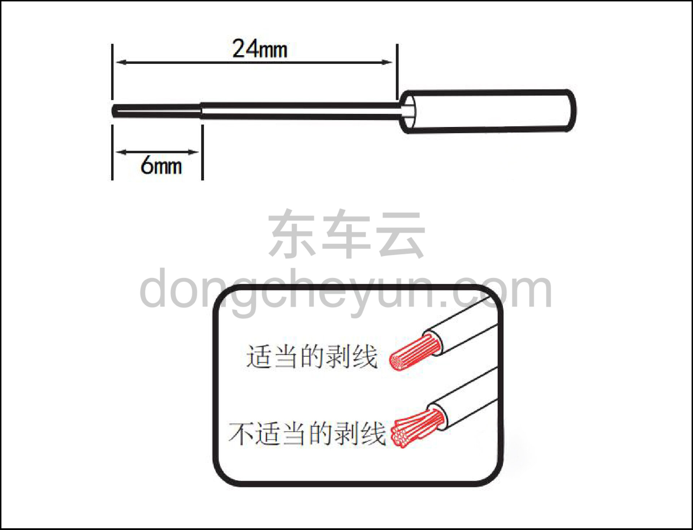

1. Разрежьте обмотку на участке провода датчика скорости колеса, подлежащего замене.

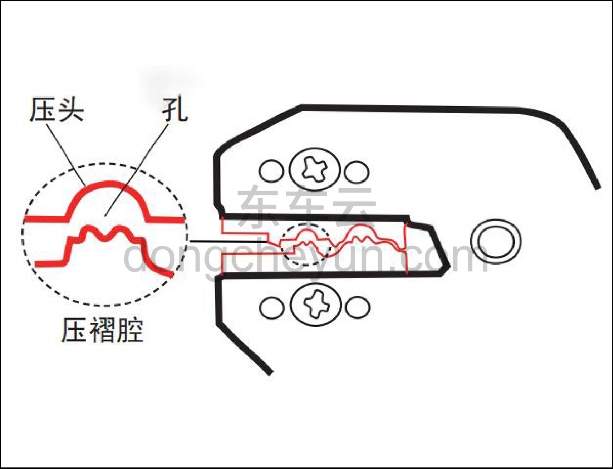

2. Приложите конец провода к обжимной пластине пресса с указанными размерами для сравнения размера и определения подходящей обжимной полости на прессе.

3. Установите наконечник провода в центр подходящей обжимной полости.

**Внимание:**

**Если наконечник виден, убедитесь, что медный сварной шов направлен к пуансону.**

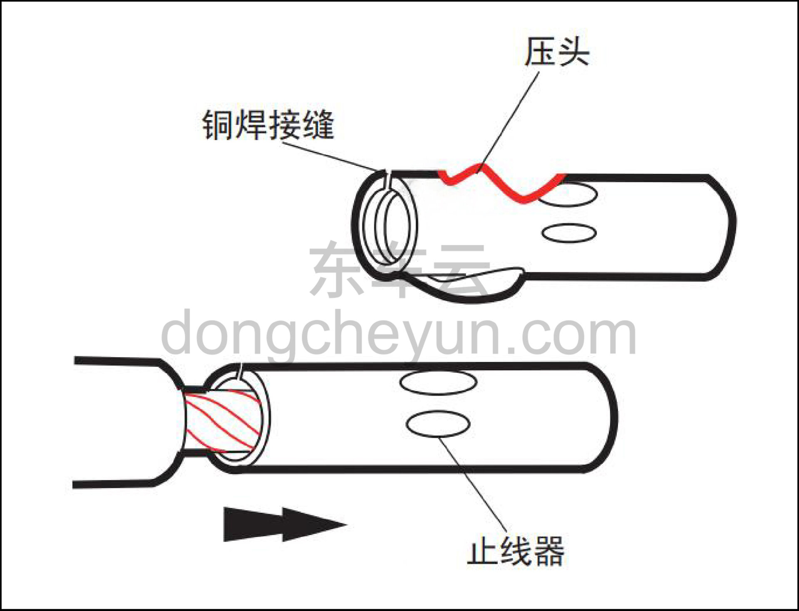

4. Вставьте зачищенный провод в полость наконечника; установите провод в правильное положение и отрегулируйте храповик обжимного инструмента на нужное усилие.

5. Проверьте правильность обжима

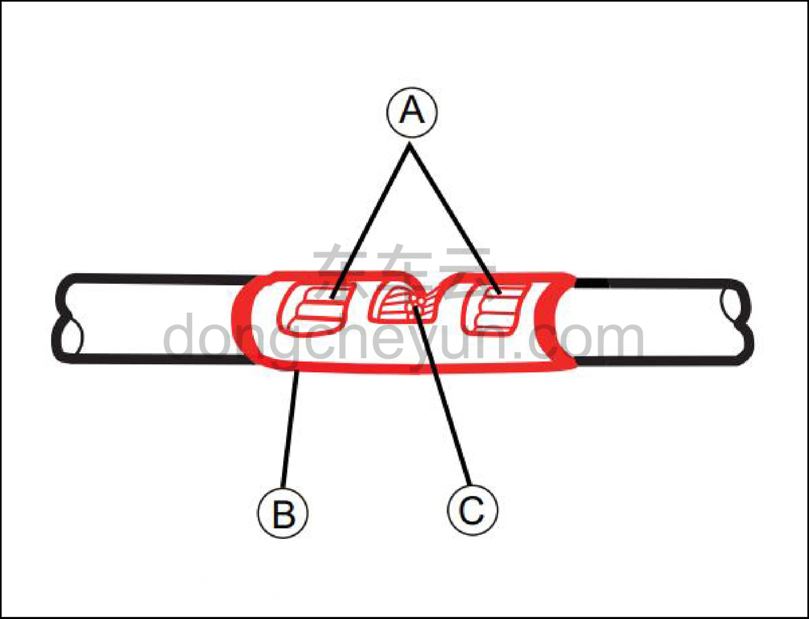

A — обжатый конец должен находиться в центре каждой обжимной пластины.

B — изоляция провода не должна попадать в зону обжимной пластины.

C — провод должен быть виден через смотровое отверстие наконечника.

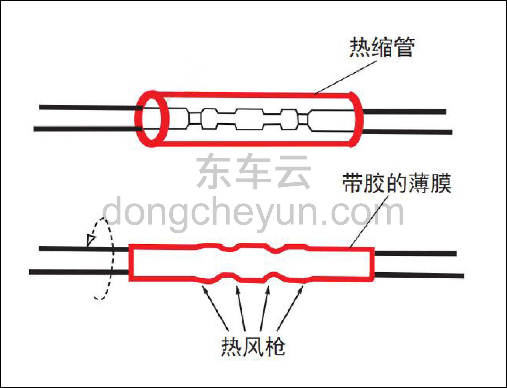

6. Равномерно наденьте термоусадочную трубку на отремонтированный участок провода. Нагрейте отремонтированный участок фeном горячего воздуха до появления клея по краям термоусадочной трубки.

7. Осмотрите поверхность обоих концов термоусадочной трубки на наличие зазора между проводом и расплавленным клеем термоусадочной трубки; при наличии зазора продолжайте нагрев до его исчезновения.

8. Контроль длины провода датчика скорости колеса.

| Расстояние от точки обжима до | Коричневый провод | Жёлтый провод | Зелёный провод | Чёрный провод | Красный провод |
|---|---|---|---|---|---|
| Длина датчика | /mm | /mm | /mm | /mm | /mm |
| Передние колёса | 430 | 460 | - | - | - |
| Задние колёса | - | 90 | 120 | 240 | 270 |
