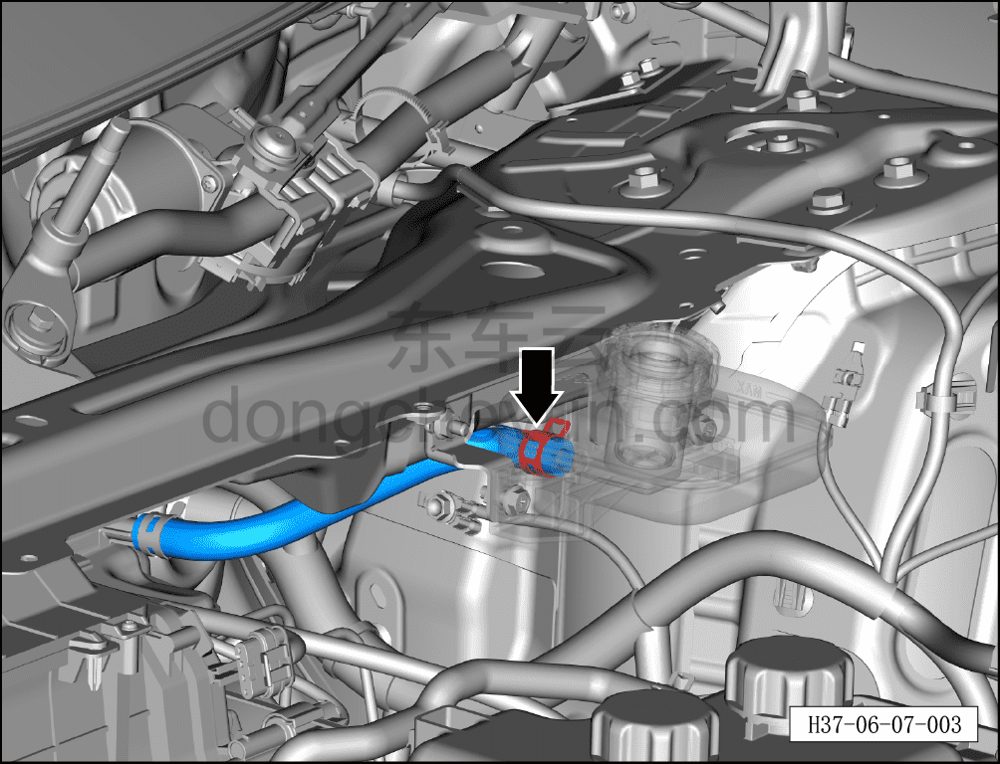
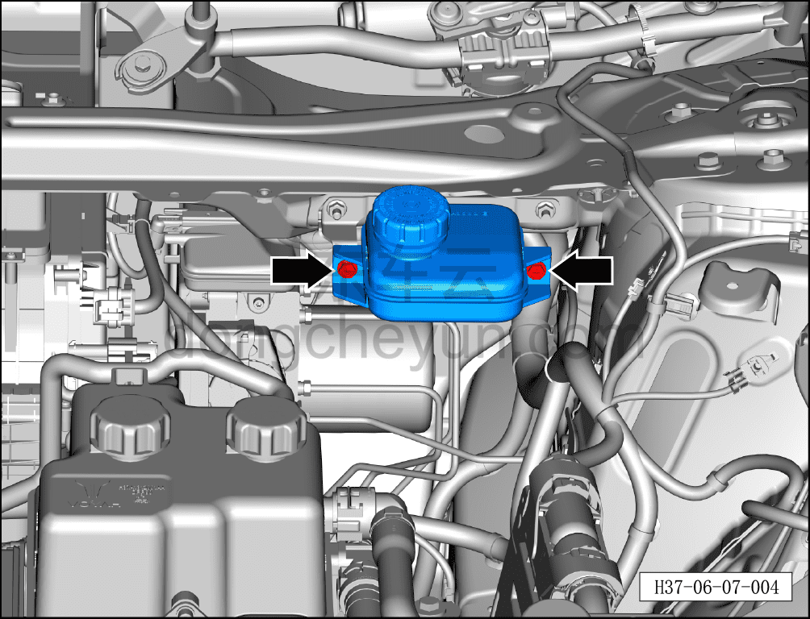
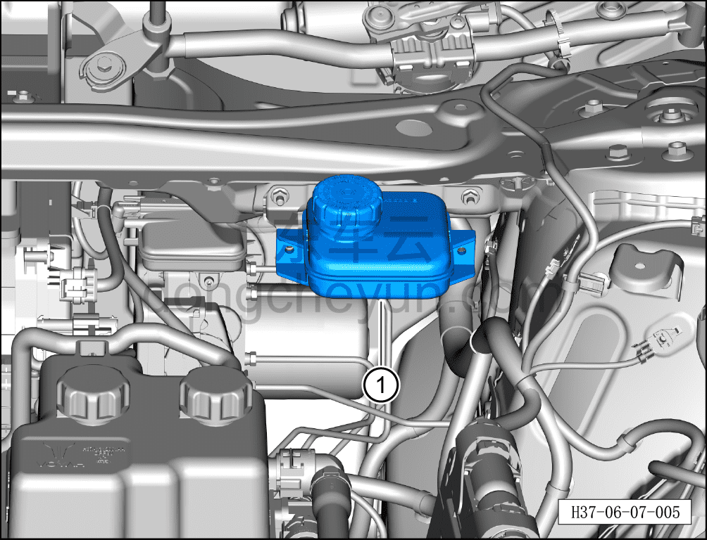

# Снятие и установка бачка тормозной жидкости

> Система шасси › Электронные системы шасси › Интегрированный интеллектуальный блок управления тормозами  
> Оригинал: `拆卸与安装制动储油壶` · [dongcheyun 56746](https://dongcheyun.com/p/56746), страница `1c55dce10c3f4370990c636ff746a82c` · [оглавление](../README.md)

**Порядок снятия**

1. Выключите все электроприборы, отключите питание.

2. Выполните обесточивание автомобиля для ремонта. См. [3.1.4.1 Обесточивание автомобиля](../03-техническое-обслуживание/005-обесточивание-автомобиля.md)

3. Слейте тормозную жидкость. См. [3.1.5.3 Замена тормозной жидкости](../03-техническое-обслуживание/008-замена-тормозной-жидкости.md)

4. Снимите крышку в сборе стеклоочистителя (левую). См. [8.6.7.7 Снятие и установка крышки в сборе стеклоочистителя (левой)](../08-внутренняя-и-внешняя-отделка/244-снятие-и-установка-крышки-стеклоочистителя-в-сборе.md)

5. Снимите бачок тормозной жидкости.

a. Используя клещи для хомутов шлангов, отсоедините хомут подводящего шланга бачка и отсоедините подводящий шланг бачка тормозной жидкости.

**Внимание:**

**- При снятии подводящего шланга бачка подложите ветошь непосредственно под бачок тормозной жидкости, чтобы тормозная жидкость не попала на автомобиль.**

**- Тормозная жидкость токсична и обладает коррозионным действием, не допускайте её контакта с лакокрасочным покрытием кузова.**

b. Используя торцевую головку на 10 мм, отверните крепёжный болт бачка тормозной жидкости.

Момент затяжки болтов: 10±1 Н·м

c. Извлеките бачок тормозной жидкости ①.

**Порядок установки**

Установка выполняется в обратном порядке.

**Внимание:**

**- Проверьте уровень тормозной жидкости, при необходимости долейте. См. [3.1.5.3 Замена тормозной жидкости](../03-техническое-обслуживание/008-замена-тормозной-жидкости.md)**

**- После завершения установки прокачайте тормозную систему. См. [3.1.5.3 Замена тормозной жидкости](../03-техническое-обслуживание/008-замена-тормозной-жидкости.md)**

**- Отработанную жидкость собирайте и утилизируйте централизованно.**

**- Необходимо провести дорожное испытание, проверить эффективность торможения, правильность установки и убедиться в отсутствии посторонних шумов ходовой части и уводов автомобиля.**
