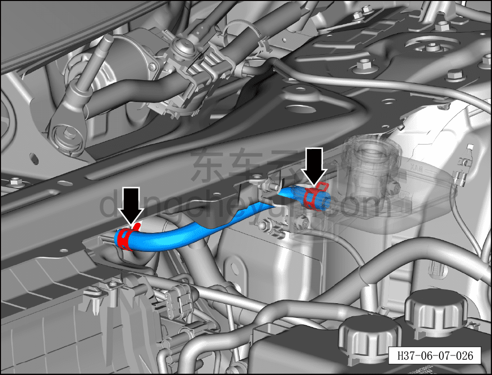
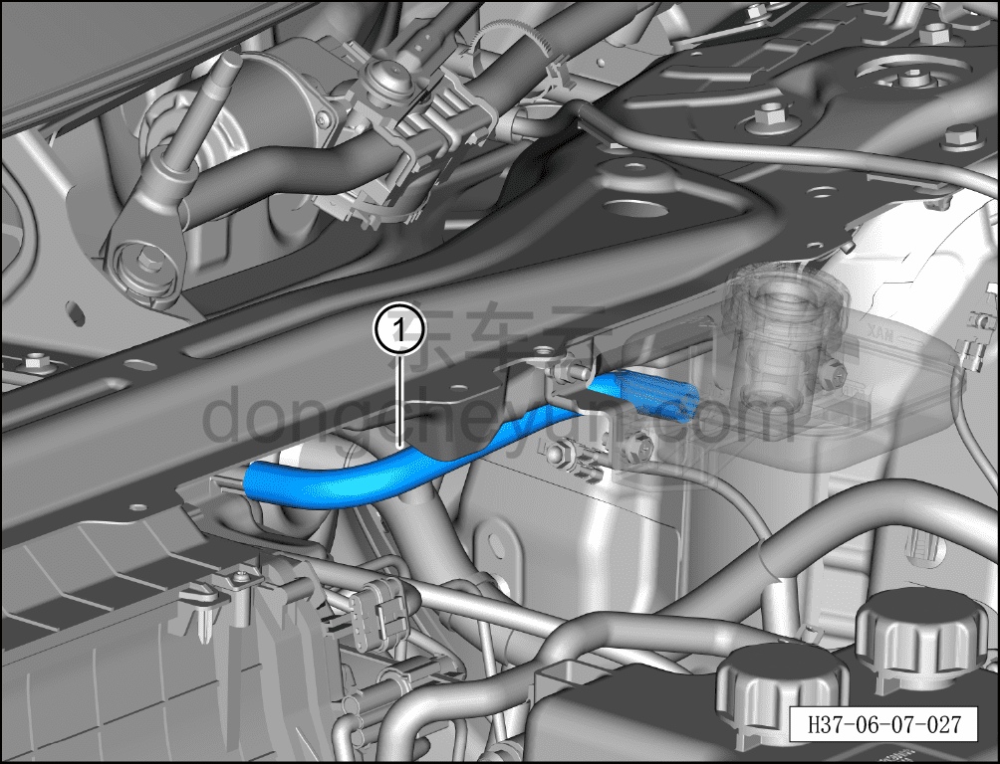

# Снятие и установка подводящего шланга бачка

> Система шасси › Электронные системы шасси › Интегрированный интеллектуальный блок управления тормозами  
> Оригинал: `拆卸与安装储油壶进油管` · [dongcheyun 56746](https://dongcheyun.com/p/56746), страница `8733501c46ca49fbab0000fcf8973899` · [оглавление](../README.md)

Порядок снятия

1. Выключите все электроприборы, отключите питание.

2. Выполните обесточивание автомобиля для ремонта. См. [3.1.4.1 Обесточивание автомобиля](../03-техническое-обслуживание/005-обесточивание-автомобиля.md)

3. Слейте тормозную жидкость. См. [3.1.5.3 Замена тормозной жидкости](../03-техническое-обслуживание/008-замена-тормозной-жидкости.md)

4. Снимите крышку в сборе стеклоочистителя (левую). См. [8.6.7.7 Снятие и установка крышки в сборе стеклоочистителя (левой)](../08-внутренняя-и-внешняя-отделка/244-снятие-и-установка-крышки-стеклоочистителя-в-сборе.md)

5. Снимите подводящий шланг бачка.

a. Используя клещи для хомутов шлангов, отсоедините 2 хомута подводящего шланга бачка.

**Внимание:**

**- При снятии подводящего шланга бачка подложите ветошь непосредственно под него, чтобы тормозная жидкость не попала на автомобиль.**

**-Тормозная жидкость токсична и обладает коррозионным действием, не допускайте её контакта с лакокрасочным покрытием кузова.**

**- Обратите внимание на маркировку подводящего шланга бачка.**

b. Отсоедините и извлеките подводящий шланг бачка ①.

**Порядок установки**

Установка выполняется в обратном порядке.

**Внимание:**

**- Проверьте уровень тормозной жидкости, при необходимости долейте. См. [3.1.5.3 Замена тормозной жидкости](../03-техническое-обслуживание/008-замена-тормозной-жидкости.md)**

**- После завершения установки прокачайте тормозную систему. См. [3.1.5.3 Замена тормозной жидкости](../03-техническое-обслуживание/008-замена-тормозной-жидкости.md)**

**- Отработанную жидкость собирайте и утилизируйте централизованно.**

**- Необходимо провести дорожное испытание, проверить эффективность торможения, правильность установки и убедиться в отсутствии посторонних шумов ходовой части и уводов автомобиля.**
