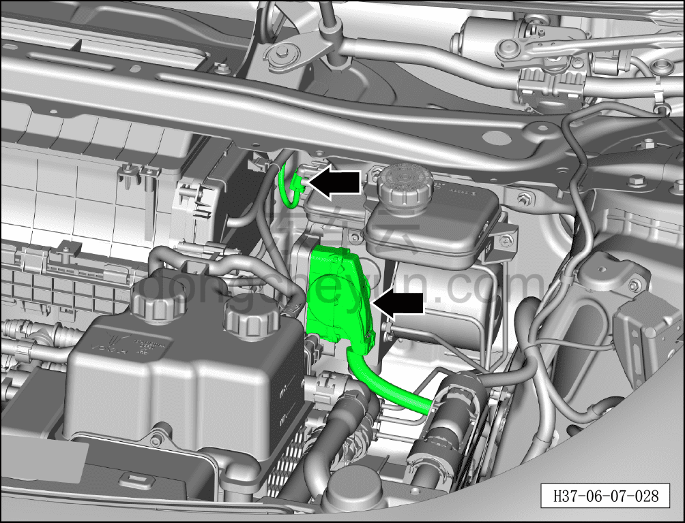
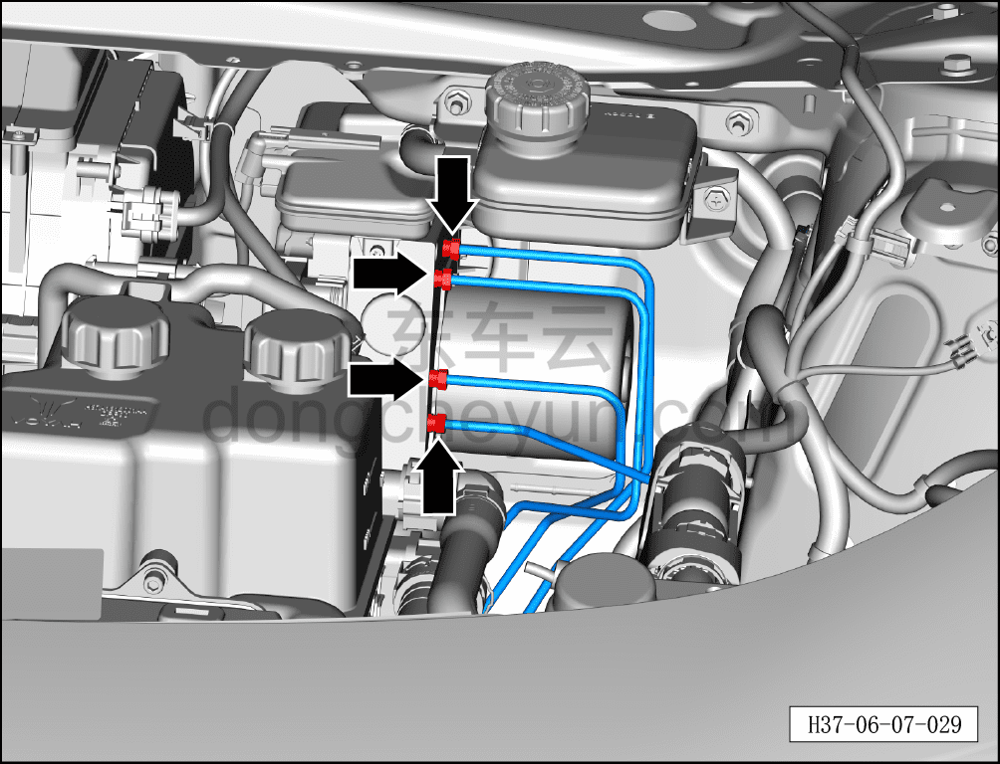
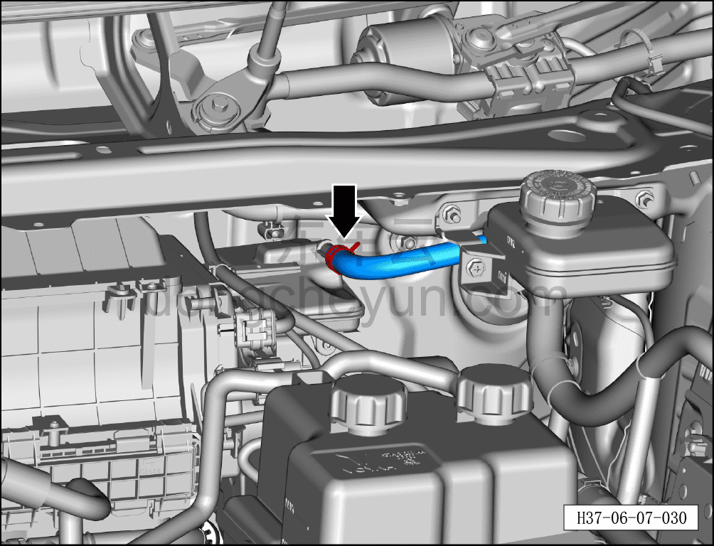
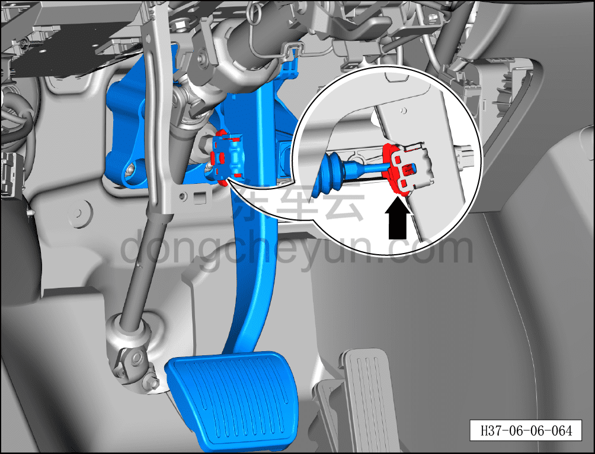
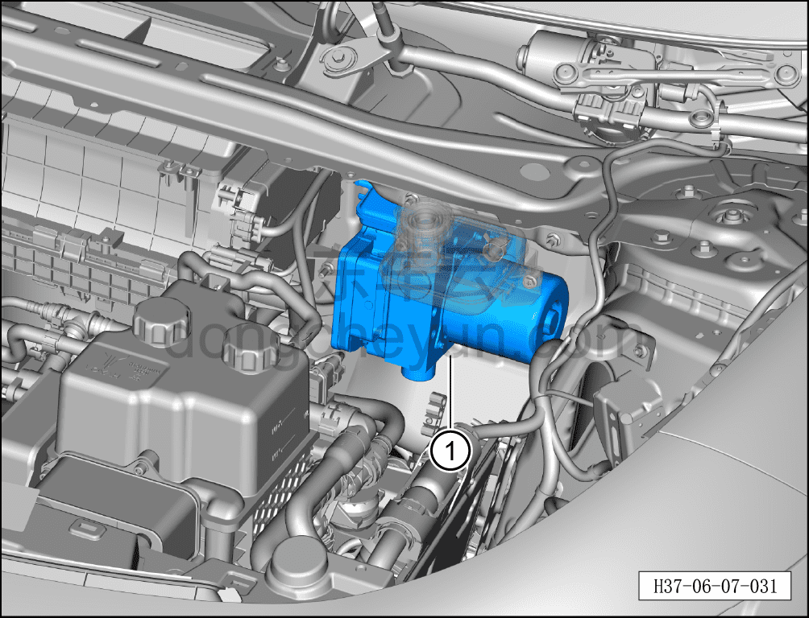

# Снятие и установка интегрированного интеллектуального блока управления тормозами

> Система шасси › Электронные системы шасси › Интегрированный интеллектуальный блок управления тормозами  
> Оригинал: `拆卸与安装智能集成制动控制单元` · [dongcheyun 56746](https://dongcheyun.com/p/56746), страница `e4239ff9362c4021b9b320d84f0adf38` · [оглавление](../README.md)

**Порядок снятия**

1. Выключите все электроприборы, отключите питание.

2. Выполните обесточивание автомобиля для ремонта. См. [3.1.4.1 Обесточивание автомобиля](../03-техническое-обслуживание/005-обесточивание-автомобиля.md)

3. Слейте тормозную жидкость. См. [3.1.5.3 Замена тормозной жидкости](../03-техническое-обслуживание/008-замена-тормозной-жидкости.md)

4. Снимите крышку в сборе стеклоочистителя (левую). См. [8.6.7.7 Снятие и установка крышки в сборе стеклоочистителя (левой)](../08-внутренняя-и-внешняя-отделка/244-снятие-и-установка-крышки-стеклоочистителя-в-сборе.md)

5. Снимите левую нижнюю защитную панель в сборе. См. [8.2.4.2 Снятие и установка левой нижней защитной панели в сборе](../08-внутренняя-и-внешняя-отделка/055-снятие-и-установка-нижней-левой-защитной-накладки-в.md)

6. Снимите интегрированный интеллектуальный блок управления тормозами.

a. Отсоедините разъём интеллектуального усилителя в сборе.

**Внимание:**

**- Контакты разъёма интеллектуального усилителя в сборе необходимо защитить от деформации.**

b. Используя гаечный ключ на 11 мм, отверните крепёжные гайки 4 тормозных трубок и отсоедините 4 тормозные трубки.

Момент затяжки гайки: 16±1 Н·м

**Внимание:**

**- Тормозные трубки не допускается перегибать.**

**- Закройте отверстия для тормозных трубок на интегрированном интеллектуальном блоке управления тормозами чистой нетканой салфеткой или заглушкой.**

c. Используя клещи для хомутов шлангов, отсоедините хомут и отсоедините интегрированный интеллектуальный блок управления тормозами от подводящего шланга бачка тормозной жидкости.

d. Нажмите и отсоедините стопорный штифт соединения педали тормоза с интегрированным интеллектуальным блоком управления тормозами.

e. Используя торцевую головку на 13 мм, отверните 5 крепёжных гаек соединения педали тормоза в сборе с интегрированным интеллектуальным блоком управления тормозами.

Момент затяжки гайки: 23±3 Н·м

f. Извлеките интегрированный интеллектуальный блок управления тормозами ①.

**Порядок установки**

Установка выполняется в обратном порядке.

**Примечание:**

**После завершения замены необходимо выполнить следующие операции с помощью диагностического сканера или удалённой диагностики:**

**- Сначала прошить программное обеспечение до последней версии;**

**- После успешного обновления программного обеспечения выполнить процедуру замены детали для контроллера.**

**Внимание:**

**- Проверьте уровень тормозной жидкости, при необходимости долейте. См. [3.1.5.3 Замена тормозной жидкости](../03-техническое-обслуживание/008-замена-тормозной-жидкости.md)**

**- После завершения установки прокачайте тормозную систему. См. [3.1.5.3 Замена тормозной жидкости](../03-техническое-обслуживание/008-замена-тормозной-жидкости.md)**

**- Отработанную жидкость собирайте и утилизируйте централизованно.**

**- Необходимо провести дорожное испытание, проверить эффективность торможения, правильность установки и убедиться в отсутствии посторонних шумов ходовой части и уводов автомобиля.**
