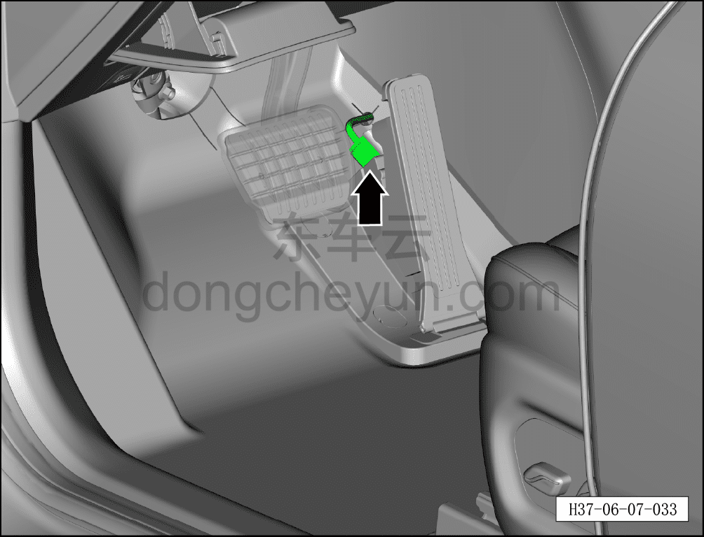
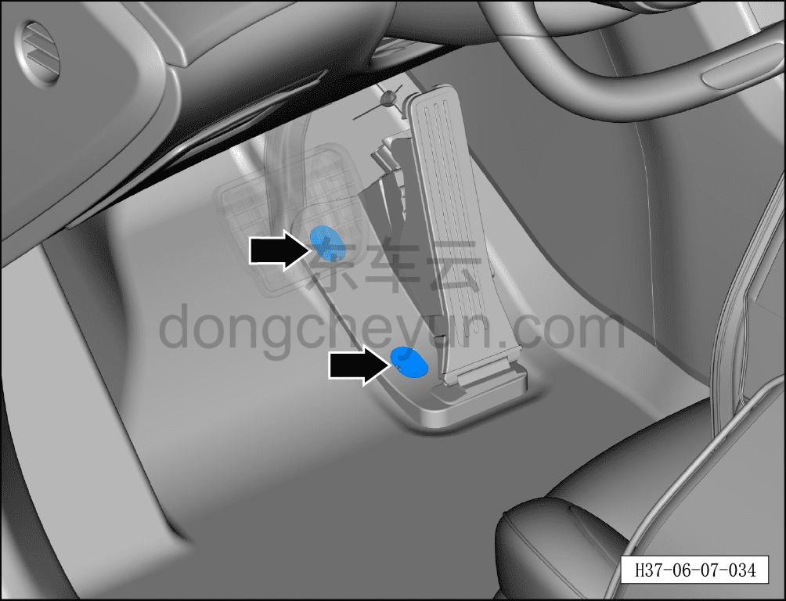
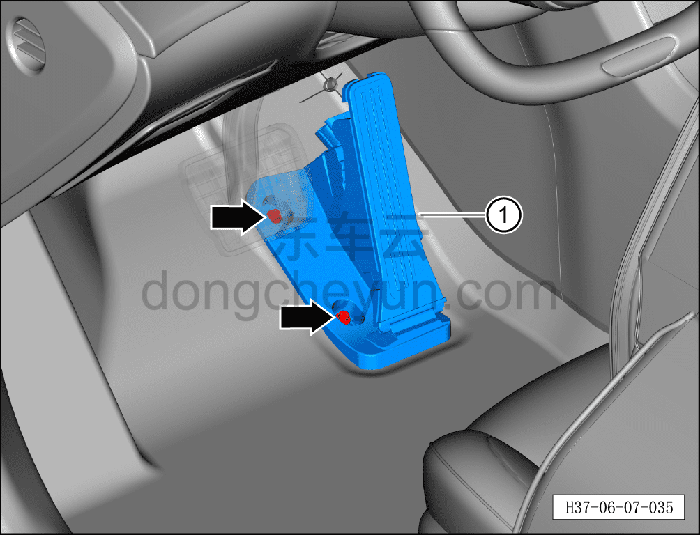

# Снятие и установка электронной педали акселератора

> Система шасси › Электронные системы шасси › Педаль акселератора в сборе  
> Оригинал: `拆卸与安装电子油门踏板` · [dongcheyun 56746](https://dongcheyun.com/p/56746), страница `e393887f22cf498ab052f6ff48da65f9` · [оглавление](../README.md)

**Порядок снятия**

1. Выключите все электроприборы, отключите питание.

2. Выполните обесточивание автомобиля для ремонта. См. [3.1.4.1 Обесточивание автомобиля](../03-техническое-обслуживание/005-обесточивание-автомобиля.md)

3. Снимите электронную педаль акселератора.

a. Отсоедините разъём электронной педали акселератора.

b. Используя плоскую отвёртку, снимите 2 заглушки болтов электронной педали акселератора.

c. Используя торцевую головку на 10 мм, отверните 2 крепёжных болта электронной педали акселератора.

Момент затяжки болта: 8±1 Н·м

d. Извлеките электронную педаль акселератора ①.

**Порядок установки**

Установка выполняется в обратном порядке.

**Внимание:**

**- После завершения установки подключите диагностический сканер, проверьте наличие кодов неисправностей у автомобиля; при их наличии выявите причину и удалите коды неисправностей.**

**- Необходимо провести дорожное испытание и проверить исправность функционирования электронной педали акселератора.**
