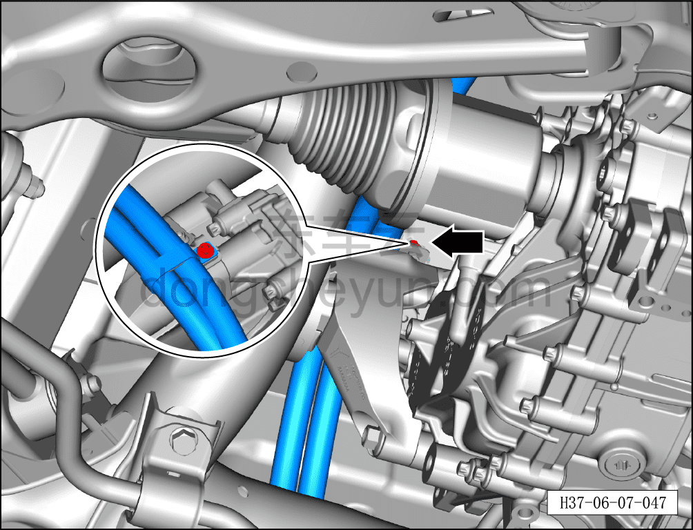
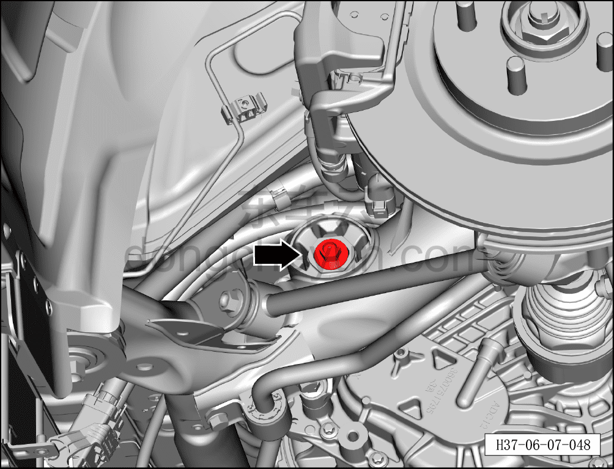
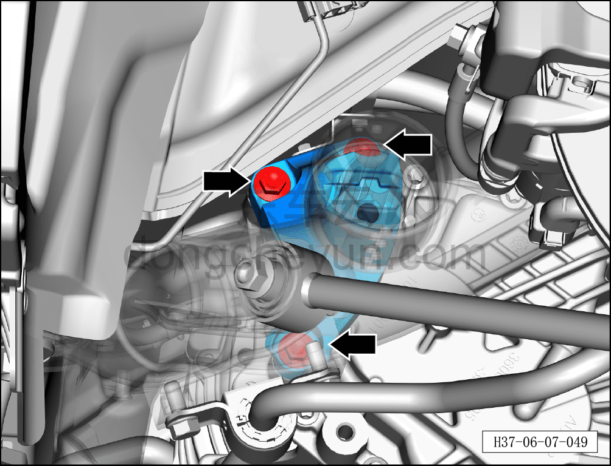
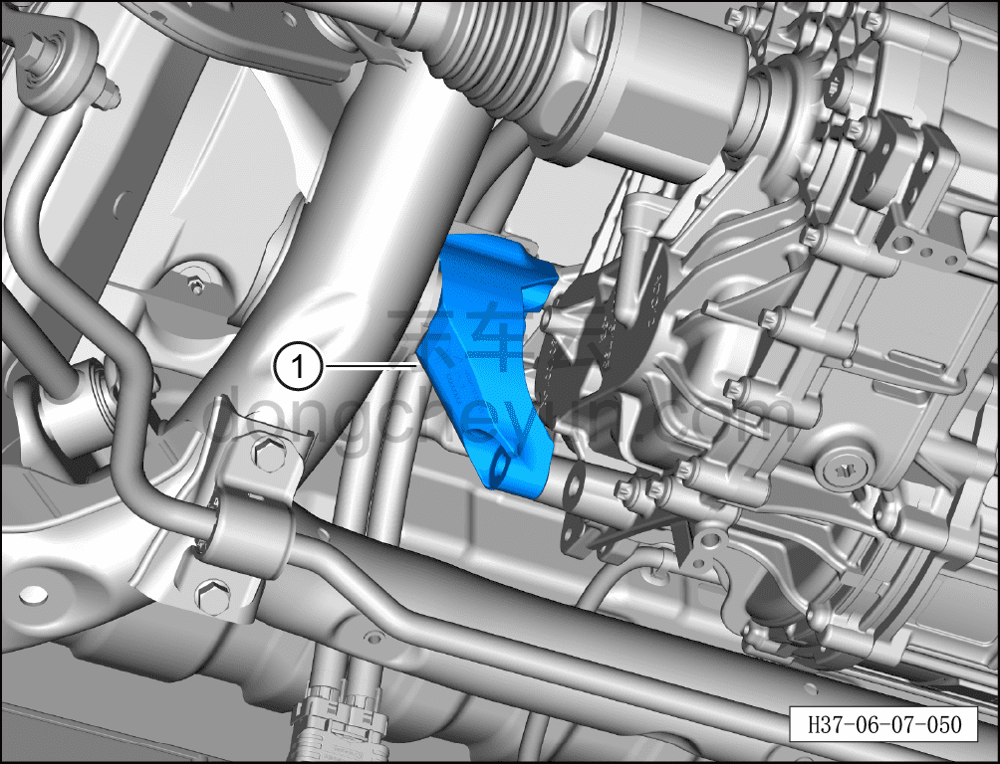

# Снятие и установка кронштейна левой опоры заднего электродвигателя

> Система шасси › Электронные системы шасси › Механизм опор заднего электродвигателя  
> Оригинал: `拆卸与安装后电机左悬置支架` · [dongcheyun 56746](https://dongcheyun.com/p/56746), страница `515b9399ecf34dc4945b569f866cb32d` · [оглавление](../README.md)

**Порядок снятия**

**Внимание:**

**- При снятии кронштейна опоры заднего электродвигателя необходимо сначала установить стойку подъёмника под задним тяговым электродвигателем и, поднимая, подпереть его.**

1. Выключите все электроприборы, отключите питание.

2. Выполните обесточивание автомобиля для ремонта. См. [3.1.4.1 Обесточивание автомобиля](../03-техническое-обслуживание/005-обесточивание-автомобиля.md)

3. Снимите левое заднее колесо. См. [6.5.8.1 Снятие и установка колеса](064-снятие-и-установка-колеса.md)

4. Поднимите автомобиль на подъёмнике на подходящую высоту.

5. Снимите заднюю нижнюю защитную панель. См. [8.6.4.4 Снятие и установка задней нижней защитной панели](../08-внутренняя-и-внешняя-отделка/194-снятие-и-установка-заднего-нижнего-защитного-щитка.md)

6. Снимите кронштейн левой опоры заднего электродвигателя.

a. Используя торцевую головку на 8 мм, отверните крепёжный болт кронштейна высоковольтного жгута заднего электродвигателя.

Момент затяжки болта: 8±1 Н·м

b. Используя торцевую головку на 18 мм, отверните крепёжный болт соединения кронштейна левой опоры заднего электродвигателя с левой опорой заднего электродвигателя в сборе.

Момент затяжки болта: 260±26 Н·м

c. Используя торцевую головку на 15 мм, отверните 3 крепёжных болта кронштейна левой опоры заднего электродвигателя.

Момент затяжки болта: 100±10 Н·м

d. Используя плоскую отвёртку в качестве вспомогательного инструмента, извлеките кронштейн левой опоры заднего электродвигателя ①.

**Порядок установки**

Установка выполняется в обратном порядке.

**Внимание:**

**- После завершения ремонта обязательно выполните дорожное испытание, убедитесь в отсутствии посторонних шумов со стороны шасси и явления увода.**
