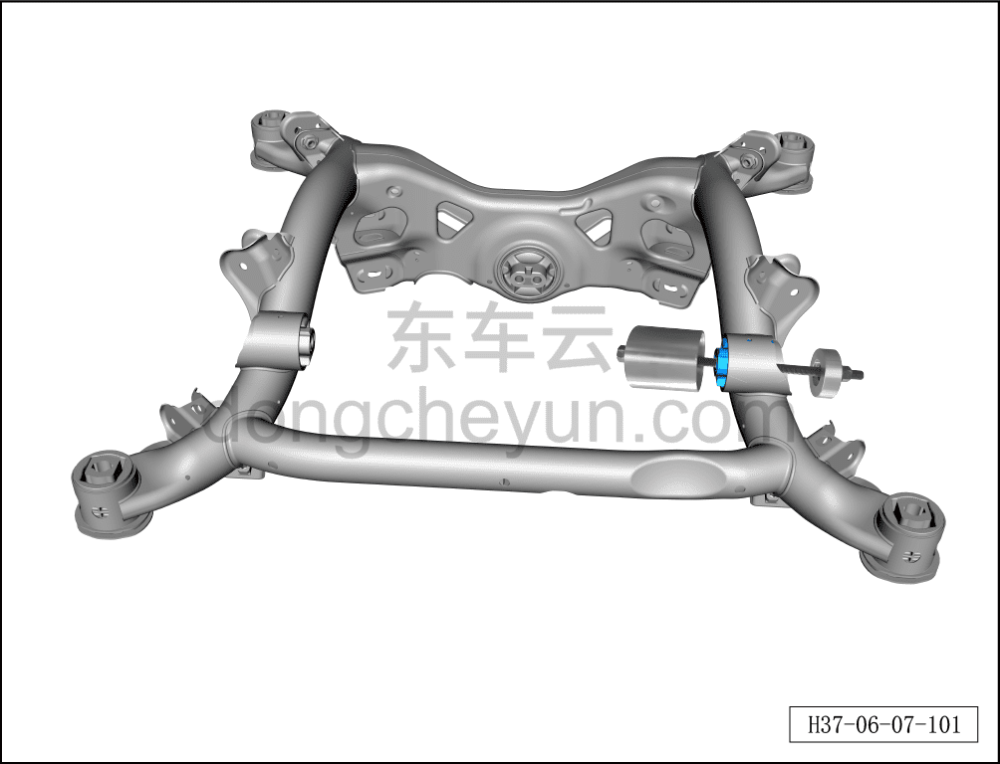

# Снятие и установка левой опоры заднего электродвигателя в сборе

> Система шасси › Электронные системы шасси › Механизм опор заднего электродвигателя  
> Оригинал: `拆卸与安装后电机左悬置总成` · [dongcheyun 56746](https://dongcheyun.com/p/56746), страница `13a5b756268d46aab54dba609759bca7` · [оглавление](../README.md)

**Порядок снятия**

**Примечание:**

**- Ниже описаны снятие и установка левой опоры заднего электродвигателя в сборе, для правой стороны см. левую.**

1. Снимите задний подрамник. См. [6.3.9.2 Снятие и установка заднего подрамника](040-снятие-и-установка-заднего-подрамника.md)

2. Снимите левую опору заднего электродвигателя в сборе.

a. Установите специальный инструмент (H52207003) на место

b. Используя гаечный ключ на 21 мм, заворачивайте крепёжную гайку специального инструмента (H52207003) до тех пор, пока левая опора заднего электродвигателя в сборе не будет выдавлена.

**Внимание:**

**- При заворачивании крепёжной гайки специального инструмента (H52207003) может возникать посторонний шум — это нормальное явление.**

**Внимание:**

**- При установке убедитесь, что выемка на задней опоре заднего электродвигателя в сборе направлена вверх и расположена по центру.**

**Порядок установки**

Порядок установки см. в видеоинструкции по использованию специального инструмента.

**Внимание:**

**- После завершения установки необходимо выполнить развал-схождение;**

**- После завершения ремонта обязательно выполните дорожное испытание, убедитесь в отсутствии посторонних шумов со стороны шасси и явления увода.**
