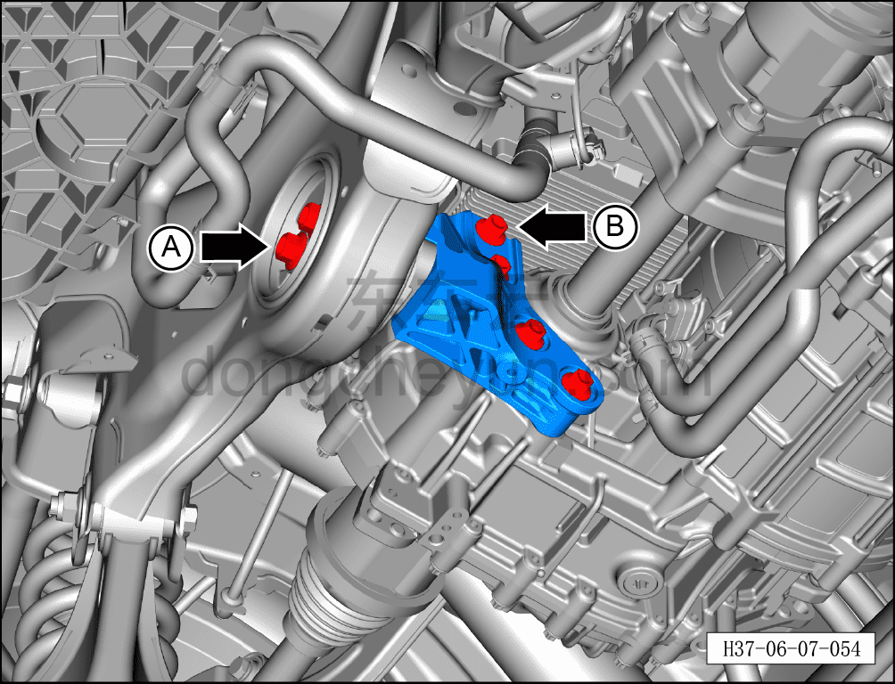
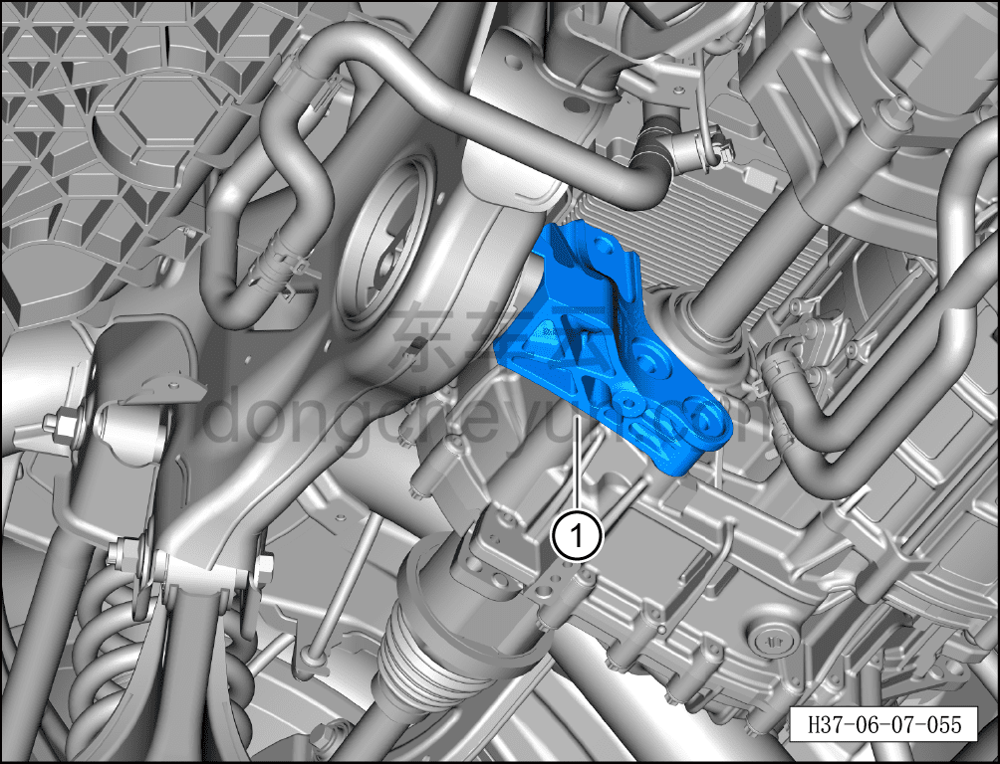

# Снятие и установка кронштейна задней опоры заднего электродвигателя

> Система шасси › Электронные системы шасси › Механизм опор заднего электродвигателя  
> Оригинал: `拆卸与安装后电机后悬置支架` · [dongcheyun 56746](https://dongcheyun.com/p/56746), страница `044d49fa67ce41fe802f3c480f3a5d5d` · [оглавление](../README.md)

**Порядок снятия**

**Внимание:**

**- При снятии кронштейна опоры заднего электродвигателя необходимо сначала установить стойку подъёмника под задним тяговым электродвигателем и, поднимая, подпереть его.**

1. Выключите все электроприборы, отключите питание.

2. Выполните обесточивание автомобиля для ремонта. См. [3.1.4.1 Обесточивание автомобиля](../03-техническое-обслуживание/005-обесточивание-автомобиля.md)

3. Поднимите автомобиль на подъёмнике на подходящую высоту.

4. Снять задний нижний защитный щиток. См. [8.6.4.4 Снятие и установка заднего нижнего защитного щитка](../08-внутренняя-и-внешняя-отделка/194-снятие-и-установка-заднего-нижнего-защитного-щитка.md)

5. Снимите кронштейн задней опоры заднего электродвигателя.

a. Используя торцевую головку на 18 мм, отверните 2 крепёжных болта A соединения кронштейна задней опоры заднего электродвигателя с задней опорой заднего электродвигателя в сборе.

Момент затяжки болтов: 180±18 Н·м

b. Используя торцевую головку на 15 мм, отверните 4 крепёжных болта B кронштейна задней опоры заднего электродвигателя.

Момент затяжки болта: 100±10 Н·м

c. Используя плоскую отвёртку в качестве вспомогательного инструмента, извлеките кронштейн задней опоры заднего электродвигателя ①.

**Порядок установки**

Установка выполняется в обратном порядке.

**Внимание:**

**- После завершения ремонта обязательно выполните дорожное испытание, убедитесь в отсутствии посторонних шумов со стороны шасси и явления увода.**
