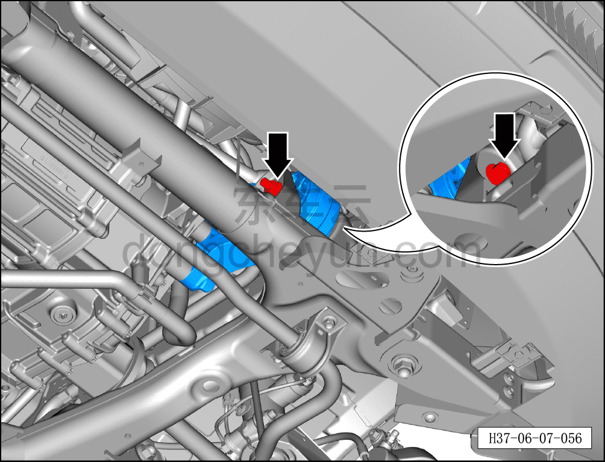
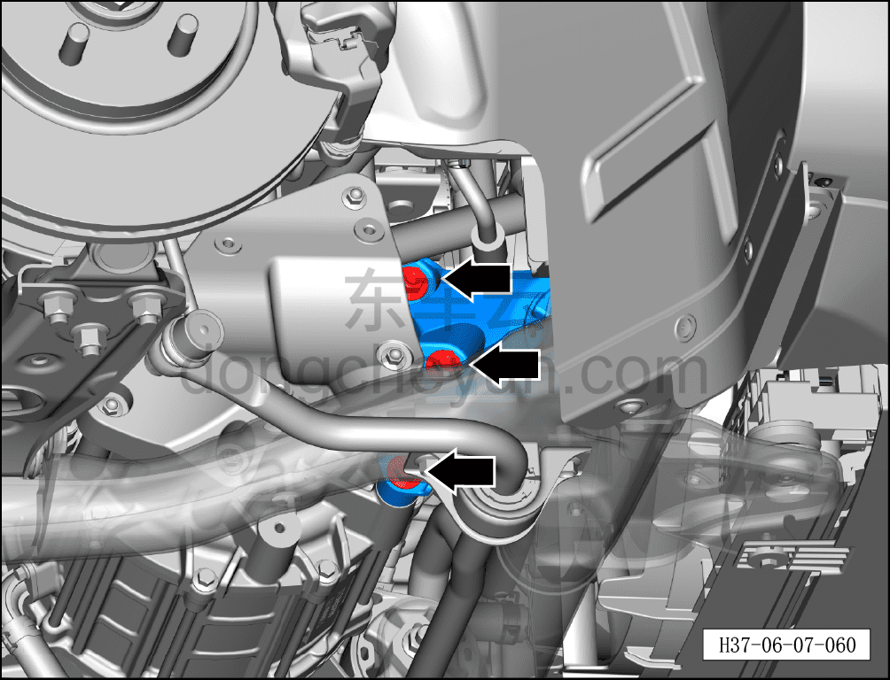
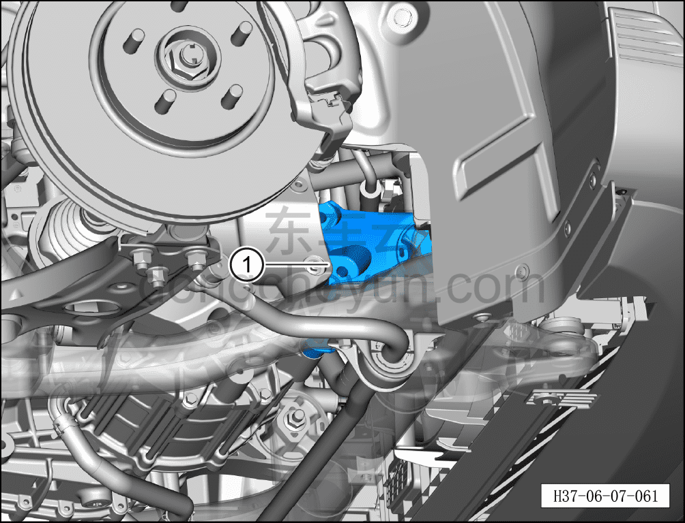

# Снятие и установка правой опоры переднего электродвигателя

> Система шасси › Электронные системы шасси › Механизм опор переднего электродвигателя  
> Оригинал: `拆卸与安装前电机右悬置` · [dongcheyun 56746](https://dongcheyun.com/p/56746), страница `75dc65e30ff54bbb86df3381a06429e0` · [оглавление](../README.md)

**Порядок снятия**

**Внимание:**

**- При снятии опоры переднего электродвигателя необходимо сначала установить стойку подъёмника под передним тяговым электродвигателем и, поднимая, подпереть его.**

1. Выключите все электроприборы, отключите питание.

2. Выполните обесточивание автомобиля для ремонта. См. [3.1.4.1 Обесточивание автомобиля](../03-техническое-обслуживание/005-обесточивание-автомобиля.md)

3. Поднимите автомобиль на подъёмнике на подходящую высоту.

4. Снять передний нижний защитный щиток. См. [8.6.4.3 Снятие и установка переднего нижнего защитного щитка](../08-внутренняя-и-внешняя-отделка/193-снятие-и-установка-переднего-нижнего-защитного-щитка.md)

5. Откачайте хладагент. См. [10.1.6.11 Откачка/вакуумирование/заправка хладагента](../10-кондиционер/045-сбор-вакуумирование-заправка-хладагента.md)

6. Снимите компрессор в сборе. См. [10.1.5.5 Снятие и установка компрессора (полноприводные автомобили)](../10-кондиционер/014-снятие-и-установка-компрессора-версия-awd.md)

7. Снимите правую опору переднего электродвигателя.

a. Используя торцевую головку на 15 мм, отверните 4 крепёжных болта правой опоры переднего электродвигателя.

Момент затяжки болта: 100±10 Н·м

b. Используя торцевую головку на 15 мм, отверните 3 крепёжных болта правой опоры переднего электродвигателя.

Момент затяжки болта: 100±10 Н·м

c. Используя плоскую отвёртку в качестве вспомогательного инструмента, извлеките правую опору переднего электродвигателя ①.

**Порядок установки**

Установка выполняется в обратном порядке.

**Внимание:**

**- При замене уплотнительного кольца O-типа на новое нанесите на него небольшое количество смазочного масла.**

**- После завершения установки выполните вакуумирование системы кондиционирования и заправку хладагентом, см. [10.1.6.12 Откачка/заправка масла компрессора](../10-кондиционер/046-сбор-заправка-масла-компрессора.md).**

**- Проверьте и убедитесь, что все функции системы кондиционирования работают нормально, затем подключите диагностический сканер и проверьте наличие кодов неисправностей; если таковые имеются, найдите причину и удалите коды неисправностей.**

**- После завершения ремонта обязательно выполните дорожное испытание, убедитесь в отсутствии посторонних шумов со стороны шасси и явления увода.**
