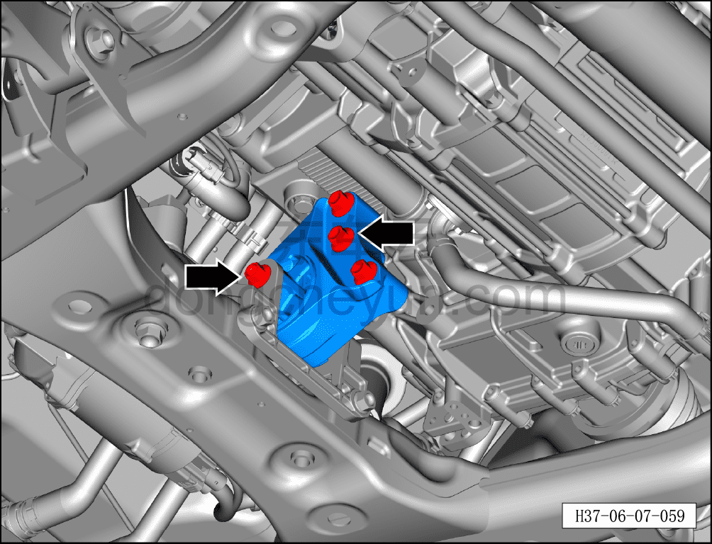
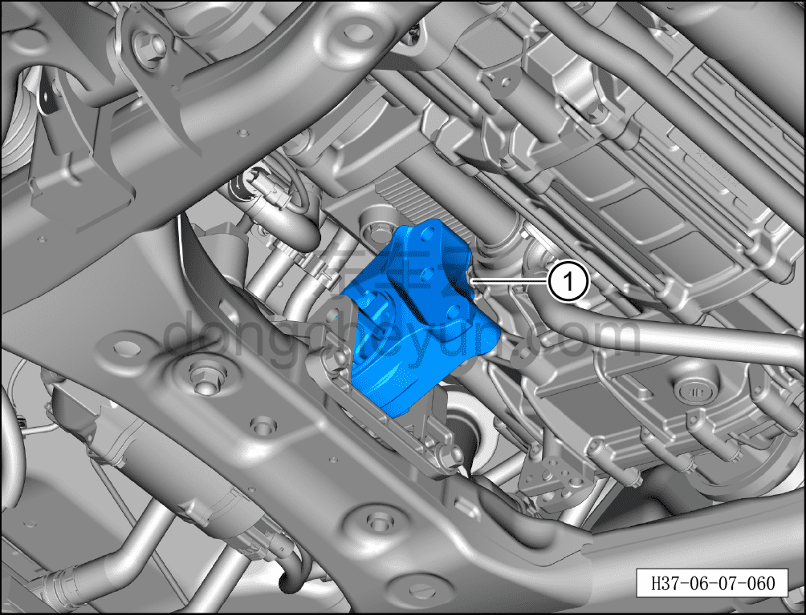

# Снятие и установка задней опоры переднего электродвигателя

> Система шасси › Электронные системы шасси › Механизм опор переднего электродвигателя  
> Оригинал: `拆卸与安装前电机后悬置` · [dongcheyun 56746](https://dongcheyun.com/p/56746), страница `5743468137ba484d8356d06b7b5827b0` · [оглавление](../README.md)

**Порядок снятия**

**Внимание:**

**- При снятии опоры переднего электродвигателя необходимо сначала установить стойку подъёмника под передним тяговым электродвигателем и, поднимая, подпереть его.**

1. Выключите все электроприборы, отключите питание.

2. Выполните обесточивание автомобиля для ремонта. См. [3.1.4.1 Обесточивание автомобиля](../03-техническое-обслуживание/005-обесточивание-автомобиля.md)

3. Поднимите автомобиль на подъёмнике на подходящую высоту.

4. Снять передний нижний защитный щиток. См. [8.6.4.3 Снятие и установка переднего нижнего защитного щитка](../08-внутренняя-и-внешняя-отделка/193-снятие-и-установка-переднего-нижнего-защитного-щитка.md)

5. Снимите заднюю опору переднего электродвигателя.

a. Используя торцевую головку на 15 мм, отверните 4 крепёжных болта задней опоры переднего электродвигателя.

Момент затяжки болта: 100±10 Н·м

b. Используя плоскую отвёртку в качестве вспомогательного инструмента, извлеките заднюю опору переднего электродвигателя ①.

**Порядок установки**

Установка выполняется в обратном порядке.

**Внимание:**

**- После завершения ремонта обязательно выполните дорожное испытание, убедитесь в отсутствии посторонних шумов со стороны шасси и явления увода.**
