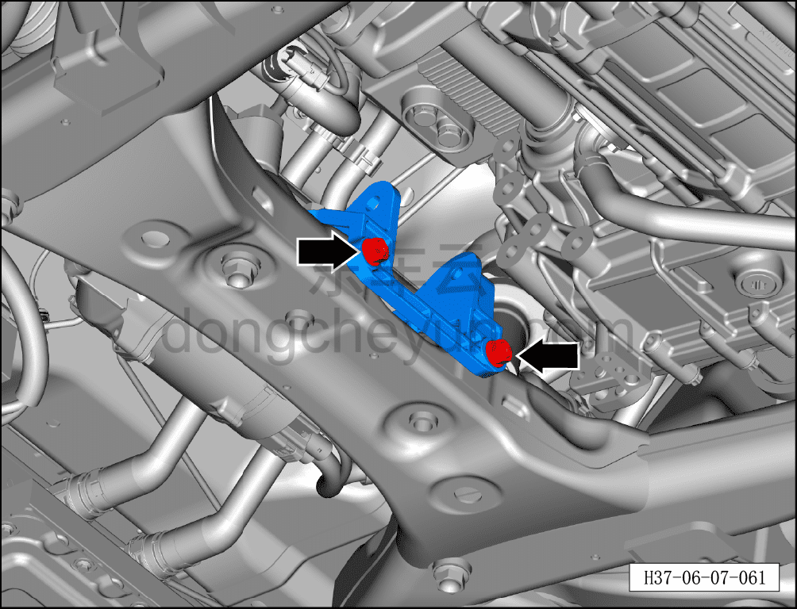
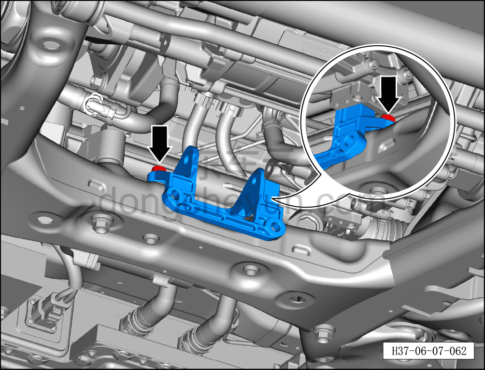
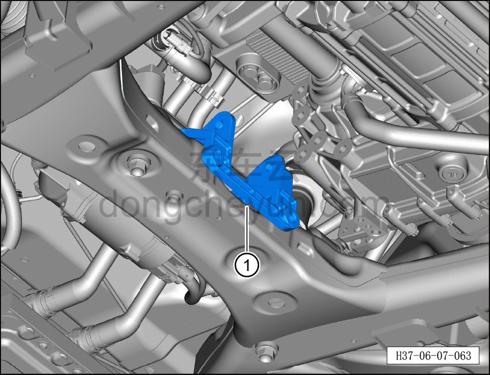

# Снятие и установка кронштейна правой опоры переднего электродвигателя

> Система шасси › Электронные системы шасси › Механизм опор переднего электродвигателя  
> Оригинал: `拆卸与安装前电机右悬置支架` · [dongcheyun 56746](https://dongcheyun.com/p/56746), страница `b7cc027b01a2428cb1eda3535983c614` · [оглавление](../README.md)

**Порядок снятия**

**Внимание:**

**- При снятии опоры переднего электродвигателя необходимо сначала установить стойку подъёмника под передним тяговым электродвигателем и, поднимая, подпереть его.**

1. Выключите все электроприборы, отключите питание.

2. Выполните обесточивание автомобиля для ремонта. См. [3.1.4.1 Обесточивание автомобиля](../03-техническое-обслуживание/005-обесточивание-автомобиля.md)

3. Снять передний нижний защитный щиток. См. [8.6.4.3 Снятие и установка переднего нижнего защитного щитка](../08-внутренняя-и-внешняя-отделка/193-снятие-и-установка-переднего-нижнего-защитного-щитка.md)

4. Снимите заднюю опору переднего электродвигателя. См. [6.7.10.3 Снятие и установка задней опоры переднего электродвигателя](117-снятие-и-установка-задней-опоры-переднего.md)

5. Снимите кронштейн правой опоры переднего электродвигателя.

a. Используя торцевую головку на 15 мм, отверните 2 крепёжных болта кронштейна правой опоры переднего электродвигателя.

b. Используя торцевую головку на 15 мм, отверните 2 крепёжных болта кронштейна правой опоры переднего электродвигателя.

c. Извлеките кронштейн правой опоры переднего электродвигателя ①.

**Порядок установки**

Установка выполняется в обратном порядке.

**Внимание:**

**- После завершения ремонта обязательно выполните дорожное испытание, убедитесь в отсутствии посторонних шумов со стороны шасси и явления увода.**
