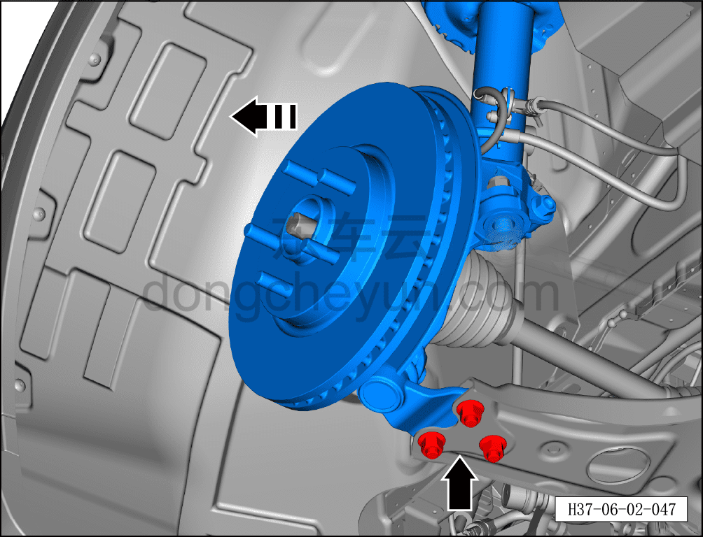
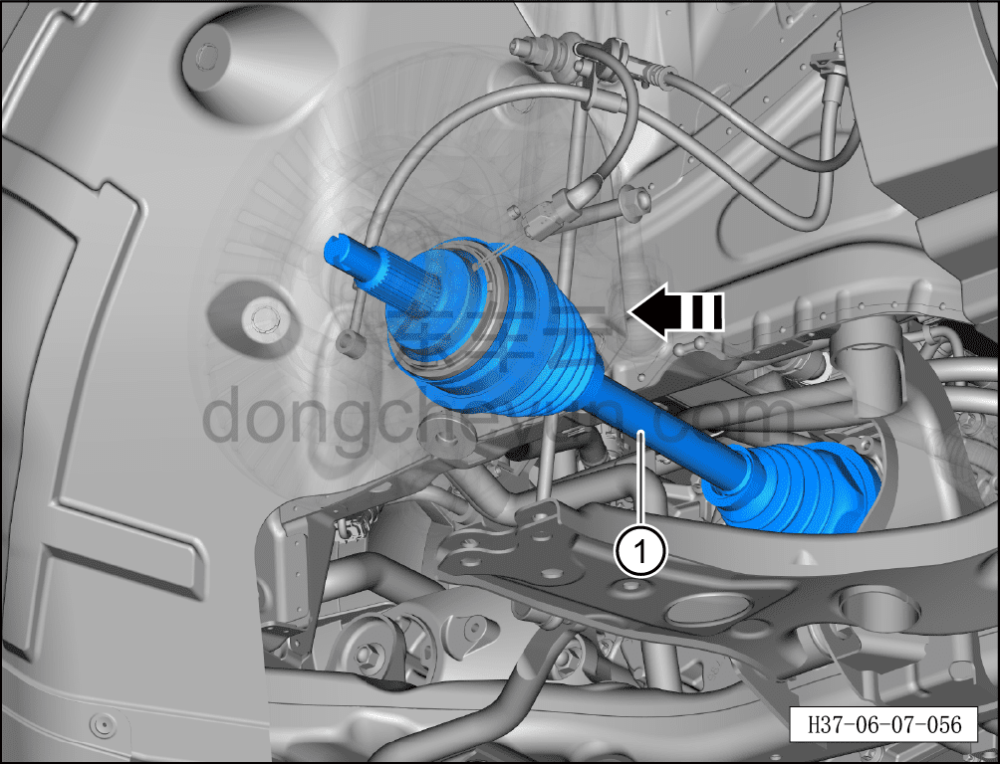

# Снятие и установка левого переднего приводного вала (полный привод)

> Система шасси › Электронные системы шасси › Передняя приводная система  
> Оригинал: `拆卸与安装左前驱动轴（四驱）` · [dongcheyun 56746](https://dongcheyun.com/p/56746), страница `0901b52f88d04867a826b85f50f48630` · [оглавление](../README.md)

**Порядок снятия**

1. Выключите все электроприборы, отключите питание.

2. Выполните обесточивание автомобиля для ремонта. См. [3.1.4.1 Обесточивание автомобиля](../03-техническое-обслуживание/005-обесточивание-автомобиля.md)

3. Снимите левое переднее колесо. См. [6.5.8.1 Снятие и установка колеса](064-снятие-и-установка-колеса.md)

4. Снять передний нижний защитный щиток. См. [8.6.4.3 Снятие и установка переднего нижнего защитного щитка](../08-внутренняя-и-внешняя-отделка/193-снятие-и-установка-переднего-нижнего-защитного-щитка.md)

5. Слейте смазочное масло переднего тягового электродвигателя в сборе. См. [3.1.5.4 Замена смазочного масла переднего тягового электродвигателя в сборе](../03-техническое-обслуживание/009-замена-смазочного-масла-переднего-тягового.md)

6. Снимите левый передний приводной вал (полный привод).

a. Используя усиленную торцевую головку на 36 мм, отверните гайку ступицы колеса.

Момент затяжки гайки: 330±15 Н·м

**Примечание:**

**- Необходимо зафиксировать тормозной диск с помощью фиксатора ступицы.**

**- Ослабьте гайку ступицы колеса, чтобы облегчить снятие приводного вала.**

**- Выше описан порядок ослабления гайки ступицы колеса, для правой стороны см. левую.**

**- При установке гайки не используйте пневматический инструмент — это может привести к повреждению резьбы гайки.**

**- Гайка ступицы колеса является деталью одноразового использования; после снятия необходимо установить новую.**

b. Удерживая тягу переднего стабилизатора битой TX30, отверните гаечным ключом на 19 мм крепёжную гайку и отсоедините тягу переднего стабилизатора от стойки переднего амортизатора в сборе.

Момент затяжки гайки составляет: 60 Н·м+45°

c. Удерживая палец левого наружного шарового шарнира рулевого механизма гаечным ключом на 8 мм, отверните гаечным ключом на 21 мм крепёжную гайку.

Момент затяжки гайки составляет: 120±12 Н·м

d. С помощью специального инструмента (H52246001) отсоедините левый наружный шаровой шарнир рулевого механизма от поворотного кулака.

e. Удерживая крепёжный болт торцевой головкой на 15 мм, отверните торцевой головкой на 18 мм 3 крепёжные гайки шарового шарнира нижнего рычага передней подвески.

f. Отведите стойку переднего амортизатора в сборе и поворотный кулак в сборе в направлении стрелки до тех пор, пока шаровой шарнир нижнего рычага передней подвески не выйдет из установочного отверстия нижнего рычага.

g. Используя инструмент для снятия приводного вала, отсоедините левый передний приводной вал и извлеките его в направлении стрелки — левый передний приводной вал (полный привод) ①.

**Порядок установки**

Установка выполняется в обратном порядке.

**Внимание:**

**- Поскольку задний рычаг передней подвески и шаровой палец являются одной сборочной единицей, соединительные болты шарового пальца с левым задним рычагом передней подвески имеют строгие требования к сборке; после снятия болтов необходимо заменить левый передний нижний рычаг с шаровым пальцем в сборе на новый, разборка при установке не допускается.**

**- Смазочное масло редуктора тягового электродвигателя нельзя использовать повторно или смешивать; необходимо заменить его на новое;**

**- Необходимо заменить левый передний сальник приводного вала (полный привод) на новый;**

**- После завершения установки необходимо выполнить развал-схождение;**

**- После завершения ремонта обязательно выполните дорожное испытание, убедитесь в отсутствии посторонних шумов со стороны шасси и явления увода.**
