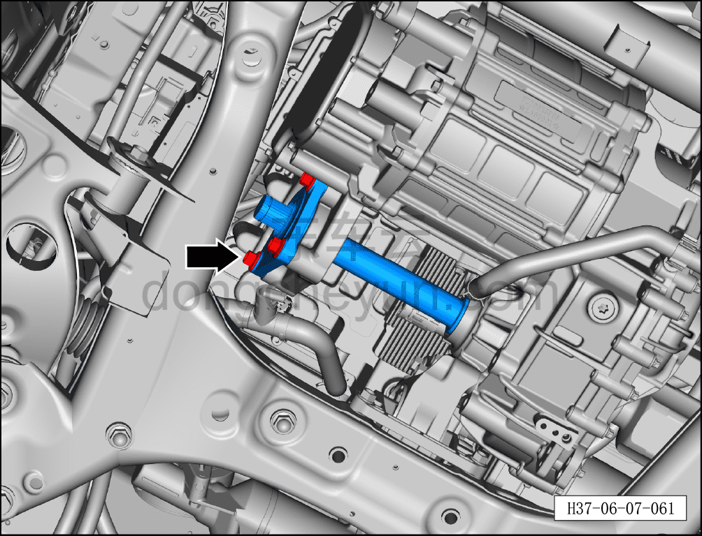
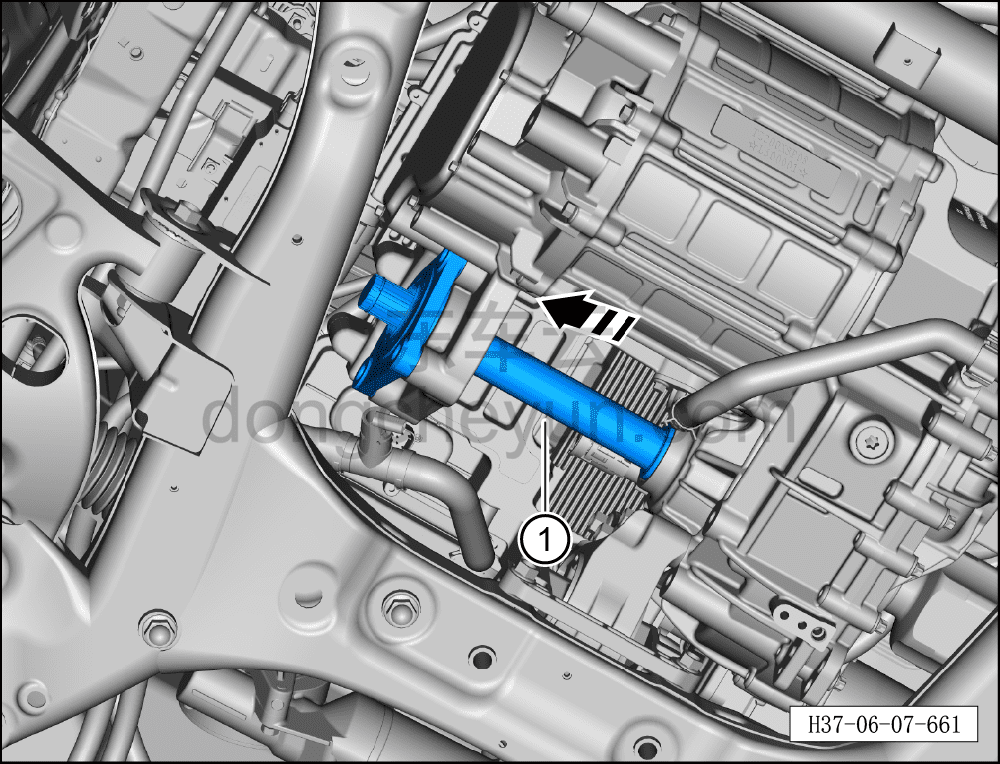

# Снятие и установка переднего соединительного вала (полный привод)

> Система шасси › Электронные системы шасси › Передняя приводная система  
> Оригинал: `拆卸与安装前连接轴（四驱）` · [dongcheyun 56746](https://dongcheyun.com/p/56746), страница `d21eddae40b04a8b86a12afb49787200` · [оглавление](../README.md)

**Порядок снятия**

1. Выключите все электроприборы, отключите питание.

2. Выполните обесточивание автомобиля для ремонта. См. [3.1.4.1 Обесточивание автомобиля](../03-техническое-обслуживание/005-обесточивание-автомобиля.md)

3. Снимите правое переднее колесо. См. [6.5.8.1 Снятие и установка колеса](064-снятие-и-установка-колеса.md)

4. Снять передний нижний защитный щиток. См. [8.6.4.3 Снятие и установка переднего нижнего защитного щитка](../08-внутренняя-и-внешняя-отделка/193-снятие-и-установка-переднего-нижнего-защитного-щитка.md)

5. Слейте смазочное масло переднего тягового электродвигателя в сборе. См. [3.1.5.4 Замена смазочного масла переднего тягового электродвигателя в сборе](../03-техническое-обслуживание/009-замена-смазочного-масла-переднего-тягового.md)

6. Снимите правый передний приводной вал (полный привод). [6.7.11.2 Снятие и установка правого переднего приводного вала (полный привод)](120-снятие-и-установка-правого-переднего-приводного-вала.md)

7. Снимите передний соединительный вал (полный привод).

a. Используя торцевую головку на 14 мм, отверните 3 крепёжных болта переднего соединительного вала.

Момент затяжки болта: 50±5 Н·м

b. Извлеките передний соединительный вал (полный привод) в направлении стрелки ①.

**Порядок установки**

Установка выполняется в обратном порядке.

**Внимание:**

**- Смазочное масло редуктора тягового электродвигателя нельзя использовать повторно или смешивать; необходимо заменить его на новое;**

**- Необходимо заменить правое переднее сальник полуоси (полный привод) на новое;**

**- После завершения установки необходимо выполнить развал-схождение;**

**- После завершения ремонта обязательно выполните дорожное испытание, убедитесь в отсутствии посторонних шумов со стороны шасси и явления увода.**
