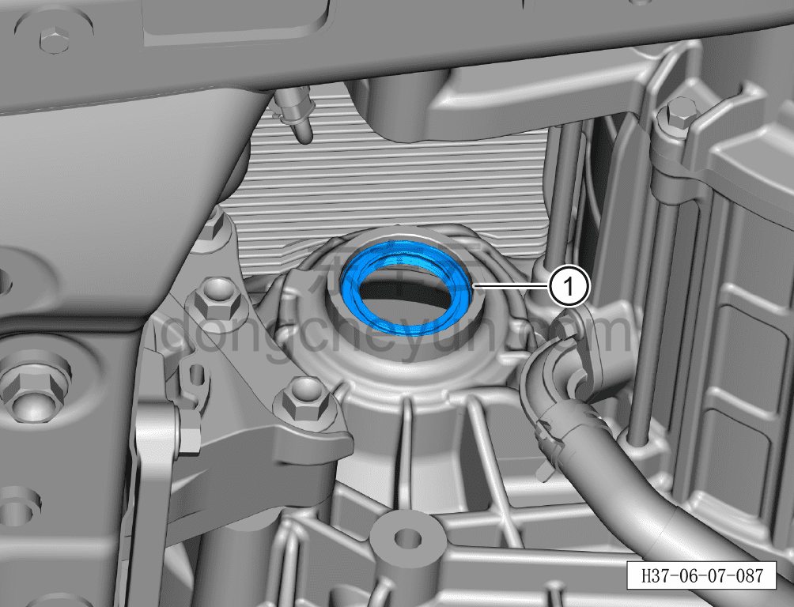

# Снятие и установка сальника правой передней полуоси (полный привод)

> Система шасси › Электронные системы шасси › Передняя приводная система  
> Оригинал: `拆卸与安装右前半轴油封（四驱）` · [dongcheyun 56746](https://dongcheyun.com/p/56746), страница `db85ca904f6047768fd637a219f6983e` · [оглавление](../README.md)

**Порядок снятия**

1. Выключите все электроприборы, отключите питание.

2. Выполните обесточивание автомобиля для ремонта. См. [3.1.4.1 Обесточивание автомобиля](../03-техническое-обслуживание/005-обесточивание-автомобиля.md)

3. Снимите правый передний соединительный вал (полный привод). См. [6.7.11.3 Снятие и установка переднего соединительного вала (полный привод)](121-снятие-и-установка-переднего-соединительного-вала.md)

4. Снимите сальник правой передней полуоси (полный привод).

a. С помощью инструмента для снятия сальника полуоси снимите сальник правой передней полуоси (полный привод) ①.

**Порядок установки**

Установка выполняется в обратном порядке.

**Внимание:**

**- Для установки использовать новый сальник полуоси.**

**- Очистите посадочную поверхность сальника, убедитесь в отсутствии посторонних предметов на посадочной поверхности.**

**- Для установки используйте инструмент для установки сальника (H5229002). **

**- После завершения установки проверьте, убедитесь, что сальник установлен на своё место.**

**- Необходимо выполнить дорожное испытание, убедиться в отсутствии посторонних шумов в шасси, отсутствии увода автомобиля в сторону, отсутствии подтёков масла в месте установки сальника.**
