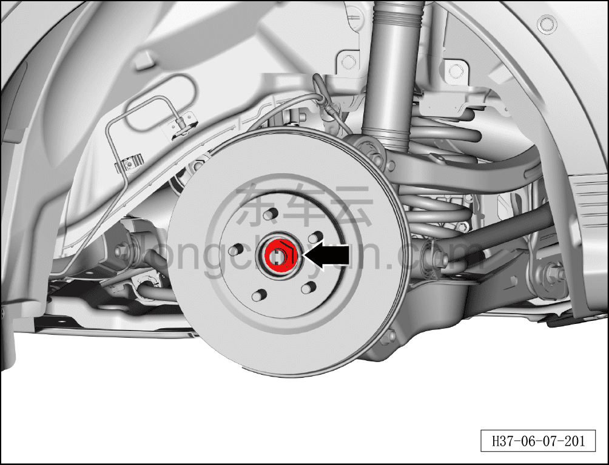
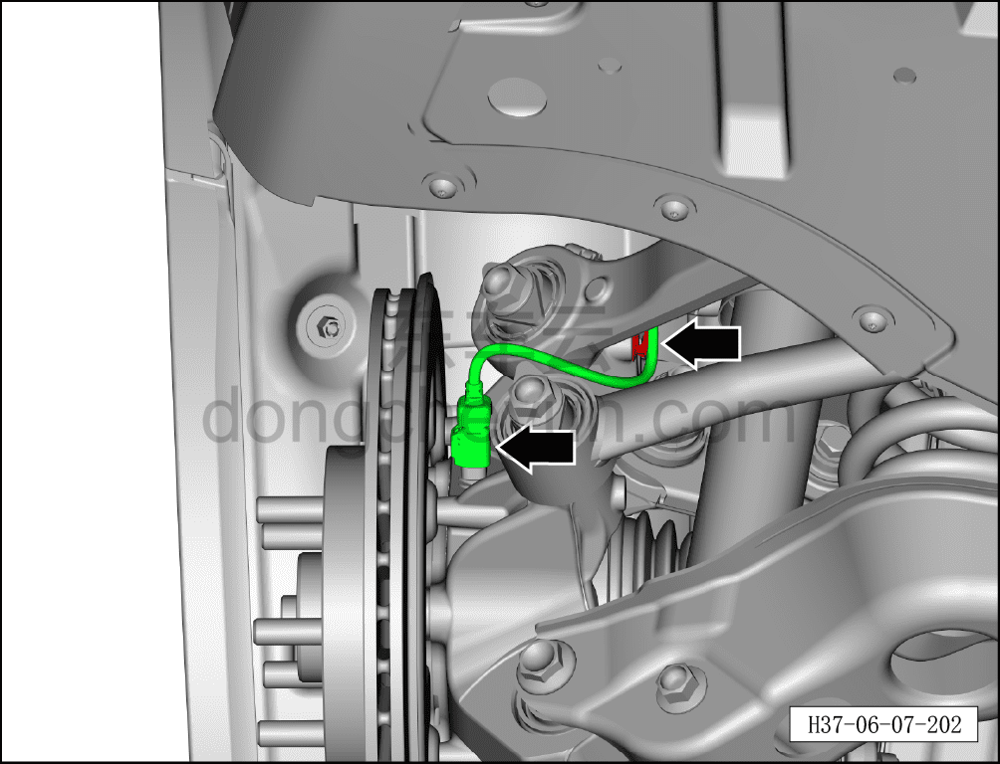
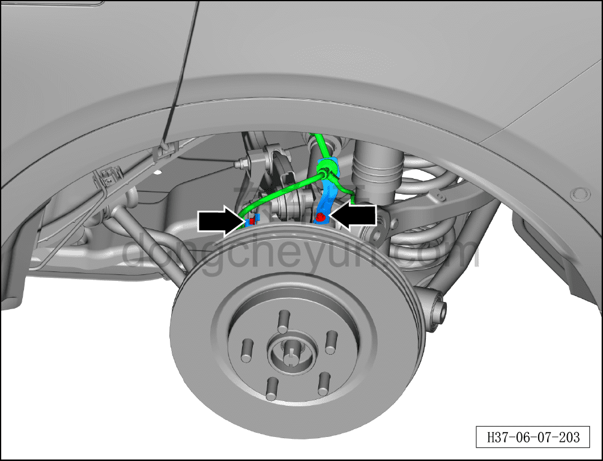
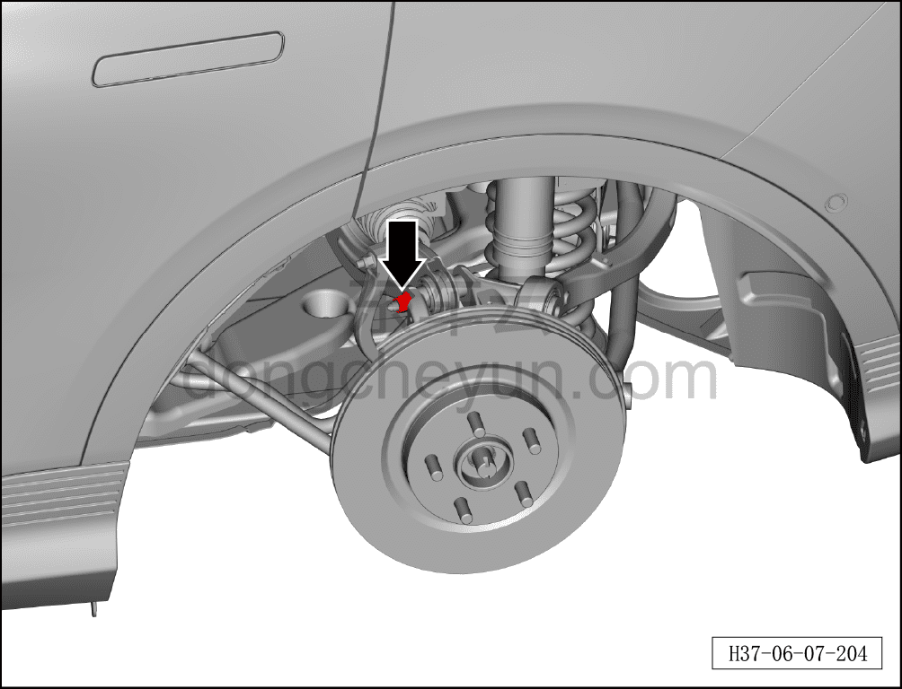
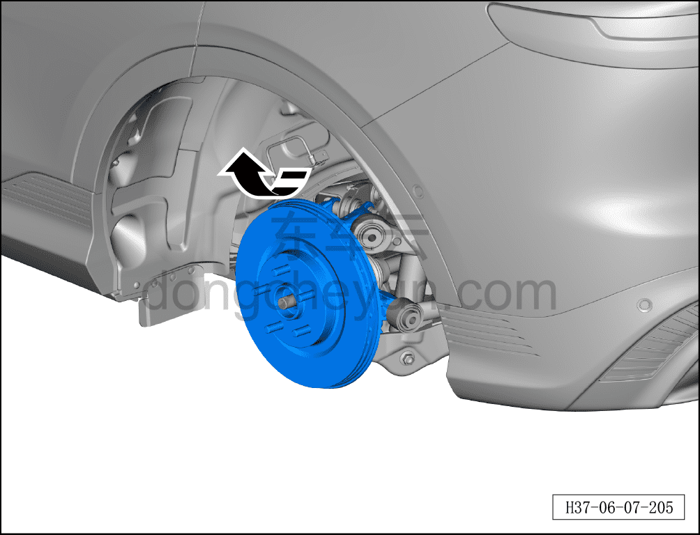
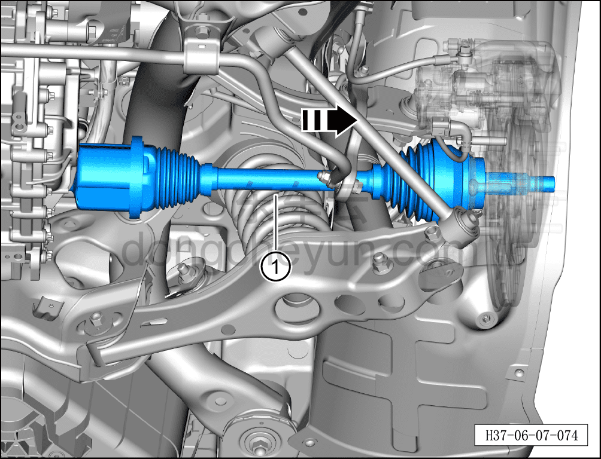

# Снятие и установка левого заднего приводного вала

> Система шасси › Электронные системы шасси › Задняя приводная система  
> Оригинал: `拆卸与安装左后驱动轴` · [dongcheyun 56746](https://dongcheyun.com/p/56746), страница `ef5aa02db35a47d681bed3430c471a9e` · [оглавление](../README.md)

**Порядок снятия**

**Примечание:**

**- При снятии левого заднего тормозного суппорта не требуется снимать соединительный болт тормозного шланга и тормозного суппорта.**

**- После снятия тормозного суппорта закрепите его стальной проволокой в месте, не мешающем снятию и не создающем натяжения тормозного шланга.**

1. Выключите все электроприборы, отключите питание.

2. Выполните обесточивание автомобиля для ремонта. См. [3.1.4.1 Обесточивание автомобиля](../03-техническое-обслуживание/005-обесточивание-автомобиля.md)

3. Снимите заднее колесо. См. [6.5.8.1 Снятие и установка колеса](064-снятие-и-установка-колеса.md)

4. Слейте смазочное масло в сборе заднего тягового электродвигателя. См. [3.1.5.5 Замена смазочного масла в сборе заднего тягового электродвигателя](../03-техническое-обслуживание/010-замена-смазочного-масла-заднего-тягового.md)

5. Поднимите автомобиль на подъёмнике на соответствующую высоту.

6. Снимите левый задний тормозной суппорт. См. [6.6.6.2 Снятие и установка левого заднего тормозного суппорта](075-снятие-и-установка-левого-заднего-тормозного-суппорта.md)

7. Снимите соединительный болт верхнего рычага левой задней подвески и левой задней стойки (цапфы). См. [6.3.7.5 Снятие и установка верхнего рычага задней подвески слева](036-снятие-и-установка-левого-верхнего-рычага-задней.md)

8. Снимите соединительный болт тяги схождения и левой задней стойки (цапфы). См. [6.3.7.4 Снятие и установка тяги схождения](035-снятие-и-установка-тяги-схождения.md)

9. Снимите соединительный болт переднего нижнего рычага задней подвески и левой задней стойки (цапфы). См. [6.3.7.3 Снятие и установка переднего нижнего рычага задней подвески](034-снятие-и-установка-переднего-нижнего-рычага-задней.md)

10. Снимите соединительный болт левого заднего нижнего рычага задней подвески и левой задней стойки (цапфы). См. [6.3.7.1 Снятие и установка левого заднего нижнего рычага задней подвески](032-снятие-и-установка-левого-нижнего-рычага-задней.md)

11. Снимите левый задний приводной вал.

a. Используя усиленную торцевую головку на 36 мм, отверните гайку ступицы колеса.

Момент затяжки гайки: 330±15 Н·м

**Примечание:**

**- Необходимо использовать инструмент фиксации ступицы для удержания тормозного диска.**

**- При установке гайки не используйте пневматический инструмент — это может привести к повреждению резьбы гайки.**

b. Отсоедините разъём жгута датчика скорости заднего колеса, отсоедините фиксирующие клипсы жгута.

c. С помощью торцевой головки 10 мм выверните 2 крепёжных болта кронштейна жгута проводов.

d. С помощью торцевой головки 18 мм ослабьте крепёжную гайку переднего верхнего рычага задней подвески.

e. Отклоните стойку (цапфу) и тормозной диск в сборе вверх в направлении стрелки до отсоединения от левого заднего приводного вала.

**Внимание:**

**- Необходимо следить, чтобы жгут проводов и фиксирующие клипсы не были натянуты и не испытывали нагрузки, во избежание повреждения жгута.**

f. С помощью инструмента для снятия приводного вала отсоедините левый задний приводной вал, извлеките левый задний приводной вал в направлении стрелки ①.

**Порядок установки**

Установка выполняется в обратном порядке.

**Внимание:**

**- Смазочное масло шестерён тягового электродвигателя не подлежит повторному использованию и смешиванию, необходимо заменить на новое смазочное масло шестерён тягового электродвигателя.**

**- Необходимо заменить сальник левой задней полуоси на новый.**

**- После завершения установки необходимо выполнить развал-схождение;**

**- После завершения ремонта обязательно выполните дорожное испытание, убедитесь в отсутствии посторонних шумов со стороны шасси и явления увода.**
