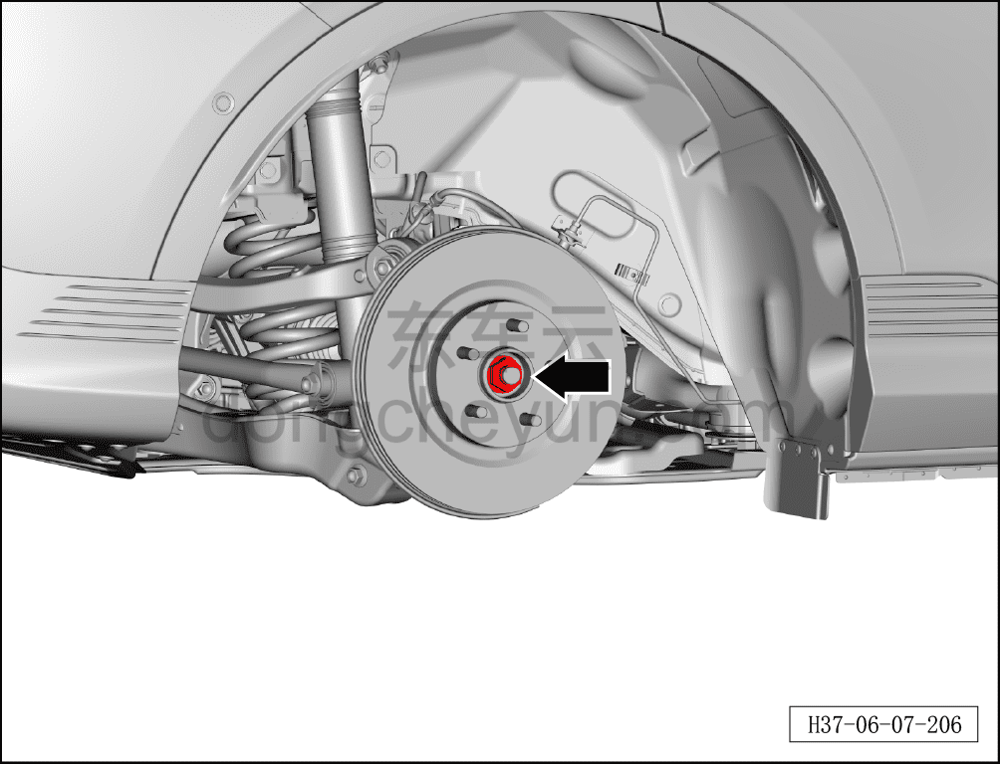
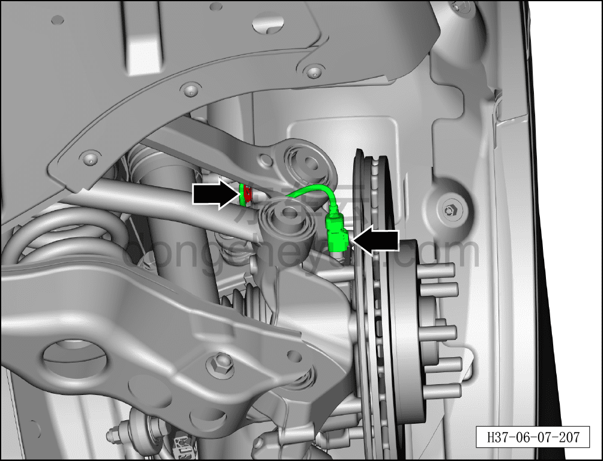
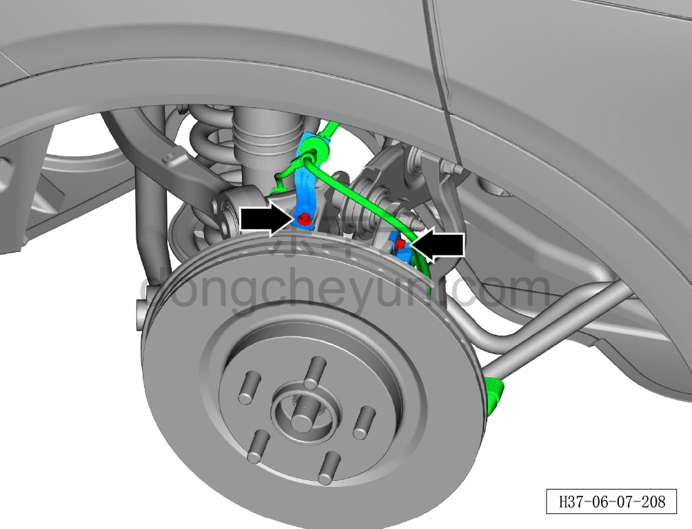
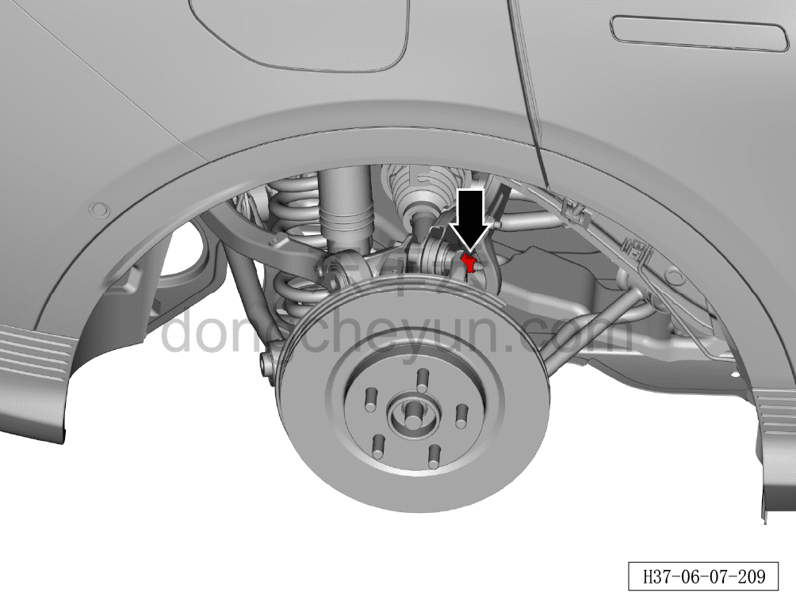
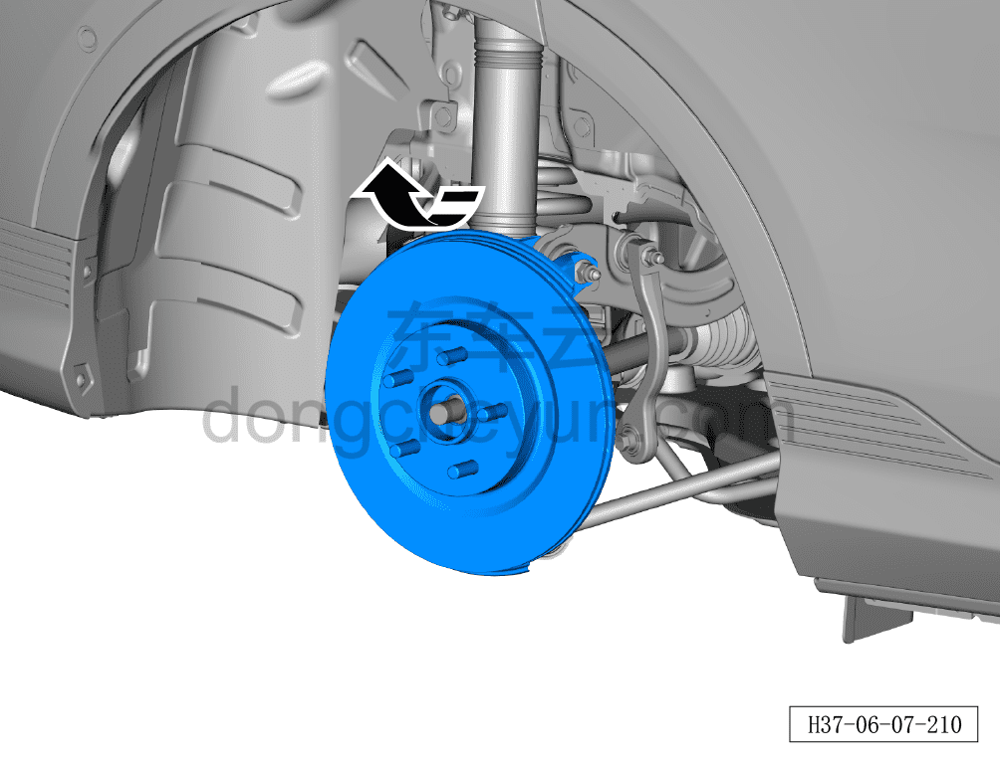
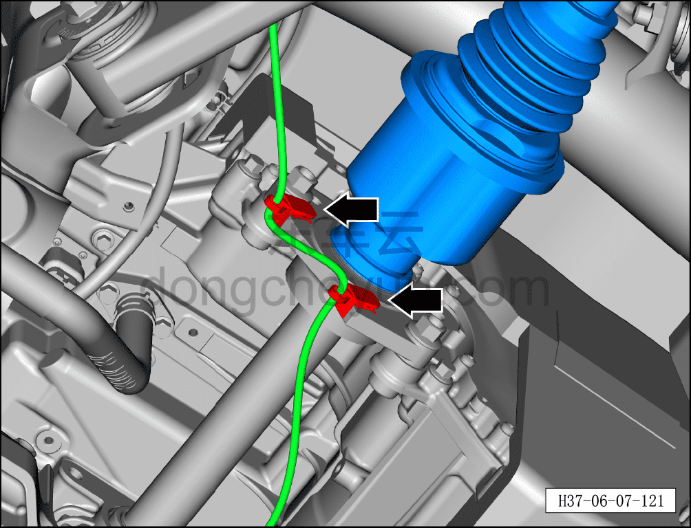
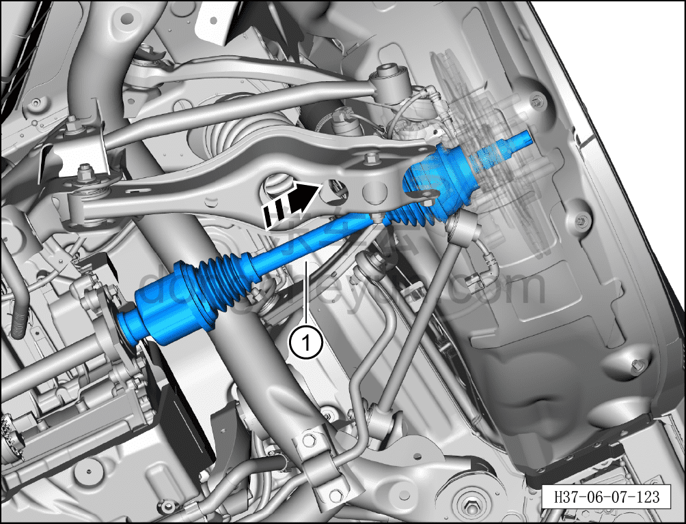

# Снятие и установка правого заднего приводного вала

> Система шасси › Электронные системы шасси › Задняя приводная система  
> Оригинал: `拆卸与安装右后驱动轴` · [dongcheyun 56746](https://dongcheyun.com/p/56746), страница `13bc54469cb44c3a9f51cee5609a3500` · [оглавление](../README.md)

**Порядок снятия**

**Примечание:**

**- При снятии правого заднего тормозного суппорта не требуется снимать соединительный болт тормозного шланга и тормозного суппорта.**

**- После снятия тормозного суппорта закрепите его стальной проволокой в месте, не мешающем снятию и не создающем натяжения тормозного шланга.**

1. Выключите все электроприборы, отключите питание.

2. Выполните обесточивание автомобиля для ремонта. См. [3.1.4.1 Обесточивание автомобиля](../03-техническое-обслуживание/005-обесточивание-автомобиля.md)

3. Снимите правое заднее колесо. См. [6.5.8.1 Снятие и установка колеса](064-снятие-и-установка-колеса.md)

4. Поднимите автомобиль на подъёмнике на подходящую высоту.

5. Снимите дополнительный кронштейн заднего защитного щитка днища. [8.6.4.6 Снятие и установка дополнительного кронштейна заднего защитного щитка днища](../08-внутренняя-и-внешняя-отделка/196-снятие-и-установка-вспомогательного-кронштейна-заднего.md)

6. Снимите правый задний тормозной суппорт. См. [6.6.6.2 Снятие и установка левого заднего тормозного суппорта](075-снятие-и-установка-левого-заднего-тормозного-суппорта.md)

7. Снимите соединительный болт верхнего рычага правой задней подвески и правой задней стойки (цапфы). См. [6.3.7.5 Снятие и установка верхнего рычага задней подвески слева](036-снятие-и-установка-левого-верхнего-рычага-задней.md)

8. Снимите соединительный болт правой тяги схождения и правой задней стойки (цапфы). См. [6.3.7.4 Снятие и установка тяги схождения](035-снятие-и-установка-тяги-схождения.md)

9. Снимите соединительный болт правого переднего нижнего рычага задней подвески и правой задней стойки (цапфы). См. [6.3.7.3 Снятие и установка переднего нижнего рычага задней подвески](034-снятие-и-установка-переднего-нижнего-рычага-задней.md)

10. Снимите соединительный болт правого заднего нижнего рычага задней подвески и правой задней стойки (цапфы). См. [6.3.7.1 Снятие и установка левого заднего нижнего рычага задней подвески](032-снятие-и-установка-левого-нижнего-рычага-задней.md)

11. Снимите правый задний приводной вал.

a. Используя усиленную торцевую головку на 36 мм, отверните гайку ступицы колеса.

Момент затяжки гайки: 330±15 Н·м

**Примечание:**

**- Необходимо использовать инструмент фиксации ступицы для удержания тормозного диска.**

**- При установке гайки не используйте пневматический инструмент — это может привести к повреждению резьбы гайки.**

b. Отсоедините разъём жгута датчика скорости заднего колеса, отсоедините фиксирующие клипсы жгута.

c. С помощью торцевой головки 10 мм выверните 2 крепёжных болта кронштейна жгута проводов.

d. С помощью торцевой головки 18 мм ослабьте крепёжную гайку переднего верхнего рычага задней подвески.

e. Отклоните стойку (цапфу) и тормозной диск вверх в направлении стрелки до отсоединения от левого заднего приводного вала.

**Внимание:**

**- Жгут проводов и фиксирующие клипсы не должны быть натянуты и испытывать нагрузку, во избежание повреждения жгута.**

f. Отсоедините 2 фиксирующие клипсы жгута заднего тягового электродвигателя, переместите жгут в положение, не мешающее снятию.

g. С помощью инструмента для снятия приводного вала (H52218002) отсоедините правый задний приводной вал, извлеките правый задний приводной вал в направлении стрелки ①.

**Порядок установки**

Установка выполняется в обратном порядке.

**Внимание:**

**- После завершения установки необходимо выполнить развал-схождение;**

**- После завершения ремонта обязательно выполните дорожное испытание, убедитесь в отсутствии посторонних шумов со стороны шасси и явления увода.**
