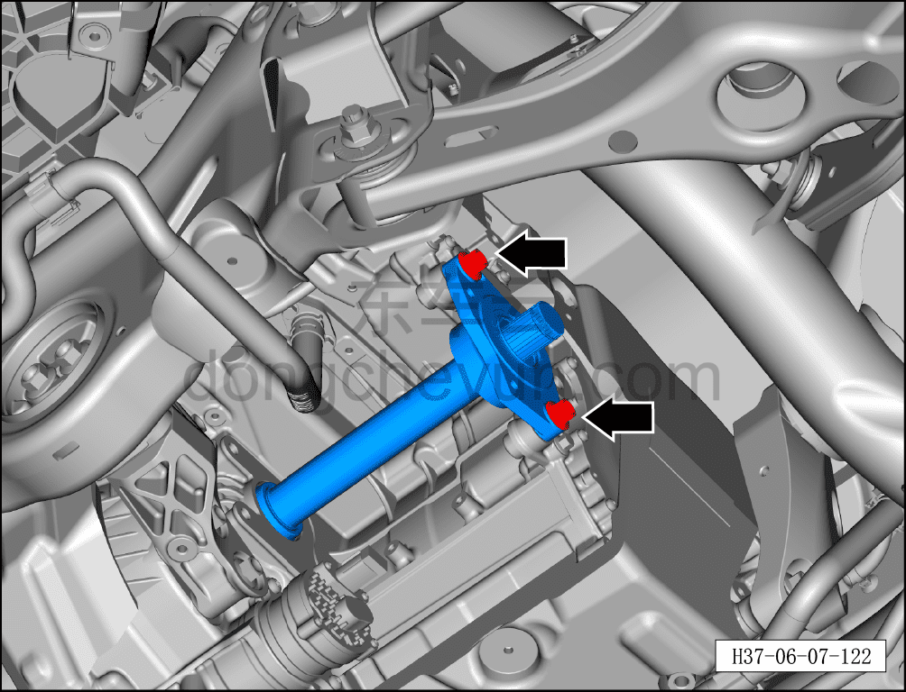
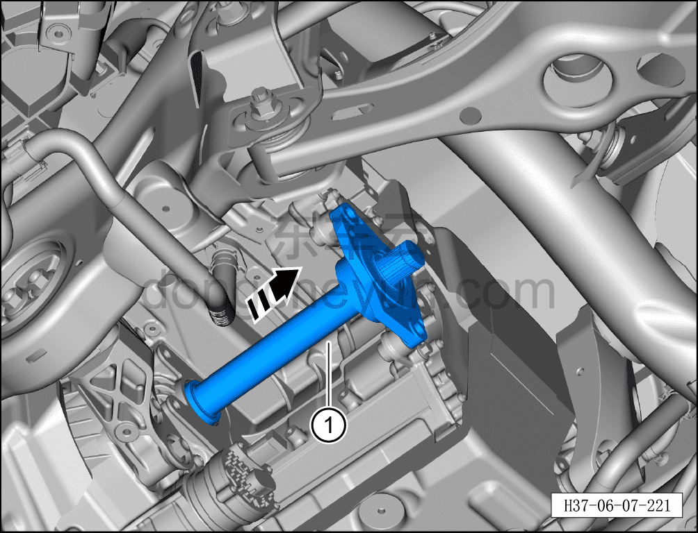

# Снятие и установка заднего соединительного вала

> Система шасси › Электронные системы шасси › Задняя приводная система  
> Оригинал: `拆卸与安装后连接轴` · [dongcheyun 56746](https://dongcheyun.com/p/56746), страница `7d6c86d0b1564eadbc39add93f58eb85` · [оглавление](../README.md)

**Порядок снятия**

**Примечание:**

**- При снятии правого заднего тормозного суппорта не требуется снимать соединительный болт тормозного шланга и тормозного суппорта.**

**- После снятия тормозного суппорта закрепите его стальной проволокой в месте, не мешающем снятию и не создающем натяжения тормозного шланга.**

1. Выключите все электроприборы, отключите питание.

2. Выполните обесточивание автомобиля для ремонта. См. [3.1.4.1 Обесточивание автомобиля](../03-техническое-обслуживание/005-обесточивание-автомобиля.md)

3. Снимите правое заднее колесо. См. [6.5.8.1 Снятие и установка колеса](064-снятие-и-установка-колеса.md)

4. Слейте смазочное масло в сборе заднего тягового электродвигателя. См. [3.1.5.5 Замена смазочного масла в сборе заднего тягового электродвигателя](../03-техническое-обслуживание/010-замена-смазочного-масла-заднего-тягового.md)

5. Поднимите автомобиль на подъёмнике на соответствующую высоту.

6. Снимите правый задний тормозной суппорт. См. [6.6.6.2 Снятие и установка левого заднего тормозного суппорта](075-снятие-и-установка-левого-заднего-тормозного-суппорта.md)

7. Снимите соединительный болт верхнего рычага правой задней подвески и правой задней стойки (цапфы). См. [6.3.7.5 Снятие и установка верхнего рычага задней подвески слева](036-снятие-и-установка-левого-верхнего-рычага-задней.md)

8. Снимите соединительный болт тяги схождения и правой задней стойки (цапфы). См. [6.3.7.4 Снятие и установка тяги схождения](035-снятие-и-установка-тяги-схождения.md)

9. Снимите соединительный болт правого переднего нижнего рычага задней подвески и правой задней стойки (цапфы). См. [6.3.7.3 Снятие и установка переднего нижнего рычага задней подвески](034-снятие-и-установка-переднего-нижнего-рычага-задней.md)

10. Снимите соединительный болт правого заднего нижнего рычага задней подвески и правой задней стойки (цапфы). См. [6.3.7.1 Снятие и установка левого заднего нижнего рычага задней подвески](032-снятие-и-установка-левого-нижнего-рычага-задней.md)

11. Снимите правый задний приводной вал. [6.7.12.2 Снятие и установка правого заднего приводного вала](125-снятие-и-установка-правого-заднего-приводного-вала.md)

12. Снимите задний соединительный вал.

a. С помощью торцевой головки 14 мм выверните 2 крепёжных болта заднего соединительного вала.

Момент затяжки болта: 50±5 Н·м

b. Извлеките задний соединительный вал в направлении стрелки ①.

**Порядок установки**

Установка выполняется в обратном порядке.

**Внимание:**

**- Смазочное масло шестерён тягового электродвигателя не подлежит повторному использованию и смешиванию, необходимо заменить на новое смазочное масло шестерён тягового электродвигателя.**

**- Необходимо заменить сальник правой задней полуоси на новый.**

**- После завершения установки необходимо выполнить развал-схождение;**

**- После завершения ремонта обязательно выполните дорожное испытание, убедитесь в отсутствии посторонних шумов со стороны шасси и явления увода.**
